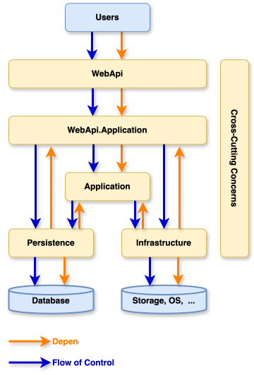
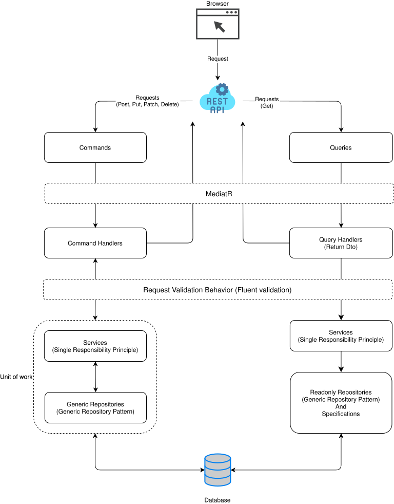
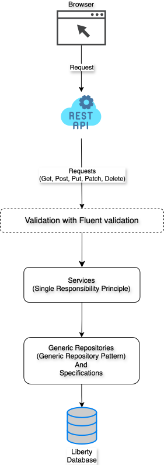

# Platform Kernel

## Table of Contents

- [Platform Kernel](#platform-kernel)
  - [Table of Contents](#table-of-contents)
  - [Environment Setup](#environment-setup)
    - [Installing .NET 8 SDK](#installing-net-8-sdk)
      - [Development Tools](#development-tools)
  - [Project Structure](#project-structure)
    - [Folder code base](#folder-code-base)
      - [Solution explorer](#solution-explorer)
      - [Layer Dependencies of a service](#layer-dependencies-of-a-service)
      - [Implement the business domain flow of a service](#implement-the-business-domain-flow-of-a-service)
      - [Implement the normarl flow of a service](#implement-the-normarl-flow-of-a-service)
  - [Git Convention](#git-convention)
    - [General Rules](#general-rules)
    - [Semantic Subjects](#semantic-subjects)
    - [Tags](#tags)
    - [Branch Name](#branch-name)
    - [Pull Request Name](#pull-request-name)
  - [Code Review Checklist](#code-review-checklist)
    - [General](#general)
    - [Commenting](#commenting)
    - [Source Code](#source-code)
  - [Coding Guideline](#coding-guideline)
    - [Get submodules](#get-submodules)
    - [Code quality](#code-quality)
  - [Version Control and CI/CD](#version-control-and-cicd)
  - [References](#references)

---

## Environment Setup

### Installing .NET 8 SDK

1. Windows: https://github.com/dotnet/core/blob/main/release-notes/8.0/install-windows.md
2. macOS: https://github.com/dotnet/core/blob/main/release-notes/8.0/install-macos.md
3. Linux: https://github.com/dotnet/core/blob/main/release-notes/8.0/install-linux.md

#### Development Tools

- [Visual Studio 2022 or later](https://visualstudio.microsoft.com/): This is a popular integrated development
  environment (IDE) for .NET. Download and install it from Microsoft's official website. Extensions should install:
  - [SonarLint for Visual Studio 2022](https://marketplace.visualstudio.com/items?itemName=SonarSource.SonarLintforVisualStudio2022)
  - [Visual Studio Spell Checker (VS2022 and Later)](https://marketplace.visualstudio.com/items?itemName=EWoodruff.VisualStudioSpellCheckerVS2022andLater)
- [Visual Studio Code](https://code.visualstudio.com/): A lighter-weight but powerful editor with extensions for .NET
  development. Install it from the official website or through extensions in VS Code. Extensions should install:
  - [C#](https://marketplace.visualstudio.com/items?itemName=ms-dotnettools.csharp)
  - [C# Dev Kit](https://marketplace.visualstudio.com/items?itemName=ms-dotnettools.csdevkit)
  - [Test Explorer UI](https://marketplace.visualstudio.com/items?itemName=hbenl.vscode-test-explorer)
    and [Test Adapter Converter](https://marketplace.visualstudio.com/items?itemName=ms-vscode.test-adapter-converter)
  - [EditorConfig for VS Code](https://marketplace.visualstudio.com/items?itemName=EditorConfig.EditorConfig)
  - [SonarLint](https://marketplace.visualstudio.com/items?itemName=SonarSource.sonarlint-vscode)
  - [Code Spell Checker](https://marketplace.visualstudio.com/items?itemName=streetsidesoftware.code-spell-checker)
  - [REST Client](https://marketplace.visualstudio.com/items?itemName=humao.rest-client)

---

## Project Structure

### Folder code base

```txt
- .vscode
- docker
- src
- .dockerignore
- .editorconfig
- .gitignore
- docker-compose.yml
- nuget.config
- sonar-analysis.sh
- SonarAnalysis.ps1
- SonarQube.Analysis.xml
- PlatformKernel.sln
```

1. **.vscode**: Directory used by Visual Studio Code (VS Code), a popular code editor developed by Microsoft. This
   folder typically contains configuration files and settings specific to the project or workspace it resides in. Here
   are some common files and their purposes within the .vscode folder: settings.json, launch.json, tasks.json, v.v...

2. **docker**: Contains the configuration files and resources required to build and deploy Docker containers to the
   project via docker-compose.

3. **src**: Contains the main source code of the application. This is where developers place source code files,
   configurations, and other components necessary to build and run the application.

4. **.editorconfig**: Used to maintain consistent source code formatting rules within a project. It helps developers
   working on the same project adhere to the same source code formatting rules when using IDEs like Visual Studio 2022
   or Visual Studio Code. (https://learn.microsoft.com/en-us/dotnet/fundamentals/code-analysis/code-style-rule-options).

5. **.dockerignore**: Used to specify files and directories that should be ignored by Docker when building an image.
   This is similar to a .gitignore file used by Git to ignore files and directories in version control.

6. **.gitignore**: Specifies which files and directories should be ignored by Git. This means that any files or
   directories listed in the .gitignore file will not be tracked by Git, and changes to these files will not be included
   in commits.

7. **docker-compose.yml**: A configuration file used by Docker Compose to define and manage multi-container Docker
   applications. It allows you to specify the services, networks, and volumes that your application requires.

8. **nuget.config**: Used to configure NuGet, the package manager for .NET. This file typically contains settings that
   control how NuGet behaves when restoring and managing packages from https://api.nuget.org/v3/index.json

9. **sonar-analysis.sh**: A shell script used to perform static code analysis using SonarQube, a popular tool for
   continuous inspection of code quality.

10. **SonarAnalysis.ps1**: A PowerShell script designed to perform a SonarQube analysis on the project.

11. **SonarQube.Analysis.xml**: A configuration file used for integrating the SonarQube static code analysis tool with
    the project.

12. **PlatformKernel.sln**: A solution file used by Microsoft Visual Studio and other compatible Integrated
    Development Environments (IDEs) to manage a collection of projects.

#### Solution explorer

```txt
- shared-kernel
  + SharedKernel.AppShared
  + SharedKernel.Cache
  + SharedKernel.CQRS
  + SharedKernel.Entity
  + SharedKernel.Grpc
  + SharedKernel.Hangfire
  + SharedKernel.IntegrationEvent
  + SharedKernel.MassTransit
  + SharedKernel.Pagination
  + SharedKernel.RepositoryBase
  + SharedKernel.Sentry
  + SharedKernel.Serilog
  + SharedKernel.ServiceBase
  + SharedKernel.ServiceDefaults
  + SharedKernel.Specification
  + SharedKernel.SysException
  + SharedKernel.UnitOfWork
  + and so more ...
```

Contains common or shared code that is used across multiple modules or services
within the application. This can include utility classes, helper functions, base classes, and
other reusable components that are not specific to a single module but are needed by various parts of the
application. **Plugin mechanism for adding shared parts**.

- **SharedKernel.AppShared**: Contains shared application logic and utilities that are used across different parts
  of the application. This can include common services, utilities, base classes, and other shared
  components that are not specific to a single module but are used throughout the application.

- **SharedKernel.Cache**: Provides distributed caching functionality using Redis. Includes cache service with operations
  for get/set/remove data, connection pooling, bulk operations, pattern-based key management, distributed locking
  mechanism, and Lua script execution for optimized Redis operations. Supports both in-memory and Redis caching with
  configurable TTL, sliding expiration, and connection retry policies.

- **SharedKernel.Entity**: Contains entity definitions and interfaces related to the entities. Such as ILoginHistory,
  IHasCreator, ...

- **SharedKernel.Hangfire**: Provides background job processing using Hangfire with PostgreSQL storage. Includes recurring
  job scheduling with Cron expressions, scheduled jobs execution at specific times or with delays, custom retry
  mechanisms, dashboard with basic authentication, and job management utilities with configurable time zones.

- **SharedKernel.MassTransit**: Provides message queue integration using MassTransit with RabbitMQ support. Includes
  message broker configuration, publish-subscribe patterns, batch publishing with publisher confirmation, queue
  settings with durable and lazy mode, and customizable bus registration with factory configurators.

- **SharedKernel.Pagination**: Contains code related to pagination functionality within the application. Such as Order, Sort, PageableBinderConfig, ...

- **SharedKernel.Sentry**: A library for integrating Sentry into ASP.NET Core applications within the system.
  It provides extension methods to easily configure and use Sentry (log, trace, error monitoring) via appsettings, supports
  Entity Framework and OpenTelemetry, allows custom log filtering and event handling, and helps standardize centralized
  error monitoring across all microservices.

- **SharedKernel.Serilog**: A logging library for .NET applications in the system, providing centralized and extensible
  logging using Serilog. It supports various sinks such as Console, Seq, AWS CloudWatch, OpenTelemetry, and Sentry, as well
  as enrichers for environment and exception details. The library enables structured logging, asynchronous log processing,
  and seamless integration with ASP.NET Core and Entity Framework, helping standardize and enhance observability across
  all microservices.

- **SharedKernel.ServiceDefaults**: A shared library providing default configurations and integrations for .NET microservices in
  the system. It includes built-in support for OpenTelemetry tracing, resilient HTTP client policies, and service
  discovery, helping standardize observability, reliability, and distributed tracing across all services.

- **SharedKernel.Specification**: Contains code related to the Specification pattern. The Specification pattern is a
  software design pattern that allows for the creation of business rules that can be combined and reused. It is often
  used to encapsulate the logic for querying and filtering data in a way that is both flexible and maintainable. Such
  as SpecificationBase, GridSpecificationBase, IGridSpecification, ...

  - **Specification Interface**: Defines the contract for specifications, typically including methods like
    IsSatisfiedBy which checks if a given object meets the criteria of the specification.
  - **Composite Specifications**: These are specifications that combine other specifications using logical operations
    like AND, OR, and NOT.
  - **Concrete Specifications**: These are specific implementations of the specification interface that encapsulate
    particular business rules.
  - **Specification Builder**: A utility to help construct complex specifications from simpler ones.
  - **Extensions and Helpers**: Additional methods and utilities to work with specifications, such as converting them
    to expressions that can be used with LINQ queries.

- **SharedKernel.SysException**: Contains classes and files related to exception handling within the
  application. This could include custom exception classes, exception handling utilities, and possibly configurations
  for how exceptions are managed and logged within the application. Custom Exception Classes: These are classes that
  extend the base exception class to provide more specific error information. For example, AppNotFoundException,
  AppInvalidException, and AppAuthException.

- **SharedKernel.SysIntegrationEvent**: A shared library for defining and handling integration events in the system.
  It provides base event contracts and utilities for event-driven communication between microservices, leveraging
  MassTransit for message transport and supporting reliable, decoupled integration patterns.

- **SharedKernel.UnitOfWork**: Contains the implementation of the Unit of Work pattern for the
  application. The Unit of Work pattern is a design pattern used to manage changes to a set of objects by coordinating
  the writing out of changes and the resolution of concurrency problems. Such as AppDbContextBase và
  CustomDbConnectionInterceptor.

#### Layer Dependencies of a service



#### Implement the business domain flow of a service

CQRS is a good choice for a PMS system, especially if the system has high requirements for performance, scalability and
flexibility.
For complex operations in the business domain, the execution flow of the system will need to use CQRS.



#### Implement the normarl flow of a service

Implemented with simple operations such as CRUD for catalog data types, to reduce system complexity.



---

## Git Convention


### General Rules

| No | Checked Items                                                                                 | Assessment | Notes | Priority | Severity |
|----|-----------------------------------------------------------------------------------------------|------------|-------|----------|----------|
| 1  | The subject of the commit message is limited to 50 characters                                 | Mandatory  |       | 1        |          |
| 2  | Capitalize the first letter of the subject                                                    |            |       | 2        |          |
| 3  | Do not end the subject with a period                                                          |            |       | 2        |          |
| 4  | Use an imperative style in the subject (Add password validation vs Added password validation) |            |       | 2        |          |
| 5  | Add a commit body when additional background for the commit is necessary                      |            |       | 2        |          |
| 6  | Body is separated from subject by one blank line                                              | Mandatory  |       | 1        |          |

### Semantic Subjects

| No | Checked Items                                                                                                                                                                                                                                                                                    | Assessment | Notes | Priority | Severity |
|----|--------------------------------------------------------------------------------------------------------------------------------------------------------------------------------------------------------------------------------------------------------------------------------------------------|------------|-------|----------|----------|
| 1  | Commit messages' subjects are preceded by a tag to make it easier to read through them and filter them out: <br> `<type>: <commit subject>` <br> For example: <br> `feat: #tasknumber short_Description` <br> `fix: #bugNumber short_Description` <br> `hotfix: #hotfixNumber short_Description` | Mandatory  |       | 1        |          |

### Tags

| No | Checked Items                                                                                                | Assessment | Notes | Priority | Severity |
|----|--------------------------------------------------------------------------------------------------------------|------------|-------|----------|----------|
| 1  | `feat`: New feature or functionality for the user, not a new feature for the build script                    | Mandatory  |       | 1        |          |
| 2  | `fix`: Bug fix for the user, not a fix to a build script                                                     | Mandatory  |       | 1        |          |
| 3  | `docs`: Changes to the documentation                                                                         |            |       | 2        |          |
| 4  | `style`: Formatting, missing semi-colons, etc; no production code change                                     |            |       | 2        |          |
| 5  | `refactor`: Code refactoring (variable renaming or code restructuring) that doesn't affect the functionality |            |       | 2        |          |
| 6  | `test`: Adding, fixing, or refactoring tests; no production code change                                      |            |       | 3        |          |
| 7  | `chore`: Updating build scripts or upgrading dependencies; no production code change                         |            |       | 3        |          |
| 8  | `misc`: Use for anything that doesn't clearly fall into any of the previous categories                       |            |       | 3        |          |

### Branch Name

| No | Checked Items                                                                                                                                                                                                            | Assessment | Notes | Priority | Severity |
|----|--------------------------------------------------------------------------------------------------------------------------------------------------------------------------------------------------------------------------|------------|-------|----------|----------|
| 1  | Branch name with new features <br> `features/<ticket_number>_<summary_feature>` <br> `bugs/<ticket_number>_<summary_feature>` <br> `hotfixs/<ticket_number>_<summary_feature>` <br> Example: `features/001_login_logout` | Mandatory  |       | 2        |          |

### Pull Request Name

| No | Checked Items                                                                                                                                                    | Assessment | Notes | Priority | Severity |
|----|------------------------------------------------------------------------------------------------------------------------------------------------------------------|------------|-------|----------|----------|
| 1  | Pull Request title <br> `[<type>] <PR title>` <br> For example: <br> `[Feat] short_Description` <br> `[Fix] short_Description` <br> `[Hotfix] short_Description` | Mandatory  |       | 1        |          |

---

## Code Review Checklist

### General

| No | Checked Items                                                     | Assessment | Notes | Priority  | Severity |
|----|-------------------------------------------------------------------|------------|-------|-----------|----------|
| 1  | Does the code comply with the language and framework conventions? |            |       | Mandatory | 1        |

### Commenting

| No | Checked Items                                              | Assessment | Notes | Priority  | Severity |
|----|------------------------------------------------------------|------------|-------|-----------|----------|
| 1  | Has the comment been updated with the latest code?         |            |       | Mandatory | 1        |
| 2  | Is the comment clear and correct with the code?            |            |       |           |          |
| 3  | Did the comment describe why and how the code works?       |            |       |           |          |
| 4  | Exceptions, errors around have been commented yet?         |            |       |           |          |
| 5  | Has each operation and feature cluster been commented yet? |            |       |           |          |
| 6  | Have related events and features been commented yet?       |            |       |           |          |
| 7  | Is there a comment on each class title?                    |            |       |           |          |

### Source Code

| No | Checked Items                                                                                                                      | Assessment | Notes | Priority  | Severity |
|----|------------------------------------------------------------------------------------------------------------------------------------|------------|-------|-----------|----------|
| 1  | Does the name of the method/function make sense and describe what it will do?                                                      |            |       | Mandatory | 2        |
| 2  | Are the params used already described?                                                                                             |            |       | Mandatory | 1        |
| 3  | Are normal and exception streams clearly separated?                                                                                |            |       | Mandatory | 1        |
| 4  | When a logic thread is too long, has the action been split into smaller methods?                                                   |            |       |           | 2        |
| 5  | When the logic flow is too long, is it possible to reduce the conditional syntaxes like if-else, while, etc?                       |            |       |           | 2        |
| 6  | Have you minimized nested loops?                                                                                                   |            |       |           | 3        |
| 7  | Is the given variable name meaningful and easy to understand?                                                                      |            |       | Mandatory | 3        |
| 8  | Is the code easy to understand and straight to the point?                                                                          |            |       |           | 3        |
| 9  | With the complex code, are there explanations and comments to avoid confusion when maintaining?                                    |            |       | Mandatory | 2        |
| 10 | Have you used Tab with Space logically according to the structure?                                                                 |            |       |           | 2        |
| 11 | Is there only 1 command per line? Do not put multiple commands in 1 line, because it will be difficult to read and maintain later. |            |       |           | 1        |
| 14 | Is the variable name different from the class name?                                                                                |            |       | Mandatory | 3        |
| 15 | Is the function/method name set according to the general rules? For example, camelCase, is a verb.                                 |            |       |           | 2        |
| 16 | Is the global function's name different from the local function?                                                                   |            |       | Mandatory | 3        |
| 19 | Are names for folders and libraries defined in the document?                                                                       |            |       | Mandatory | 2        |
| 20 | Did the name and type of the folder match the required framework? For example, folder ./src to contain source code.                |            |       | Mandatory | 2        |
| 21 | Are 3rd party libraries used? If yes, then:                                                                                        |            |       |           |          |
| 22 | Has the customer approved this listing?                                                                                            |            |       |           |          |
| 23 | Is the license for the libraries to use appropriate and approved?                                                                  |            |       |           |          |
| 24 | Is there a line of code that is not being used?                                                                                    |            |       |           | 3        |

---

## Coding Guideline

### Get submodules

- init

  ```bash
  git submodule update --init --recursive
  ```

- update

  ```bash
  git submodule update --remote --recursive
  ```

- add submodule

  ```bash
  git submodule add [Repo path]
  ```

### Code quality

**By Script :**

1. Run Sonar in container : `docker compose -f ./docker/sonar.yml up -d`

2. Wait container was up Run `SonarAnalysis.ps1` or `sonar-analysis.sh` and go to http://localhost:9001

**Manually :**

1. Run Sonar in container : `docker compose -f ./docker/sonar.yml up -d`

2. Install sonar scanner for .net : `dotnet tool install --global dotnet-sonarscanner`

3. Run sonar begin

```bash
dotnet sonarscanner begin /d:sonar.login=admin /d:sonar.password=admin /k:"platform-kernel" /d:sonar.host.url="http://localhost:9001" /s:"`pwd`/SonarQube.Analysis.xml" ``
```

1. Build your application : `dotnet build`

2. Publish sonar results : `dotnet sonarscanner end /d:sonar.login=admin /d:sonar.password=admin`

3. Go to http://localhost:9001

---

## Version Control and CI/CD

Will update soon

---

## References

Will update soon
