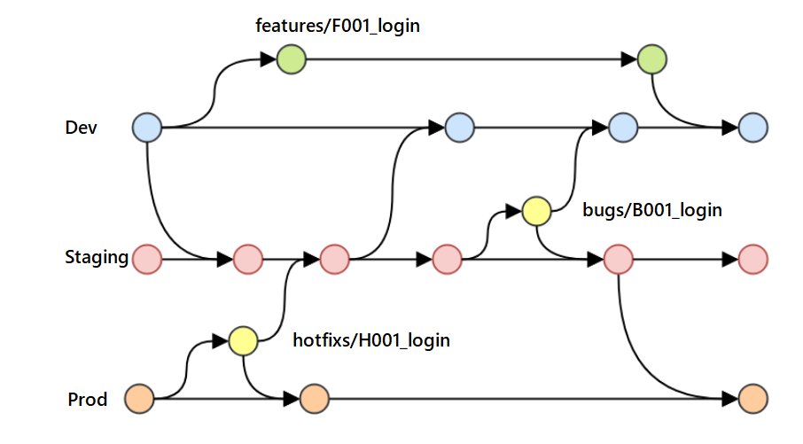

# Platform Kernel

Platform Kernel is a robust foundation for building .NET microservices, providing a set of shared libraries, design patterns, and templates. It emphasizes consistency, observability, and scalability across services through a well-defined Shared Kernel and standardized architectural patterns (CQRS, DDD).

## Table of Contents

- [Overview](#overview)
- [Stack and Requirements](#stack-and-requirements)
- [Project Structure](#project-structure)
- [Environment Setup](#environment-setup)
- [Scripts and Task Management](#scripts-and-task-management)
- [Environment Variables](#environment-variables)
- [Testing](#testing)
- [Git Convention](#git-convention)
- [Code Review Checklist](#code-review-checklist)
- [License](#license)
- [References](#references)

---

## Overview

The Platform Kernel serves as the backbone for multiple microservices, offering:

- **Shared Kernel**: Reusable modules for CQRS, Caching, Messaging (MassTransit/Rebus), Background Jobs (Hangfire), gRPC, ElasticSearch, Firebase Notifications, and more.
- **Blueprints**: Service templates for Clean Architecture and CQRS-based services (JHipster + .NET).
- **Observability**: Standardized logging (Serilog, Sentry, Seq) and distributed tracing.
- **Infrastructure**: Pre-configured Docker environments for PostgreSQL (+ TimescaleDB), Redis, RabbitMQ, MinIO, and Seq.
- **Quality Gates**: SonarQube integration with enforced code coverage (≥ 55%) and strict compiler analysis.

---

## Stack and Requirements

### Tech Stack

| Category | Technology |
|---|---|
| Language | C# 12 |
| Runtime | .NET 8.0 (locked — do NOT upgrade) |
| Web | ASP.NET Core |
| ORM | Entity Framework Core |
| Database | PostgreSQL, TimescaleDB |
| Object Storage | MinIO (S3-compatible) |
| Cache | Redis |
| Messaging | MassTransit 8.2.3 (locked), Rebus, RabbitMQ |
| Background Jobs | Hangfire |
| Search | Elasticsearch |
| Notifications | Firebase Cloud Messaging |
| RPC | gRPC |
| Workflow | Elsa Workflow |
| Observability | Serilog, Seq, Sentry, SonarQube |
| Package Manager | NuGet (via `dotnet restore`) |

### Requirements

1. **.NET 8 SDK** — [Install .NET 8](https://dotnet.microsoft.com/en-us/download/dotnet/8.0)
2. **Docker & Docker Compose** — required to run all infrastructure services
3. **Task CLI** _(optional)_ — `brew install go-task/tap/go-task` or see [taskfile.dev](https://taskfile.dev)
4. **Make** _(optional)_ — standard `make` utility
5. **SonarQube tools** _(optional, for code analysis)_:
   ```bash
   dotnet tool install --global dotnet-sonarscanner
   dotnet tool install --global coverlet.console
   dotnet tool install --global dotnet-coverage
   ```

---

## Project Structure

```
PlatformKernel/
├── docker/                        # Docker config files (db, sonar)
├── docs/                          # Architecture docs, ADRs, diagrams
├── src/
│   ├── shared-kernel/             # Reusable SharedKernel libraries
│   │   ├── SharedKernel.AppShared         # Common app bootstrap helpers
│   │   ├── SharedKernel.BulkInsert        # High-performance bulk insert (RepoDb)
│   │   ├── SharedKernel.BulkInsertPipeline# Pipeline-based bulk insert
│   │   ├── SharedKernel.Cache             # Distributed caching (Redis)
│   │   ├── SharedKernel.CQRS              # MediatR + Mediator CQRS abstractions
│   │   ├── SharedKernel.ElasticSearch     # Elasticsearch integration
│   │   ├── SharedKernel.Entity            # Base entities, auditing, soft-delete
│   │   ├── SharedKernel.Exception         # Unified exception handling
│   │   ├── SharedKernel.FirebaseNotification # Firebase Cloud Messaging
│   │   ├── SharedKernel.Grpc              # gRPC service base
│   │   ├── SharedKernel.Hangfire          # Background job management
│   │   ├── SharedKernel.IntegrationEvent  # Integration event contracts
│   │   ├── SharedKernel.MassTransit       # MassTransit messaging + outbox
│   │   ├── SharedKernel.Pagination        # Spring-style pagination
│   │   ├── SharedKernel.Rebus             # Rebus messaging + outbox
│   │   ├── SharedKernel.RepositoryBase    # Generic + Fluent repository patterns
│   │   ├── SharedKernel.Sentry            # Sentry error tracking
│   │   ├── SharedKernel.Serilog           # Serilog structured logging
│   │   ├── SharedKernel.ServiceBase       # Web API service bootstrap base
│   │   ├── SharedKernel.ServiceDefaults   # .NET Aspire service defaults
│   │   ├── SharedKernel.Specification     # Specification query pattern
│   │   ├── SharedKernel.UnitOfWork        # EF Core Unit of Work
│   │   └── SharedKernel.WorkflowEngineElsa# Elsa workflow orchestration
│   ├── blueprint-service/         # Service templates
│   │   ├── clean-architecture/    # Clean Architecture scaffold
│   │   ├── dotnet-backend-template/
│   │   ├── jhipster-blueprint-cqrs/
│   │   └── jhipster-blueprint-normal/
│   └── timescaledb-demo/          # Reference implementation for TimescaleDB
├── technical-design/              # Design docs per feature/domain
├── dependency-audit/              # CVE vulnerability audit tool
├── Directory.Build.props          # Global MSBuild properties
├── global.json                    # .NET SDK version pin
├── nuget.config                   # NuGet feed configuration
├── Taskfile.yml                   # Task CLI task definitions
├── Makefile                       # Make task definitions
├── docker-compose.yml             # Infrastructure services
└── PlatformKernel.sln             # Root solution file
```

---

## Environment Setup

### 1. Start Infrastructure (Docker)

All services require PostgreSQL, Redis, RabbitMQ, Seq, and MinIO to be running:

```bash
docker compose up -d
```

| Service | URL | Default Credentials |
|---|---|---|
| pgAdmin | http://localhost:5050 | `admin@localhost.com` / `admin.localhost` |
| Redis Commander | http://localhost:8081 | — |
| Seq (Logs) | http://localhost:5341 | — |
| MinIO Console | http://localhost:9011 | `minioadmin` / `minioadmin123` |
| RabbitMQ Management | http://localhost:15672 | <!-- TODO: confirm default credentials --> |

### 2. Restore and Build

```bash
dotnet restore
dotnet build --no-restore -warnaserror
```

Or use the task runners:

```bash
task build    # clean → restore → build → vulnerability check
make build    # restore → build → vulnerability check
```

### 3. Development Tools (VS Code / Rider)

Recommended VS Code extensions:
- **C# Dev Kit**
- **SonarLint**
- **EditorConfig**
- **REST Client**
- **Code Spell Checker**

---

## Scripts and Task Management

| Command | Description |
|---|---|
| `task build` / `make build` | Restore, build (warnings as errors), check vulnerabilities |
| `task clean` / `make clean` | Remove `bin`, `obj`, `node_modules`, `TestResults`, `.sonarqube` |
| `task dotnet-counters` | Monitor live .NET performance counters for a running service |
| `./sonar-analysis.sh` | Run SonarQube static analysis (Linux/macOS) |
| `./SonarAnalysis.ps1` | Run SonarQube static analysis (Windows) |
| `./delete_stale_branches.sh` | Delete merged/stale local git branches |
| `./dependency-audit/dependency-audit.sh` | Audit NuGet packages for known CVEs |

---

## Environment Variables

The `Makefile` and `Taskfile.yml` load variables from a `.env` file in the project root (create it locally — it is **not** committed).

Key variables referenced in `docker-compose.yml`:

| Variable | Default Value | Description |
|---|---|---|
| `POSTGRES_USER` | `postgres` | PostgreSQL root user |
| `POSTGRES_PASSWORD` | `01j6efde8q4q48crxe93crwxkc` | PostgreSQL root password |
| `MINIO_ROOT_USER` | `minioadmin` | MinIO root username |
| `MINIO_ROOT_PASSWORD` | `minioadmin123` | MinIO root password |
| `SEQ_API_KEY` | `01jErQ4kB7D11e78TyX92WqBN8` | API key for Seq log ingestion |

> **TODO**: Document additional `.env` variables required for application-level config (connection strings, Sentry DSN, Firebase credentials, etc.).

---

## Testing

### Run All Tests

```bash
dotnet test
```

### Run with Coverage (OpenCover format for SonarQube)

```bash
dotnet test --collect:"XPlat Code Coverage;Format=opencover" --no-build
```

Test projects follow the `{Module}.Test` naming convention and are co-located with their respective modules under `src/shared-kernel/` and `src/timescaledb-demo/`.

### Code Quality Analysis

Requires Docker services running and SonarQube tools installed:

```bash
./sonar-analysis.sh          # Linux/macOS
./SonarAnalysis.ps1          # Windows
```

> ⚠️ SonarQube enforces a **minimum 55% code coverage** gate. Tests must pass this threshold before merging.

---

## Git Convention



### General Rules

1. Subject line limited to **50 characters**.
2. Capitalize the first letter of the subject.
3. No period at the end of the subject.
4. Use **imperative mood** (`Add` not `Added`, `Fix` not `Fixed`).
5. Separate body from subject with a blank line.

### Semantic Commit Types

| Type | Purpose |
|---|---|
| `feat` | New feature |
| `fix` | Bug fix |
| `docs` | Documentation only changes |
| `style` | Formatting, whitespace (no logic change) |
| `refactor` | Code restructuring without behaviour change |
| `test` | Adding or updating tests |
| `chore` | Build scripts, CI, dependency updates |

---

## Code Review Checklist

- **Conventions**: Code follows C# 12 / .NET 8 style and project `.editorconfig` rules.
- **Typing**: Explicit types used; `var` only when type is obvious. `is null` over `== null`.
- **Nullability**: Nullable reference types respected; nulls handled explicitly.
- **Async**: All I/O uses `async`/`await` with `CancellationToken`.
- **Access Modifiers**: Types are `internal sealed` unless a broader scope is justified.
- **Architecture**:
  - Commands/Queries implement correct CQRS interfaces.
  - Integration events use the Transactional Outbox pattern (MassTransit or Rebus).
  - Repository logic extracted via Specifications where applicable.
- **Comments**: Up-to-date, explains *why* and *how*, not *what*.
- **DRY**: No unnecessary duplication.
- **Tests**: New logic accompanied by unit or integration tests; coverage maintained ≥ 55%.
- **No warnings**: `TreatWarningsAsErrors=true` — all compiler warnings must be resolved or explicitly suppressed.

---

## License

> **TODO**: Specify the license for this repository (e.g., MIT, Apache 2.0).

---

## References

- [Microsoft .NET 8 Documentation](https://learn.microsoft.com/en-us/dotnet/)
- [Clean Architecture — Uncle Bob](https://blog.cleancoder.com/uncle-bob/2012/08/13/the-clean-architecture.html)
- [CQRS Pattern — Martin Fowler](https://martinfowler.com/bliki/CQRS.html)
- [MassTransit Docs](https://masstransit.io/documentation/introduction)
- [Rebus Docs](https://github.com/rebus-org/Rebus/wiki)
- [Elsa Workflows](https://elsa-workflows.github.io/elsa-core/)
- [Taskfile](https://taskfile.dev)
- [ADR-001: Keep MassTransit 8.x](docs/adr-001-keep-masstransit-8x.md)
- [Messaging Alternatives Comparison](docs/messaging-alternatives-comparison.md)
- [TimescaleDB Guide](docs/timescaledb-guide.md)
