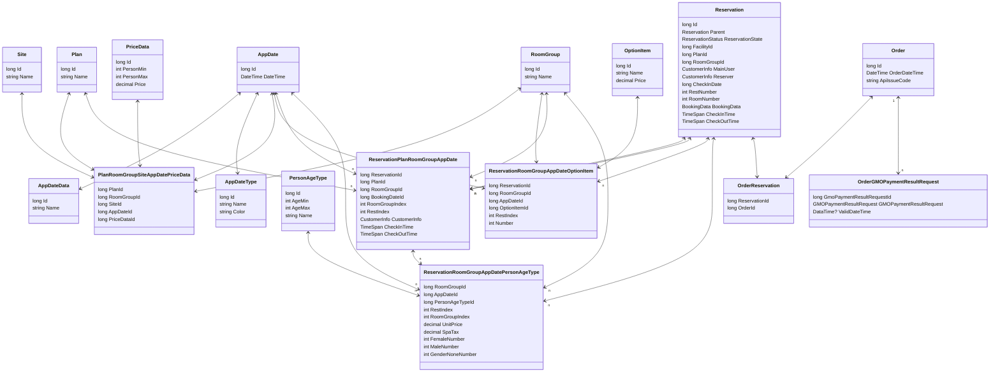

# Detail Design - Reservation - Database

## 1.Entity Relationship



## 2.Entity details

### 2.1 Entity Reservation

Store the information of reservation.

| No | Fields                                    | Description                                           |
|----|-------------------------------------------|-------------------------------------------------------|
| 1  | Id                                        | Primary key auto generated                            |
| 2  | FacilityId                                | Foreign key, Id of facility                           |
| 3  | PlanId                                    | Foreign key, Id of plan                               |
| 4  | RoomGroupId                               | Foreign key, Id of room group                         |
| 5  | MainUser                                  | Information of the customer                           |
| 6  | Reserver                                  | Information of the representative                     |
| 7  | Parent                                    | Reference to the parent reservation                   |
| 8  | CheckInDate                               | The date time customer will check in                  |
| 9  | CheckInTime                               | The time customer will check in                       |
| 10 | CheckOutTime                              | The time customer will check out                      |
| 11 | RestNumber                                | The number of resting days for the reservation        |
| 12 | RoomNumber                                | The number of rooms reserved                          |
| 13 | ReservationPlanRoomGroupAppDates          | The plan information of reservation                   |
| 14 | ReservationRoomGroupAppDatePersonAgeTypes | The person age type information of reservation        |
| 15 | ReservationRoomGroupAppDateOptionItems    | The option item information of reservation            |
| 16 | ReservationState                          | Current status of the reservation                     |
| 17 | BookingData                               | Detailed booking data associated with the reservation |

#### BookingData

Store data of booking such as person age type, prices, option, ... in json format

| No | Fields           | Description                                                             |
|----|------------------|-------------------------------------------------------------------------|
| 1  | Facility         | Facility information associated with the booking                        |
| 2  | Plan             | Plan information for the booking                                        |
| 3  | RoomGroup        | Room group details related to the booking                               |
| 4  | Site             | Site information where the booking was made                             |
| 5  | PlanQuestions    | List of questions related to the booking plan, if any                   |
| 6  | OptionQuestions  | List of optional questions associated with the booking, if any          |
| 7  | AppDates         | List of applicable dates for the booking, if any                        |
| 8  | PersonAgeTypes   | List of age types of the persons associated with the booking, if any    |
| 9  | SendMailState    | State of email communication for the booking                            |
| 10 | TotalRoomPrice   | Total price for the rooms booked                                        |
| 11 | TotalSpaTax      | Total spa tax applicable to the booking                                 |
| 12 | TotalOptionPrice | Total price for any additional options selected                         |
| 13 | UsedPoint        | Points used for discounts during the booking                            |
| 14 | TotalDiscount    | Total discount applied to the booking                                   |
| 15 | AllTotalPrice    | Final total price after applying discounts                              |
| 16 | TotalPrice       | Total calculated price, including room price, spa tax, and option price |

For example:

```json
{
  "Plan": {
    "Id": 6,
    "Meta": {
      "Meal": null,
      "Other": null,
      "SpaTax": null,
      "Payment": null,
      "Summary": null,
      "Heading1": null,
      "Cancelling": null,
      "BarrierFree": null,
      "Description": null,
      "SpaTaxTable": null,
      "CancellingTable": null
    },
    "Name": "Plan 1",
    "Files": [],
    "IsOnLinePayment": true,
    "IsOnSidePayment": true
  },
  "Site": {
    "Id": 1,
    "Name": "Site"
  },
  "AppDates": [
    {
      "Price": 1600.0,
      "Rooms": [
        {
          "SpaTax": 0.0,
          "Persons": 2,
          "RoomIndex": 0,
          "RoomPrice": 800.0,
          "MalePersons": 1,
          "OptionItems": [],
          "CustomerInfo": {
            "Kana": "Kana 1",
            "Name": "Full name 1"
          },
          "PricePeoples": [
            {
              "SpaTax": 0.0,
              "Persons": 2,
              "RoomPrice": 400.0,
              "MalePersons": 1,
              "NonePersons": 0,
              "FemalePersons": 1,
              "PersonAgeType": {
                "Id": null,
                "Name": null,
                "AgeMax": null,
                "AgeMin": null,
                "IsMain": null
              }
            }
          ],
          "FemalePersons": 1,
          "TotalOptionPrice": 0.0
        },
        {
          "SpaTax": 0.0,
          "Persons": 2,
          "RoomIndex": 1,
          "RoomPrice": 800.0,
          "MalePersons": 1,
          "OptionItems": [],
          "CustomerInfo": {
            "Kana": "Kana 2",
            "Name": "Full name 2"
          },
          "PricePeoples": [
            {
              "SpaTax": 0.0,
              "Persons": 2,
              "RoomPrice": 400.0,
              "MalePersons": 1,
              "NonePersons": 0,
              "FemalePersons": 1,
              "PersonAgeType": {
                "Id": null,
                "Name": null,
                "AgeMax": null,
                "AgeMin": null,
                "IsMain": null
              }
            }
          ],
          "FemalePersons": 1,
          "TotalOptionPrice": 0.0
        }
      ],
      "SpaTax": 0.0,
      "AppDateId": 20241204,
      "RestIndex": 0,
      "TotalPrice": 1600.0,
      "OptionPrice": 0.0
    },
    {
      "Price": 1800.0,
      "Rooms": [
        {
          "SpaTax": 0.0,
          "Persons": 2,
          "RoomIndex": 0,
          "RoomPrice": 900.0,
          "MalePersons": 1,
          "OptionItems": [],
          "CustomerInfo": {
            "Kana": "Kana 1",
            "Name": "Full name 1"
          },
          "PricePeoples": [
            {
              "SpaTax": 0.0,
              "Persons": 2,
              "RoomPrice": 450.0,
              "MalePersons": 1,
              "NonePersons": 0,
              "FemalePersons": 1,
              "PersonAgeType": {
                "Id": null,
                "Name": null,
                "AgeMax": null,
                "AgeMin": null,
                "IsMain": null
              }
            }
          ],
          "FemalePersons": 1,
          "TotalOptionPrice": 0.0
        },
        {
          "SpaTax": 0.0,
          "Persons": 2,
          "RoomIndex": 1,
          "RoomPrice": 900.0,
          "MalePersons": 1,
          "OptionItems": [],
          "CustomerInfo": {
            "Kana": "Kana 2",
            "Name": "Full name 2"
          },
          "PricePeoples": [
            {
              "SpaTax": 0.0,
              "Persons": 2,
              "RoomPrice": 450.0,
              "MalePersons": 1,
              "NonePersons": 0,
              "FemalePersons": 1,
              "PersonAgeType": {
                "Id": null,
                "Name": null,
                "AgeMax": null,
                "AgeMin": null,
                "IsMain": null
              }
            }
          ],
          "FemalePersons": 1,
          "TotalOptionPrice": 0.0
        }
      ],
      "SpaTax": 0.0,
      "AppDateId": 20241205,
      "RestIndex": 1,
      "TotalPrice": 1800.0,
      "OptionPrice": 0.0
    }
  ],
  "Facility": {
    "Id": null,
    "Name": "Test",
    "Address": "Address1 Address2 Address3 Address4",
    "Address1": "Address1",
    "Address2": "Address2",
    "Address3": "Address3",
    "Address4": "Address4",
    "IsOnLinePayment": null,
    "IsOnSidePayment": null,
    "CanOnLinePayment": null
  },
  "RoomGroup": {
    "Id": 1,
    "Name": "Room group 1",
    "Files": [],
    "CapacityMax": 600,
    "CapacityMin": 4,
    "IsEnabledSmoking": false
  },
  "UsedPoint": 0,
  "TotalPrice": 3400.0,
  "TotalSpaTax": 0.0,
  "AllTotalPrice": 3400.0,
  "PlanQuestions": null,
  "SendMailState": {
    "BookingCancellationFeeReminderSend": null,
    "BookingCancellationFeeReminderSent": null,
    "BookingReminderOfUpcomingCheckInDateSend": null,
    "BookingReminderOfUpcomingCheckInDateSent": null
  },
  "TotalDiscount": 0.0,
  "PersonAgeTypes": [
    {
      "Id": 1,
      "Name": "大人",
      "AgeMax": null,
      "AgeMin": 18,
      "IsMain": true,
      "PersonAgeTypeSpaTaxDatas": [
        {
          "Tax": 200,
          "PriceMax": 0,
          "PriceMin": 0
        }
      ]
    },
    {
      "Id": 2,
      "Name": "子供",
      "AgeMax": 17,
      "AgeMin": 6,
      "IsMain": false,
      "PersonAgeTypeSpaTaxDatas": [
        {
          "Tax": 0,
          "PriceMax": 0,
          "PriceMin": 0
        }
      ]
    },
    {
      "Id": 3,
      "Name": "幼児(食事有・布団有)",
      "AgeMax": 5,
      "AgeMin": 0,
      "IsMain": false,
      "PersonAgeTypeSpaTaxDatas": [
        {
          "Tax": 0,
          "PriceMax": 0,
          "PriceMin": 0
        }
      ]
    },
    {
      "Id": 4,
      "Name": "幼児(食事有・布団無)",
      "AgeMax": 5,
      "AgeMin": 0,
      "IsMain": false,
      "PersonAgeTypeSpaTaxDatas": [
        {
          "Tax": 0,
          "PriceMax": 0,
          "PriceMin": 0
        }
      ]
    },
    {
      "Id": 5,
      "Name": "幼児(食事無・布団有)",
      "AgeMax": 5,
      "AgeMin": 0,
      "IsMain": false,
      "PersonAgeTypeSpaTaxDatas": [
        {
          "Tax": 0,
          "PriceMax": 0,
          "PriceMin": 0
        }
      ]
    },
    {
      "Id": 6,
      "Name": "幼児(食事無・布団無)",
      "AgeMax": 5,
      "AgeMin": 0,
      "IsMain": false,
      "PersonAgeTypeSpaTaxDatas": [
        {
          "Tax": 0,
          "PriceMax": 0,
          "PriceMin": 0
        }
      ]
    }
  ],
  "TotalRoomPrice": 3400.0,
  "OptionQuestions": null,
  "TotalOptionPrice": 0.0
}
```

### 2.2 Entity OrderReservation

Store data of order when create booking

| No | Fields        | Description                    |
|----|---------------|--------------------------------|
| 1  | ReservationId | Foreign key, Id of reservation |
| 2  | OrderId       | Foreign key, Id of order       |

### 2.3 Entity Order

Store data of order when create booking

| No | Fields        | Description                                           |
|----|---------------|-------------------------------------------------------|
| 1  | Id            | Primary key auto generated                            |
| 2  | OrderDateTime | Date time when the order was created                  |
| 3  | ApiIssueCode  | Code representing an issue related to the API, if any |

### 2.4 Entity OrderGMOPaymentResultRequest

Store data of OrderGMOPaymentResultRequest in GMO payment

| No | Fields                    | Description                                                           |
|----|---------------------------|-----------------------------------------------------------------------|
| 1  | GmoPaymentResultRequestId | Foreign key, Id of GMOPaymentResultRequest                            |
| 2  | GMOPaymentResultRequest   | The GMO payment result request details                                |
| 3  | ValidDateTime             | The date and time when the request is considered valid, if applicable |

### 2.5 Entity AppDate

Store the date time of special dates.

| No | Fields   | Description                                                      |
|----|----------|------------------------------------------------------------------|
| 1  | Id       | Primary key generated from DateTime field with format "yyyyMMdd" |
| 2  | DateTime | The date time of the app date                                    |

### 2.6 Entity AppDateData

Store the information of app dates.

| No | Fields | Description                |
|----|--------|----------------------------|
| 1  | Id     | Primary key auto generated |
| 2  | Name   | The name of the app date   |

### 2.7 Entity AppDateType

Store the type name and display color of app dates.

| No | Fields | Description                   |
|----|--------|-------------------------------|
| 1  | Id     | Primary key auto generated    |
| 2  | Name   | The name of the app date type |
| 3  | Color  | The color of app date type    |

### 2.8 Entity Plan

Store information of plans.

| No | Fields | Description                |
|----|--------|----------------------------|
| 1  | Id     | Primary key auto generated |
| 2  | Name   | The name of the plan       |

### 2.9 Entity Site

Store information of sites.

| No | Fields | Description                |
|----|--------|----------------------------|
| 1  | Id     | Primary key auto generated |
| 2  | Name   | The name of the site       |

### 2.10 Entity RoomGroup

Store information of room groups.

| No | Fields | Description                |
|----|--------|----------------------------|
| 1  | Id     | Primary key auto generated |
| 2  | Name   | The name of the room group |

### 2.11 Entity PriceData

Store information of price data.

| No | Fields    | Description                                   |
|----|-----------|-----------------------------------------------|
| 1  | Id        | Primary key auto generated                    |
| 2  | PersonMin | The minimum number of person allowed          |
| 3  | PersonMax | The maximum number of person allowed          |
| 4  | Price     | The price in range of PersonMin and PersonMax |

### 2.12 Entity PersonAgeType

Store information of person age types.

| No | Fields | Description                       |
|----|--------|-----------------------------------|
| 1  | Id     | Primary key auto generated        |
| 2  | AgeMin | The minimum age of person allowed |
| 3  | AgeMax | The maximum age of person allowed |
| 4  | Name   | The name of person age type       |

### 2.13 Entity OptionItem

Store information of option item.

| No | Fields | Description                |
|----|--------|----------------------------|
| 1  | Id     | Primary key auto generated |
| 2  | Name   | The name of option item    |
| 3  | Price  | The price of option item   |

### 2.14 Entity ReservationRoomGroupAppDateOptionItem

Store the information of option items in reservation matched with room group and app date.

| No | Fields        | Description                                           |
|----|---------------|-------------------------------------------------------|
| 1  | ReservationId | Foreign key, Id of reservation                        |
| 2  | RoomGroupId   | Foreign key, Id of room group                         |
| 3  | AppDateId     | Foreign key, Id of app date                           |
| 4  | OptionItem    | Foreign key, Id of option item                        |
| 5  | RestIndex     | The index indicating the number of nights in the stay |
| 6  | Number        | The number of option items in reservation             |

### 2.15 Entity ReservationPlanRoomGroupAppDate

Store the information of plans in reservation matched with room group and app date.

| No | Fields         | Description                                           |
|----|----------------|-------------------------------------------------------|
| 1  | ReservationId  | Foreign key, Id of reservation                        |
| 2  | PlanId         | Foreign key, Id of plan                               |
| 3  | RoomGroupId    | Foreign key, Id of room group                         |
| 4  | BookingDateId  | Foreign key, Id of app date                           |
| 5  | RoomGroupIndex | The index indicating the number of rooms in the stay  |
| 6  | RestIndex      | The index indicating the number of nights in the stay |
| 7  | CustomerInfo   | The information of the representative                 |
| 8  | CheckInTime    | The time customer will check in                       |
| 9  | CheckOutTime   | The time customer will check out                      |

### 2.16 Entity ReservationRoomGroupAppDatePersonAgeType

Store the information of person age type in reservation matched with room group and app date.

| No | Fields           | Description                                           |
|----|------------------|-------------------------------------------------------|
| 1  | RoomGroupId      | Foreign key, Id of room group                         |
| 2  | AppDateId        | Foreign key, Id of app date                           |
| 3  | PersonAgeTypeId  | Foreign key, Id of person age type                    |
| 4  | RoomGroupIndex   | The index indicating the number of rooms in the stay  |
| 5  | RestIndex        | The index indicating the number of nights in the stay |
| 6  | UnitPrice        | The price of each person                              |
| 7  | SpaTax           | The tax of each person                                |
| 8  | FemaleNumber     | The number of female adult customer                   |
| 9  | MaleNumber       | The number of male adult customer                     |
| 10 | GenderNoneNumber | The number of children                                |
