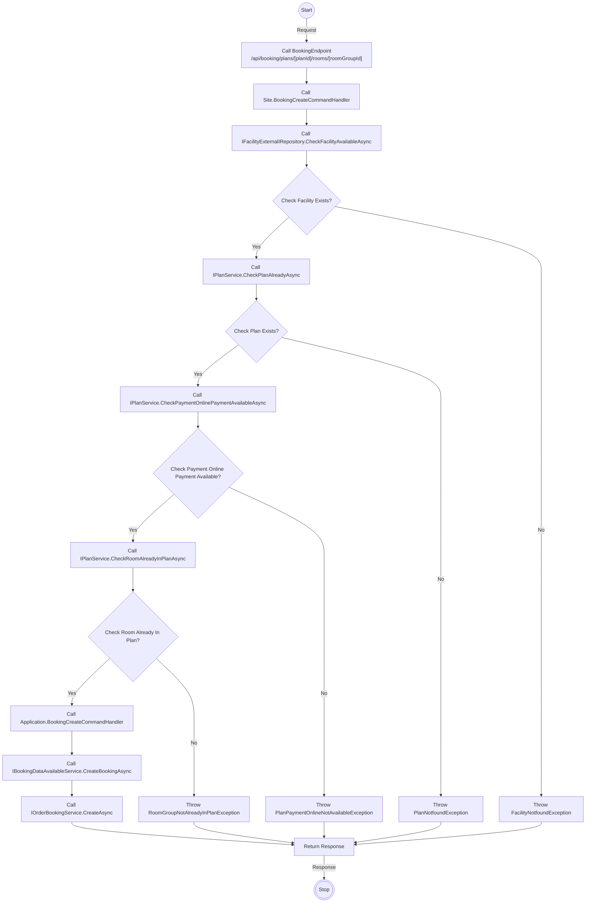
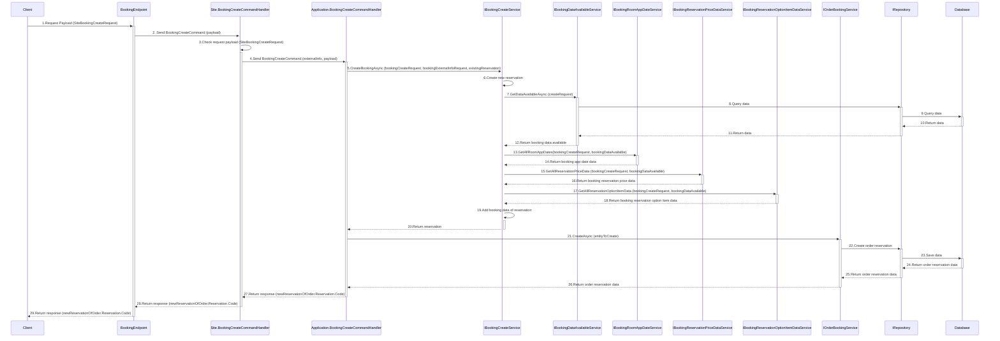

# Detail Design - Reservation - Guest - Local Payment

------------------------------------------------------------------

## 1. Activity Diagram

> **Note**: The **`Activity Diagram`** illustrate the sequence of activities and interactions between different components during the
> booking create process by guest.
> The **`BookingEndPoint` `CreateBookingAsync`** use input parameters **`SiteBookingCreateRequest`** from body and **`planId`**, *
*`roomGroupId`** from route to filter the returned data.
> The **`planId`** and **`roomGroupId`** in the **`BookingEndPoint`** are parameters from route.

### 1.1 Request (SiteBookingCreateRequest)

#### **SiteBookingCreateRequest**

| No | Parameter       | Description                                               |
|----|-----------------|-----------------------------------------------------------|
| 1  | CheckInDate     | The check-in date (required).                             |
| 2  | CheckInTime     | The check-in time (required).                             |
| 3  | CheckOutTime    | The check-out time (required).                            |
| 4  | PaymentType     | The payment method of booking (required).                 |
| 5  | Adjust          | The extra information of reservation (required)           |
| 6  | PlanQuestions   | The questions about plan (optional).                      |
| 7  | OptionQuestions | The questions about option item (optional).               |
| 8  | BookingDate     | The date when create booking (default = DateTime.UtcNow). |

> **Note**: Ensure that the **`CheckInTime`** and **`CheckOutTime`** are in the correct format **`mm:ss`** and that all required parameters
> are provided.

#### **Adjust Parameter Detail**

| No | Parameter           | Description                                                      |
|----|---------------------|------------------------------------------------------------------|
| 1  | IsAgree             | Indicate the adjust is agreed or not                             |
| 2  | CheckInTime         | The check-in time.                                               |
| 3  | NumberOfNights      | The number of nights to stay.                                    |
| 4  | NumberOfRooms       | The number of rooms to stay.                                     |
| 5  | FreeInput           | The memo information of reservation (optional).                  |
| 6  | Reserver            | The information of the representative.                           |
| 7  | MainUser            | The information of the customer.                                 |
| 8  | NightPeoples        | The information of person age type group by room and night.      |
| 9  | NightOptions        | The information of option item age type group by room and night. |
| 10 | RoomRepresentatives | The information of rooms in reservation.                         |

> **Note**: Ensure that the **`CheckInTime`** are in the correct format **`mm:ss`**.
**`NightPeoples`** parameter indicates a list of **`NightPeopleOfReservationAdjustRequest`**.
**`NightOptions`** parameter indicates a list of **`NightOptionOfReservationAdjustRequest`**. **`RoomRepresentatives`** parameter indicates
> a list of **`RoomRepresentativeOfReservationAdjustRequest`**.

##### **NightPeopleOfReservationAdjustRequest Detail**

| No | Parameter | Description                                        |
|----|-----------|----------------------------------------------------|
| 1  | AppDateId | The app date of night.                             |
| 2  | Rooms     | The person age type information of rooms in night. |

> **Note**: **`Rooms`** parameter indicates a list of **`RoomNightOfReservationAdjustRequest`**.

###### **RoomNightOfReservationAdjustRequest Detail**

| No | Parameter | Description                                 |
|----|-----------|---------------------------------------------|
| 1  | RoomIndex | The index of the room in night.             |
| 2  | Peoples   | The information of person age type in room. |

> **Note**: **`Peoples`** parameter indicates a list of **`PeopleOfReservationAdjustRequest`**.

###### **PeopleOfReservationAdjustRequest Detail**

| No | Parameter       | Description                                                          |
|----|-----------------|----------------------------------------------------------------------|
| 1  | PersonAgeTypeId | The id of person age type.                                           |
| 2  | NumberOfPeoples | The number of people in range of min and max age of person age type. |
| 2  | Gender          | The gender of person age type in room.                               |

##### **NightOptionOfReservationAdjustRequest Detail**

| No | Parameter | Description                                    |
|----|-----------|------------------------------------------------|
| 1  | AppDateId | The app date of night.                         |
| 2  | Rooms     | The option item information of rooms in night. |

> **Note**: **`Rooms`** parameter indicates a list of **`RoomOptionOfReservationAdjustRequest`**.

###### **RoomOptionOfReservationAdjustRequest Detail**

| No | Parameter   | Description                             |
|----|-------------|-----------------------------------------|
| 1  | RoomIndex   | The index of the room in night.         |
| 2  | OptionItems | The information of option item in room. |

> **Note**: **`OptionItems`** parameter indicates a list of **`OptionOfReservationAdjustRequest`**.

###### **OptionOfReservationAdjustRequest Detail**

| No | Parameter    | Description                        |
|----|--------------|------------------------------------|
| 1  | OptionItemId | The id of option item.             |
| 2  | Number       | The number of option item in room. |

##### **RoomRepresentativeOfReservationAdjustRequest Detail**

| No | Parameter | Description                                    |
|----|-----------|------------------------------------------------|
| 1  | AppDateId | The app date of night.                         |
| 2  | Rooms     | The option item information of rooms in night. |

### 1.2 Response (string)

The **`BookingEndPoint` `CreateBookingAsync`** return the code of the reservation created in type of string.

## 2. Sequence Diagram

### Guest Booking Reservation Create Sequence Diagram

### Description

| No. | Activity                                                                   | Description                                                                                                                                                     |
|-----|----------------------------------------------------------------------------|-----------------------------------------------------------------------------------------------------------------------------------------------------------------|
| 1   | Client → BookingEndpoint                                                   | The client sends a `SiteBookingCreateRequest` payload to the `BookingEndpoint`.                                                                                 |
| 2   | BookingEndpoint → Site.BookingCreateCommandHandler                         | `BookingEndpoint` forwards the request as a `BookingCreateCommand` with the payload.                                                                            |
| 3   | Site.BookingCreateCommandHandler → Site.BookingCreateCommandHandler        | The `Site.BookingCreateCommandHandler` checks the validity of the `SiteBookingCreateRequest` payload.                                                           |
| 4   | Site.BookingCreateCommandHandler → Application.BookingCreateCommandHandler | The `Site.BookingCreateCommandHandler` forwards the `BookingCreateCommand` with external info and payload to the application handler.                           |
| 5   | Application.BookingCreateCommandHandler → IBookingCreateService            | The `Application.BookingCreateCommandHandler` calls `CreateBookingAsync` with `bookingCreateRequest`, `bookingExternalInfoRequest`, and `existingReservation`.  |
| 6   | IBookingCreateService → IBookingCreateService                              | The `IBookingCreateService` creates a new reservation.                                                                                                          |
| 7   | IBookingCreateService → IBookingDataAvailableService                       | The `IBookingCreateService` calls `GetDataAvailableAsync` with the `createRequest`.                                                                             |
| 8   | IBookingDataAvailableService → IRepository                                 | The `IBookingDataAvailableService` queries data using the `IRepository`.                                                                                        |
| 9   | IRepository → Database                                                     | The `IRepository` queries the database for the required data.                                                                                                   |
| 10  | Database → IRepository                                                     | The database returns the queried data to the `IRepository`.                                                                                                     |
| 11  | IRepository → IBookingDataAvailableService                                 | The `IRepository` sends the retrieved data back to the `IBookingDataAvailableService`.                                                                          |
| 12  | IBookingDataAvailableService → IBookingCreateService                       | The `IBookingDataAvailableService` returns booking data availability details to the `IBookingCreateService`.                                                    |
| 13  | IBookingCreateService → IBookingRoomAppDateService                         | The `IBookingCreateService` calls `GetAllRoomAppDates` with `bookingCreateRequest` and `bookingDataAvailable`.                                                  |
| 14  | IBookingRoomAppDateService → IBookingCreateService                         | The `IBookingRoomAppDateService` returns the booking application date data.                                                                                     |
| 15  | IBookingCreateService → IBookingReservationPriceDataService                | The `IBookingCreateService` calls `GetAllReservationPriceData` with `bookingCreateRequest` and `bookingDataAvailable`.                                          |
| 16  | IBookingReservationPriceDataService → IBookingCreateService                | The `IBookingReservationPriceDataService` returns the reservation price data.                                                                                   |
| 17  | IBookingCreateService → IBookingReservationOptionItemDataService           | The `IBookingCreateService` calls `GetAllReservationOptionItemData` with `bookingCreateRequest` and `bookingDataAvailable`.                                     |
| 18  | IBookingReservationOptionItemDataService → IBookingCreateService           | The `IBookingReservationOptionItemDataService` returns the reservation option item data.                                                                        |
| 19  | IBookingCreateService → IBookingCreateService                              | The `IBookingCreateService` adds the reservation data to the booking.                                                                                           |
| 20  | IBookingCreateService → Application.BookingCreateCommandHandler            | The `IBookingCreateService` returns the reservation details to the `Application.BookingCreateCommandHandler`.                                                   |
| 21  | Application.BookingCreateCommandHandler → IOrderBookingService             | The `Application.BookingCreateCommandHandler` calls `CreateAsync` in the `IOrderBookingService` with `entityToCreate`.                                          |
| 22  | IOrderBookingService → IRepository                                         | The `IOrderBookingService` creates an order reservation using the `IRepository`.                                                                                |
| 23  | IRepository → Database                                                     | The `IRepository` saves the order reservation data to the database.                                                                                             |
| 24  | Database → IRepository                                                     | The database returns the saved order reservation data to the `IRepository`.                                                                                     |
| 25  | IRepository → IOrderBookingService                                         | The `IRepository` sends the saved order reservation data back to the `IOrderBookingService`.                                                                    |
| 26  | IOrderBookingService → Application.BookingCreateCommandHandler             | The `IOrderBookingService` returns the order reservation data back to the `Application.BookingCreateCommandHandler`.                                            |
| 27  | Application.BookingCreateCommandHandler → Site.BookingCreateCommandHandler | The `Application.BookingCreateCommandHandler` sends the response containing `newReservationOfOrder.Reservation.Code` to the `Site.BookingCreateCommandHandler`. |
| 28  | Site.BookingCreateCommandHandler → BookingEndpoint                         | The `Site.BookingCreateCommandHandler` returns the response containing `newReservationOfOrder.Reservation.Code` to the `BookingEndpoint`.                       |
| 29  | BookingEndpoint → Client                                                   | The `BookingEndpoint` sends the final response containing `newReservationOfOrder.Reservation.Code` back to the client.                                          |

> **Note**: The `Sequence Diagram` illustrates the interactions between the client, guest endpoint, command handler, services, repository
> and database during the booking create process by guest.
