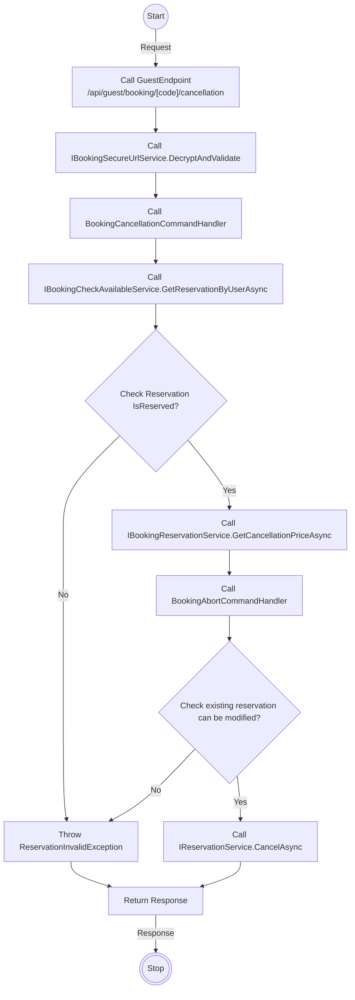
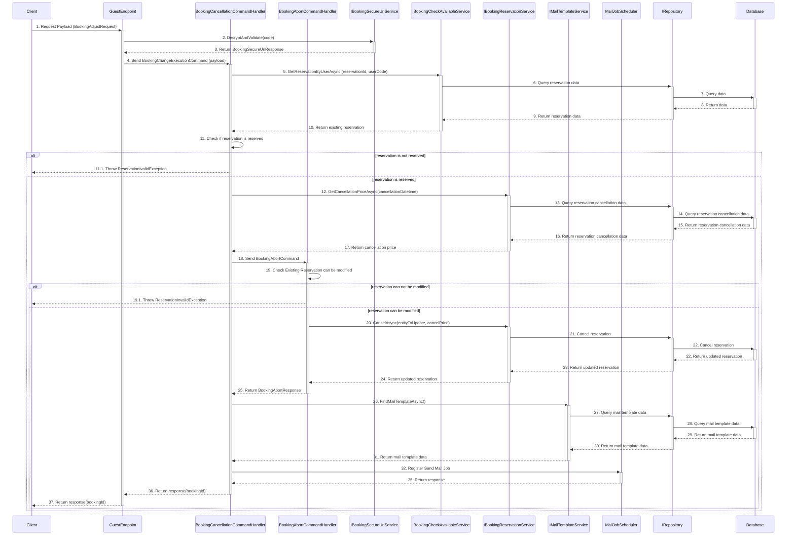

# Detail Design - Reservation Cancellation - Guest - Local Payment

------------------------------------------------------------------

## 1. Activity Diagram

> **Note**: The **`Activity Diagram`** illustrate the sequence of activities and interactions between different components during the
> booking change process by guest.
> The **`GuestEndPoint` `CancellationOfReservation`** use input parameters **`BookingCancellationRequest`** from body and **`code`** from
> route to filter existing reservation and adjust.
> The **`code`** in the **`GuestEndPoint`** is parameter from route.

### 1.1. Request (BookingCancellationRequest)

#### **BookingCancellationRequest Detail**

| No | Parameter | Description                                  |
|----|-----------|----------------------------------------------|
| 1  | Id        | Indicate the ID of the reservation to cancel |

### 1.2 Response

The **`GuestEndPoint` `CancellationOfReservation`** return code 204 no content with booking id in header when change execute successfully.

## 2. Sequence Diagram

### Guest Booking Reservation Cancellation Sequence Diagram

### Description

| No.  | Activity                                                              | Description                                                                                                                         |
|------|-----------------------------------------------------------------------|-------------------------------------------------------------------------------------------------------------------------------------|
| 1    | Client → GuestEndpoint                                                | The client sends a request payload (`BookingAdjustRequest`) to the GuestEndpoint.                                                   |
| 2    | GuestEndpoint → IBookingSecureUrlService                              | The GuestEndpoint calls `DecryptAndValidate(code)` to decrypt and validate the secure URL code.                                     |
| 3    | IBookingSecureUrlService → GuestEndpoint                              | The service returns a `BookingSecureUrlResponse` to the GuestEndpoint.                                                              |
| 4    | GuestEndpoint → BookingCancellationCommandHandler                     | The GuestEndpoint sends a `BookingChangeExecutionCommand` with the payload to the command handler.                                  |
| 5    | BookingCancellationCommandHandler → IBookingCheckAvailableService     | The command handler calls `GetReservationByUserAsync` to retrieve reservation details by reservation ID and user code.              |
| 6    | IBookingCheckAvailableService → IRepository                           | The service queries the repository for reservation data.                                                                            |
| 7    | IRepository → Database                                                | The repository queries the database for reservation data.                                                                           |
| 8    | Database → IRepository                                                | The database returns the reservation data to the repository.                                                                        |
| 9    | IRepository → IBookingCheckAvailableService                           | The repository returns the reservation data to the service.                                                                         |
| 10   | IBookingCheckAvailableService → BookingCancellationCommandHandler     | The service returns the reservation details to the command handler.                                                                 |
| 11   | BookingCancellationCommandHandler → BookingCancellationCommandHandler | The handler checks if the reservation is reserved.                                                                                  |
| 11.1 | BookingCancellationCommandHandler → Client                            | If the reservation is not reserved, the handler throws a `ReservationInvalidException`.                                             |
| 12   | BookingCancellationCommandHandler → IBookingReservationService        | If the reservation is reserved, the handler calls `GetCancellationPriceAsync` to retrieve the cancellation price based on the date. |
| 13   | IBookingReservationService → IRepository                              | The service queries the repository for cancellation data.                                                                           |
| 14   | IRepository → Database                                                | The repository queries the database for cancellation data.                                                                          |
| 15   | Database → IRepository                                                | The database returns the cancellation data to the repository.                                                                       |
| 16   | IRepository → IBookingReservationService                              | The repository returns the cancellation data to the service.                                                                        |
| 17   | IBookingReservationService → BookingCancellationCommandHandler        | The service returns the cancellation price to the handler.                                                                          |
| 18   | BookingCancellationCommandHandler → BookingAbortCommandHandler        | The handler sends a `BookingAbortCommand` to the `BookingAbortCommandHandler` to proceed with cancellation.                         |
| 19   | BookingAbortCommandHandler → BookingAbortCommandHandler               | The handler checks if the existing reservation can be modified.                                                                     |
| 19.1 | BookingAbortCommandHandler → Client                                   | If the reservation cannot be modified, the handler throws a `ReservationInvalidException`.                                          |
| 20   | BookingAbortCommandHandler → IBookingReservationService               | If the reservation can be modified, the handler calls `CancelAsync` to cancel the reservation.                                      |
| 21   | IBookingReservationService → IRepository                              | The service calls the repository to cancel the reservation.                                                                         |
| 22   | IRepository → Database                                                | The repository sends the cancel request to the database to update the reservation status.                                           |
| 23   | Database → IRepository                                                | The database returns the updated reservation data to the repository.                                                                |
| 24   | IRepository → IBookingReservationService                              | The repository returns the updated reservation data to the service.                                                                 |
| 25   | IBookingReservationService → BookingAbortCommandHandler               | The service returns the updated reservation to the handler.                                                                         |
| 26   | BookingAbortCommandHandler → BookingCancellationCommandHandler        | The handler returns the `BookingAbortResponse` to the `BookingCancellationCommandHandler`.                                          |
| 27   | BookingCancellationCommandHandler → IMailTemplateService              | The handler calls `FindMailTemplateAsync` to fetch the appropriate mail template.                                                   |
| 28   | IMailTemplateService → IRepository                                    | The service queries the repository for mail template data.                                                                          |
| 29   | IRepository → Database                                                | The repository queries the database for mail template data.                                                                         |
| 30   | Database → IRepository                                                | The database returns the mail template data to the repository.                                                                      |
| 31   | IRepository → IMailTemplateService                                    | The repository returns the mail template data to the service.                                                                       |
| 32   | IMailTemplateService → BookingCancellationCommandHandler              | The service returns the mail template data to the handler.                                                                          |
| 33   | BookingCancellationCommandHandler → MailJobScheduler                  | The handler registers a mail job to send an email.                                                                                  |
| 35   | MailJobScheduler → BookingCancellationCommandHandler                  | The scheduler returns the response after registering the mail job.                                                                  |
| 36   | BookingCancellationCommandHandler → GuestEndpoint                     | The handler returns the booking ID to the GuestEndpoint.                                                                            |
| 37   | GuestEndpoint → Client                                                | The GuestEndpoint returns the booking ID to the client.                                                                             |

> **Note**: The `Sequence Diagram` illustrates the interactions between the client, guest endpoint, command handler, services, repository
> and database during the booking cancellation process by guest.
