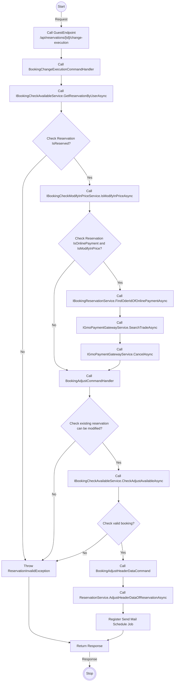
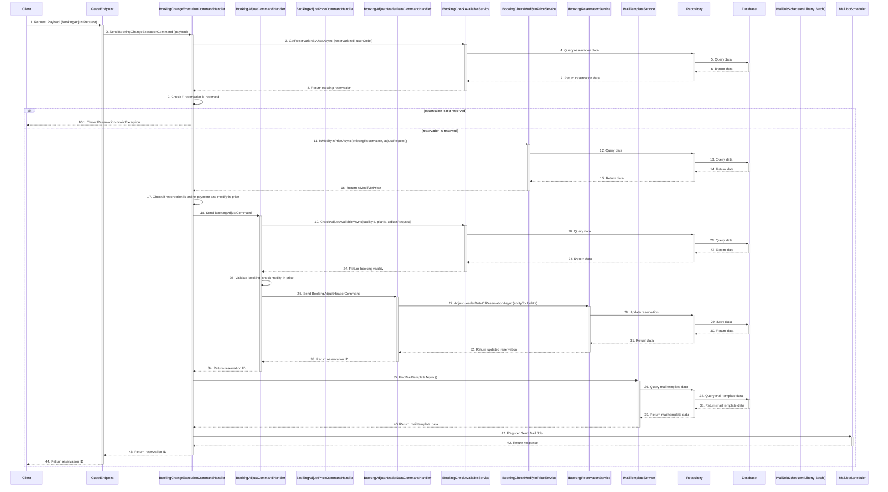

# Detail Design - Reservation Change - Manager - Local Payment

------------------------------------------------------------------

## 1. Activity Diagram

> **Note**: The **`Activity Diagram`** illustrate the sequence of activities and interactions between different components during the booking change process by guest.
> The **`GuestEndPoint` `ChangeExecutionOfReservation`** use input parameters **`BookingAdjustRequest`** from body and **`code`** from route to filter existing reservation and adjust.
> The **`code`** in the **`GuestEndPoint`** is parameter from route.

### 1.1. Request (BookingAdjustRequest)

#### **BookingAdjustRequest Detail**

| No | Parameter           | Description                                                      |
|----|---------------------|------------------------------------------------------------------|
| 1  | IsAgree             | Indicate the adjust is agreed or not                             |
| 2  | CheckInTime         | The check-in time.                                               |
| 3  | NumberOfNights      | The number of nights to stay.                                    |
| 4  | NumberOfRooms       | The number of rooms to stay.                                     |
| 5  | FreeInput           | The memo information of reservation (optional).                  |
| 6  | Reserver            | The information of the representative.                           |
| 7  | MainUser            | The information of the customer.                                 |
| 8  | NightPeoples        | The information of person age type group by room and night.      |
| 9  | NightOptions        | The information of option item age type group by room and night. |
| 10 | RoomRepresentatives | The information of rooms in reservation.                         |

> **Note**: Ensure that the **`CheckInTime`** are in the correct format **`mm:ss`**.
**`NightPeoples`** parameter indicates a list of **`NightPeopleOfReservationAdjustRequest`**.
**`NightOptions`** parameter indicates a list of **`NightOptionOfReservationAdjustRequest`**. **`RoomRepresentatives`** parameter indicates a list of **`RoomRepresentativeOfReservationAdjustRequest`**.

##### **NightPeopleOfReservationAdjustRequest Detail**

| No | Parameter | Description                                        |
|----|-----------|----------------------------------------------------|
| 1  | AppDateId | The app date of night.                             |
| 2  | Rooms     | The person age type information of rooms in night. |

> **Note**: **`Rooms`** parameter indicates a list of **`RoomNightOfReservationAdjustRequest`**.

###### **RoomNightOfReservationAdjustRequest Detail**

| No | Parameter | Description                                 |
|----|-----------|---------------------------------------------|
| 1  | RoomIndex | The index of the room in night.             |
| 2  | Peoples   | The information of person age type in room. |

> **Note**: **`Peoples`** parameter indicates a list of **`PeopleOfReservationAdjustRequest`**.

###### **PeopleOfReservationAdjustRequest Detail**

| No | Parameter       | Description                                                          |
|----|-----------------|----------------------------------------------------------------------|
| 1  | PersonAgeTypeId | The id of person age type.                                           |
| 2  | NumberOfPeoples | The number of people in range of min and max age of person age type. |
| 2  | Gender          | The gender of person age type in room.                               |

##### **NightOptionOfReservationAdjustRequest Detail**

| No | Parameter | Description                                    |
|----|-----------|------------------------------------------------|
| 1  | AppDateId | The app date of night.                         |
| 2  | Rooms     | The option item information of rooms in night. |

> **Note**: **`Rooms`** parameter indicates a list of **`RoomOptionOfReservationAdjustRequest`**.

###### **RoomOptionOfReservationAdjustRequest Detail**

| No | Parameter   | Description                             |
|----|-------------|-----------------------------------------|
| 1  | RoomIndex   | The index of the room in night.         |
| 2  | OptionItems | The information of option item in room. |

> **Note**: **`OptionItems`** parameter indicates a list of **`OptionOfReservationAdjustRequest`**.

###### **OptionOfReservationAdjustRequest Detail**

| No | Parameter    | Description                        |
|----|--------------|------------------------------------|
| 1  | OptionItemId | The id of option item.             |
| 2  | Number       | The number of option item in room. |

##### **RoomRepresentativeOfReservationAdjustRequest Detail**

| No | Parameter | Description                                    |
|----|-----------|------------------------------------------------|
| 1  | AppDateId | The app date of night.                         |
| 2  | Rooms     | The option item information of rooms in night. |

### 1.2 Response

The **`GuestEndPoint` `ChangeExecutionOfReservation`** return code 204 no content with booking id in header when change execute successfully.

## 2. Sequence Diagram

### Guest Booking Reservation Change Execute Sequence Diagram

### Description

| No.  | Activity                                                                    | Description                                                                                                    |
|------|-----------------------------------------------------------------------------|----------------------------------------------------------------------------------------------------------------|
| 1    | Client → GuestEndpoint                                                      | The client sends a request payload (`BookingAdjustRequest`) to the GuestEndpoint.                              |
| 2    | GuestEndpoint → BookingChangeExecutionCommandHandler                        | The GuestEndpoint sends a `BookingChangeExecutionCommand` with the payload to the handler.                     |
| 3    | BookingChangeExecutionCommandHandler → IBookingCheckAvailableService        | The handler calls `GetReservationByUserAsync` to retrieve reservation details by reservation ID and user code. |
| 4    | IBookingCheckAvailableService → IRepository                                 | The service queries the repository for reservation data.                                                       |
| 5    | IRepository → Database                                                      | The repository queries the database for reservation data.                                                      |
| 6    | Database → IRepository                                                      | The database returns the reservation data to the repository.                                                   |
| 7    | IRepository → IBookingCheckAvailableService                                 | The repository returns the reservation data to the service.                                                    |
| 8    | IBookingCheckAvailableService → BookingChangeExecutionCommandHandler        | The service returns the reservation details to the handler.                                                    |
| 9    | BookingChangeExecutionCommandHandler → BookingChangeExecutionCommandHandler | The handler checks if the reservation is reserved.                                                             |
| 10   | BookingChangeExecutionCommandHandler → GuestEndpoint                        | If the reservation is not reserved, the handler throws an exception to the GuestEndpoint.                      |
| 11   | BookingChangeExecutionCommandHandler → IBookingCheckModifyInPriceService    | If the reservation is reserved, the handler calls `IsModifyInPriceAsync` to check modification pricing.        |
| 12   | IBookingCheckModifyInPriceService → IRepository                             | The service queries the repository for data.                                                                   |
| 13   | IRepository → Database                                                      | The repository queries the database for data.                                                                  |
| 14   | Database → IRepository                                                      | The database returns the queried data to the repository.                                                       |
| 15   | IRepository → IBookingCheckModifyInPriceService                             | The repository returns the queried data to the service.                                                        |
| 16   | IBookingCheckModifyInPriceService → BookingChangeExecutionCommandHandler    | The service returns the modification pricing status to the handler.                                            |
| 17   | BookingChangeExecutionCommandHandler → BookingChangeExecutionCommandHandler | The handler checks if the reservation involves online payment and requires a price modification.               |
| 18   | BookingChangeExecutionCommandHandler → BookingAdjustCommandHandler          | The handler sends a `BookingAdjustCommand` to the BookingAdjustCommandHandler.                                 |
| 19   | BookingAdjustCommandHandler → IBookingCheckAvailableService                 | The handler calls `CheckAdjustAvailableAsync` to validate the adjustment.                                      |
| 20   | IBookingCheckAvailableService → IRepository                                 | The service queries the repository for adjustment data.                                                        |
| 21   | IRepository → Database                                                      | The repository queries the database for adjustment data.                                                       |
| 22   | Database → IRepository                                                      | The database returns the adjustment data to the repository.                                                    |
| 23   | IRepository → IBookingCheckAvailableService                                 | The repository returns the adjustment data to the service.                                                     |
| 24   | IBookingCheckAvailableService → BookingAdjustCommandHandler                 | The service returns the booking validity status to the handler.                                                |
| 25   | BookingAdjustCommandHandler → BookingAdjustCommandHandler                   | The handler validates the booking and checks for price modification.                                           |
| 26   | BookingAdjustCommandHandler → BookingAdjustHeaderDataCommandHandler         | The handler sends a `BookingAdjustHeaderCommand` to adjust the reservation header data.                        |
| 27   | BookingAdjustHeaderDataCommandHandler → IBookingReservationService          | The handler calls `AdjustHeaderDataOfReservationAsync` to update reservation details.                          |
| 28   | IBookingReservationService → IRepository                                    | The service updates the reservation data in the repository.                                                    |
| 29   | IRepository → Database                                                      | The repository saves the updated reservation data to the database.                                             |
| 30   | Database → IRepository                                                      | The database returns the saved data to the repository.                                                         |
| 31   | IRepository → IBookingReservationService                                    | The repository returns the saved data to the service.                                                          |
| 32   | IBookingReservationService → BookingAdjustHeaderDataCommandHandler          | The service returns the updated reservation to the handler.                                                    |
| 33   | BookingAdjustHeaderDataCommandHandler → BookingAdjustCommandHandler         | The handler returns the reservation ID to the BookingAdjustCommandHandler.                                     |
| 34   | BookingAdjustCommandHandler → BookingChangeExecutionCommandHandler          | The handler returns the reservation ID to the BookingChangeExecutionCommandHandler.                            |
| 35   | BookingChangeExecutionCommandHandler → IMailTemplateService                 | The handler calls `FindMailTemplateAsync` to fetch the appropriate mail template.                              |
| 36   | IMailTemplateService → IRepository                                          | The service queries the repository for mail template data.                                                     |
| 37   | IRepository → Database                                                      | The repository queries the database for mail template data.                                                    |
| 38   | Database → IRepository                                                      | The database returns the mail template data to the repository.                                                 |
| 39   | IRepository → IMailTemplateService                                          | The repository returns the mail template data to the service.                                                  |
| 40   | IMailTemplateService → BookingChangeExecutionCommandHandler                 | The service returns the mail template data to the handler.                                                     |
| 41   | BookingChangeExecutionCommandHandler → MailJobScheduler                     | The handler registers a mail job to send an email.                                                             |
| 42   | MailJobScheduler → BookingChangeExecutionCommandHandler                     | The scheduler returns the mail job response to the handler.                                                    |
| 43   | BookingChangeExecutionCommandHandler → GuestEndpoint                        | The handler returns the reservation ID to the GuestEndpoint.                                                   |
| 44   | GuestEndpoint → Client                                                      | The GuestEndpoint returns the reservation ID to the client.                                                    |

> **Note**: The `Sequence Diagram` illustrates the interactions between the client, guest endpoint, command handler, services, repository and database during the booking change process by guest.
