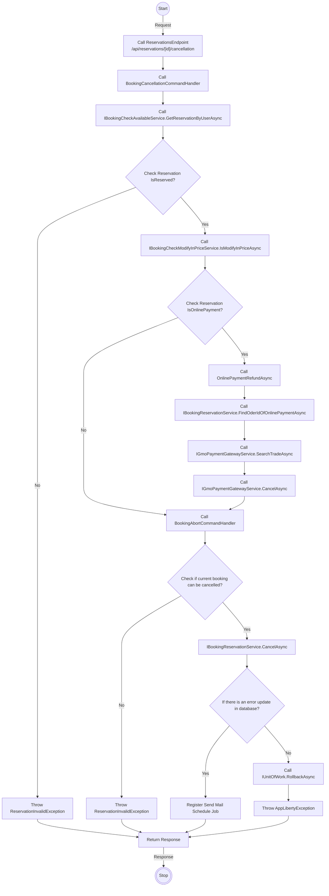
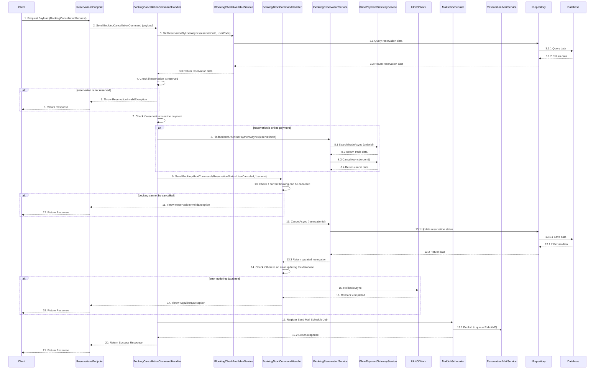

# Detail Design - Reservation Cancellation - Member - Online Payment

------------------------------------------------------------------

## 1. Activity Diagram

> Note: The `Activity Diagram` illustrate the sequence of activities and interactions between different components during the booking
> cancellation process by member.
> The `ReservationsEndpoint` use input parameters `BookingCancellationRequest` from body and `id` from route to filter existing reservation
> and cancellation.
> The `id` in the `ReservationsEndpoint` is parameter from route.

### 1.1. Request (BookingCancellationRequest)

| No | Parameter | Description                           |
|----|-----------|---------------------------------------|
| 1  | AppDateId | The ID of the option item (required). |

### 1.2 Response

The `ReservationsEndpoint`  return code 204 no content with booking id in header when cancellation execute successfully.

## 2. Sequence Diagram

### Description

| No.    | Activity                                                          | Description                                                                                    |
|--------|-------------------------------------------------------------------|------------------------------------------------------------------------------------------------|
| 1      | Client → ReservationsEndpoint                                     | The `Client` sends a `BookingCancellationRequest` payload to the `ReservationsEndpoint`.       |
| 2      | ReservationsEndpoint → BookingCancellationCommandHandler          | `ReservationsEndpoint` forwards the request as a `BookingCancellationCommand`.                 |
| 3      | BookingCancellationCommandHandler → IBookingCheckAvailableService | Calls `GetReservationByUserAsync` with `reservationId` and `userCode` to get reservation data. |
| 3.1    | IBookingCheckAvailableService → IRepository                       | Queries the reservation data from `IRepository`.                                               |
| 3.1.1  | IRepository → Database                                            | Queries the data from `Database`.                                                              |
| 3.1.2  | Database → IRepository                                            | Returns the data to `IRepository`.                                                             |
| 3.2    | IRepository → IBookingCheckAvailableService                       | Returns the reservation data to `IBookingCheckAvailableService`.                               |
| 3.3    | IBookingCheckAvailableService → BookingCancellationCommandHandler | Returns the reservation data to `BookingCancellationCommandHandler`.                           |
| 4      | BookingCancellationCommandHandler                                 | Checks if the reservation is reserved.                                                         |
| 5      | BookingCancellationCommandHandler → ReservationsEndpoint          | Throws `ReservationInvalidException` if the reservation is not reserved.                       |
| 6      | ReservationsEndpoint → Client                                     | Returns the exception to the client.                                                           |
| 7      | BookingCancellationCommandHandler                                 | Checks if the reservation is an online payment.                                                |
| 8      | BookingCancellationCommandHandler → IBookingReservationService    | Calls `FindOrderIdOfOnlinePaymentAsync` with `reservationId`.                                  |
| 8.1    | IBookingReservationService → IGmoPaymentGatewayService            | Calls `SearchTradeAsync` with `orderId`.                                                       |
| 8.2    | IGmoPaymentGatewayService → IBookingReservationService            | Returns the trade data to `IBookingReservationService`.                                        |
| 8.3    | IBookingReservationService → IGmoPaymentGatewayService            | Calls `CancelAsync` with `orderId`.                                                            |
| 8.4    | IGmoPaymentGatewayService → IBookingReservationService            | Returns the cancel data to `IBookingReservationService`.                                       |
| 9      | BookingCancellationCommandHandler → BookingAbortCommandHandler    | Sends the `BookingAbortCommand` with `ReservationStatus.UserCanceled` and parameters.          |
| 10     | BookingAbortCommandHandler                                        | Checks if the current booking can be cancelled.                                                |
| 11     | BookingAbortCommandHandler → ReservationsEndpoint                 | Throws `ReservationInvalidException` if the booking cannot be cancelled.                       |
| 12     | ReservationsEndpoint → Client                                     | Returns the exception to the client.                                                           |
| 13     | BookingAbortCommandHandler → IBookingReservationService           | Calls `CancelAsync` with `reservationId`.                                                      |
| 13.1   | IBookingReservationService → IRepository                          | Updates the reservation status in `IRepository`.                                               |
| 13.1.1 | IRepository → Database                                            | Saves the data in `Database`.                                                                  |
| 13.1.2 | Database → IRepository                                            | Returns the data to `IRepository`.                                                             |
| 13.2   | IRepository → IBookingReservationService                          | Returns the data to `IBookingReservationService`.                                              |
| 13.3   | IBookingReservationService → BookingAbortCommandHandler           | Returns the updated reservation to `BookingAbortCommandHandler`.                               |
| 14     | BookingAbortCommandHandler                                        | Checks if there is an error updating the database.                                             |
| 15     | BookingAbortCommandHandler → IUnitOfWork                          | Calls `RollbackAsync` if there is an error.                                                    |
| 16     | IUnitOfWork → BookingAbortCommandHandler                          | Returns the rollback completion to `BookingAbortCommandHandler`.                               |
| 17     | BookingAbortCommandHandler → ReservationsEndpoint                 | Throws `AppLibertyException` if there is an error.                                             |
| 18     | ReservationsEndpoint → Client                                     | Returns the exception to the client.                                                           |
| 19     | BookingCancellationCommandHandler → MailJobScheduler              | Registers the send mail schedule job.                                                          |
| 19.1   | MailJobScheduler → Reservation.MailService                        | Publishes the mail job to the RabbitMQ queue.                                                  |
| 19.2   | MailJobScheduler → BookingCancellationCommandHandler              | Returns the response to `BookingCancellationCommandHandler`.                                   |
| 20     | BookingCancellationCommandHandler → ReservationsEndpoint          | Returns the success response to `ReservationsEndpoint`.                                        |
| 21     | ReservationsEndpoint → Client                                     | Returns the final response to the client.                                                      |

> Note: The `Sequence Diagram` illustrates the interactions between the client, `ReservationsEndpoint`, command handler, services,
> repository and database during the booking cancellation process by member.
