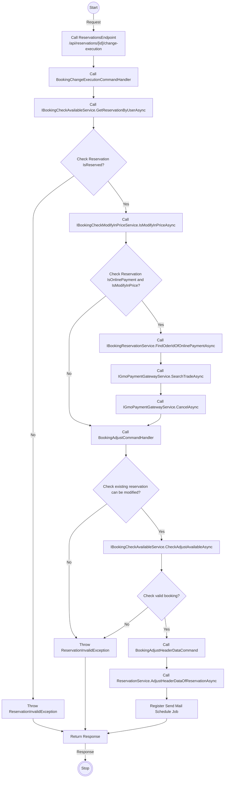
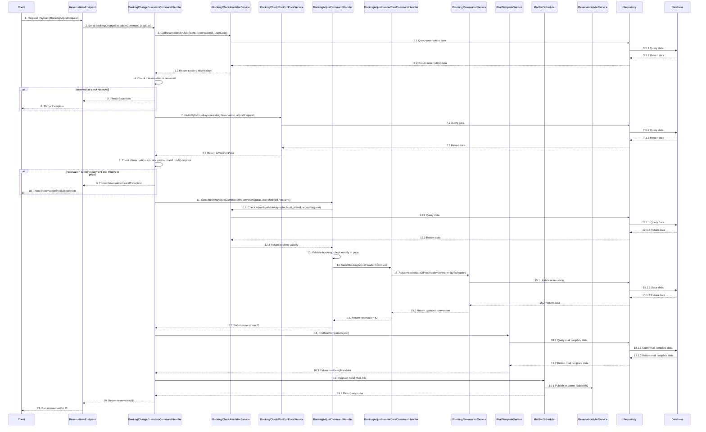

# Detail Design - Reservation Change - Member - Online Payment

------------------------------------------------------------------

## 1. Activity Diagram

> Note: The `Activity Diagram` illustrate the sequence of activities and interactions between different components during the booking change
> process by member.
> The `ReservationsEndpoint` `ChangeExecutionOfReservation` use input parameters `BookingAdjustRequest` from body and `code` from route to
> filter existing reservation and adjust.
> The `code` in the `ReservationsEndpoint` is parameter from route.

### 1.1. Request (BookingAdjustRequest)

#### Adjust Parameter Detail

| No | Parameter           | Description                                                      |
|----|---------------------|------------------------------------------------------------------|
| 1  | IsAgree             | Indicate the adjust is agreed or not                             |
| 2  | CheckInTime         | The check-in time.                                               |
| 3  | NumberOfNights      | The number of nights to stay.                                    |
| 4  | NumberOfRooms       | The number of rooms to stay.                                     |
| 5  | FreeInput           | The memo information of reservation (optional).                  |
| 6  | Reserver            | The information of the representative.                           |
| 7  | MainUser            | The information of the customer.                                 |
| 8  | NightPeoples        | The information of person age type group by room and night.      |
| 9  | NightOptions        | The information of option item age type group by room and night. |
| 10 | RoomRepresentatives | The information of rooms in reservation.                         |

> Note: Ensure that the `CheckInTime` are in the correct format `mm:ss`.
`NightPeoples` parameter indicates a list of `NightPeopleOfReservationAdjustRequest`.
`NightOptions` parameter indicates a list of `NightOptionOfReservationAdjustRequest`. `RoomRepresentatives` parameter indicates a list of
`RoomRepresentativeOfReservationAdjustRequest`.

##### NightPeopleOfReservationAdjustRequest Detail

| No | Parameter | Description                                        |
|----|-----------|----------------------------------------------------|
| 1  | AppDateId | The app date of night.                             |
| 2  | Rooms     | The person age type information of rooms in night. |

> Note: `Rooms` parameter indicates a list of `RoomNightOfReservationAdjustRequest`.

###### RoomNightOfReservationAdjustRequest Detail

| No | Parameter | Description                                 |
|----|-----------|---------------------------------------------|
| 1  | RoomIndex | The index of the room in night.             |
| 2  | Peoples   | The information of person age type in room. |

> Note: `Peoples` parameter indicates a list of `PeopleOfReservationAdjustRequest`.

###### PeopleOfReservationAdjustRequest Detail

| No | Parameter       | Description                                                          |
|----|-----------------|----------------------------------------------------------------------|
| 1  | PersonAgeTypeId | The id of person age type.                                           |
| 2  | NumberOfPeoples | The number of people in range of min and max age of person age type. |
| 2  | Gender          | The gender of person age type in room.                               |

##### NightOptionOfReservationAdjustRequest Detail

| No | Parameter | Description                                    |
|----|-----------|------------------------------------------------|
| 1  | AppDateId | The app date of night.                         |
| 2  | Rooms     | The option item information of rooms in night. |

> Note: `Rooms` parameter indicates a list of `RoomOptionOfReservationAdjustRequest`.

###### RoomOptionOfReservationAdjustRequest Detail

| No | Parameter   | Description                             |
|----|-------------|-----------------------------------------|
| 1  | RoomIndex   | The index of the room in night.         |
| 2  | OptionItems | The information of option item in room. |

> Note: `OptionItems` parameter indicates a list of `OptionOfReservationAdjustRequest`.

###### OptionOfReservationAdjustRequest Detail

| No | Parameter    | Description                        |
|----|--------------|------------------------------------|
| 1  | OptionItemId | The id of option item.             |
| 2  | Number       | The number of option item in room. |

##### RoomRepresentativeOfReservationAdjustRequest Detail

| No | Parameter | Description                                    |
|----|-----------|------------------------------------------------|
| 1  | AppDateId | The app date of night.                         |
| 2  | Rooms     | The option item information of rooms in night. |

### 1.2 Response

The `ReservationsEndpoint`  return code 204 no content with booking id in header when change execute successfully.

## 2. Sequence Diagram

### Description

| No.    | Activity                                                                 | Description                                                                                                                   |
|--------|--------------------------------------------------------------------------|-------------------------------------------------------------------------------------------------------------------------------|
| 1      | Client → ReservationsEndpoint                                            | The `Client` sends a `BookingAdjustRequest` payload to the `ReservationsEndpoint`.                                            |
| 2      | ReservationsEndpoint → BookingChangeExecutionCommandHandler              | `ReservationsEndpoint` forwards the request as a `BookingChangeExecutionCommand`.                                             |
| 3      | BookingChangeExecutionCommandHandler → IBookingCheckAvailableService     | Calls `GetReservationByUserAsync` with `reservationId` and `userCode` to get reservation data.                                |
| 3.1    | IBookingCheckAvailableService → IRepository                              | Queries the reservation data from `IRepository`.                                                                              |
| 3.1.1  | IRepository → Database                                                   | Queries the data from `Database`.                                                                                             |
| 3.1.2  | Database → IRepository                                                   | Returns the data to `IRepository`.                                                                                            |
| 3.2    | IRepository → IBookingCheckAvailableService                              | Returns the reservation data to `IBookingCheckAvailableService`.                                                              |
| 3.3    | IBookingCheckAvailableService → BookingChangeExecutionCommandHandler     | Returns the existing reservation data to `BookingChangeExecutionCommandHandler`.                                              |
| 4      | BookingChangeExecutionCommandHandler                                     | Checks if the reservation is reserved.                                                                                        |
| 5      | BookingChangeExecutionCommandHandler → ReservationsEndpoint              | Throws an exception if the reservation is not reserved.                                                                       |
| 6      | ReservationsEndpoint → Client                                            | Returns the exception to the client.                                                                                          |
| 7      | BookingChangeExecutionCommandHandler → IBookingCheckModifyInPriceService | Calls `IsModifyInPriceAsync` with `existingReservation` and `adjustRequest`.                                                  |
| 7.1    | IBookingCheckModifyInPriceService → IRepository                          | Queries the data for price modification from `IRepository`.                                                                   |
| 7.1.1  | IRepository → Database                                                   | Queries the data from `Database`.                                                                                             |
| 7.1.2  | Database → IRepository                                                   | Returns the data to `IRepository`.                                                                                            |
| 7.2    | IRepository → IBookingCheckModifyInPriceService                          | Returns the data to `IBookingCheckModifyInPriceService`.                                                                      |
| 7.3    | IBookingCheckModifyInPriceService → BookingChangeExecutionCommandHandler | Returns the result of the price modification check to `BookingChangeExecutionCommandHandler`.                                 |
| 8      | BookingChangeExecutionCommandHandler                                     | Checks if the reservation is an online payment and if the price can be modified.                                              |
| 9      | BookingChangeExecutionCommandHandler → ReservationsEndpoint              | Throws `ReservationInvalidException` if the reservation is an online payment and the price can be modified.                   |
| 10     | ReservationsEndpoint → Client                                            | Returns `ReservationInvalidException` to the client.                                                                          |
| 11     | BookingChangeExecutionCommandHandler → BookingAdjustCommandHandler       | Sends the `BookingAdjustCommand` with `ReservationStatus.UserModified` and parameters.                                        |
| 12     | BookingAdjustCommandHandler → IBookingCheckAvailableService              | Calls `CheckAdjustAvailableAsync` with `facilityId`, `planId`, and `adjustRequest`.                                           |
| 12.1   | IBookingCheckAvailableService → IRepository                              | Queries the data for adjustment availability from `IRepository`.                                                              |
| 12.1.1 | IRepository → Database                                                   | Queries the data from `Database`.                                                                                             |
| 12.1.2 | Database → IRepository                                                   | Returns the data to `IRepository`.                                                                                            |
| 12.2   | IRepository → IBookingCheckAvailableService                              | Returns the data to `IBookingCheckAvailableService`.                                                                          |
| 12.3   | IBookingCheckAvailableService → BookingAdjustCommandHandler              | Returns the booking validity to `BookingAdjustCommandHandler`.                                                                |
| 13     | BookingAdjustCommandHandler                                              | Validates the booking and checks if the price can be modified.                                                                |
| 14     | BookingAdjustCommandHandler → BookingAdjustHeaderDataCommandHandler      | Sends the `BookingAdjustHeaderCommand`.                                                                                       |
| 15     | BookingAdjustHeaderDataCommandHandler → IBookingReservationService       | Calls `AdjustHeaderDataOfReservationAsync` with `entityToUpdate`.                                                             |
| 15.1   | IBookingReservationService → IRepository                                 | Updates the reservation in `IRepository`.                                                                                     |
| 15.1.1 | IRepository → Database                                                   | Saves the data in `Database`.                                                                                                 |
| 15.1.2 | Database → IRepository                                                   | Returns the data to `IRepository`.                                                                                            |
| 15.2   | IRepository → IBookingReservationService                                 | Returns the data to `IBookingReservationService`.                                                                             |
| 15.3   | IBookingReservationService → BookingAdjustHeaderDataCommandHandler       | Returns the updated reservation to `BookingAdjustHeaderDataCommandHandler`.                                                   |
| 16     | BookingAdjustHeaderDataCommandHandler → BookingAdjustCommandHandler      | Returns the reservation ID to `BookingAdjustCommandHandler`.                                                                  |
| 17     | BookingAdjustCommandHandler → BookingChangeExecutionCommandHandler       | Returns the reservation ID to `BookingChangeExecutionCommandHandler`.                                                         |
| 18     | BookingChangeExecutionCommandHandler → IMailTemplateService              | Calls `FindMailTemplateAsync`.                                                                                                |
| 18.1   | IMailTemplateService → IRepository                                       | Queries the mail template data from `IRepository`.                                                                            |
| 18.1.1 | IRepository → Database                                                   | Queries the data from `Database`.                                                                                             |
| 18.1.2 | Database → IRepository                                                   | Returns the mail template data to `IRepository`.                                                                              |
| 18.2   | IRepository → IMailTemplateService                                       | Returns the mail template data to `IMailTemplateService`.                                                                     |
| 18.3   | IMailTemplateService → BookingChangeExecutionCommandHandler              | Returns the mail template data to `BookingChangeExecutionCommandHandler`.                                                     |
| 19     | BookingChangeExecutionCommandHandler → MailJobScheduler                  | Registers the send mail job.                                                                                                  |
| 19.1   | MailJobScheduler → Reservation.MailService                               | Publishes the mail job to the RabbitMQ queue.                                                                                 |
| 19.2   | MailJobScheduler → BookingChangeExecutionCommandHandler                  | Returns the response from `Reservation.MailService` to `MailJobScheduler` and then to `BookingChangeExecutionCommandHandler`. |
| 20     | BookingChangeExecutionCommandHandler → ReservationsEndpoint              | Returns the reservation ID to `ReservationsEndpoint`.                                                                         |
| 21     | ReservationsEndpoint → Client                                            | Returns the reservation ID to the client.                                                                                     |

This description provides a detailed explanation of each step in the sequence diagram for handling a booking change execution request in the
`BookingChangeExecutionCommandHandler`.

> Note: The `Sequence Diagram` illustrates the interactions between the client, `ReservationsEndpoint`, command handler, services,
> repository and database during the booking change process by member.
