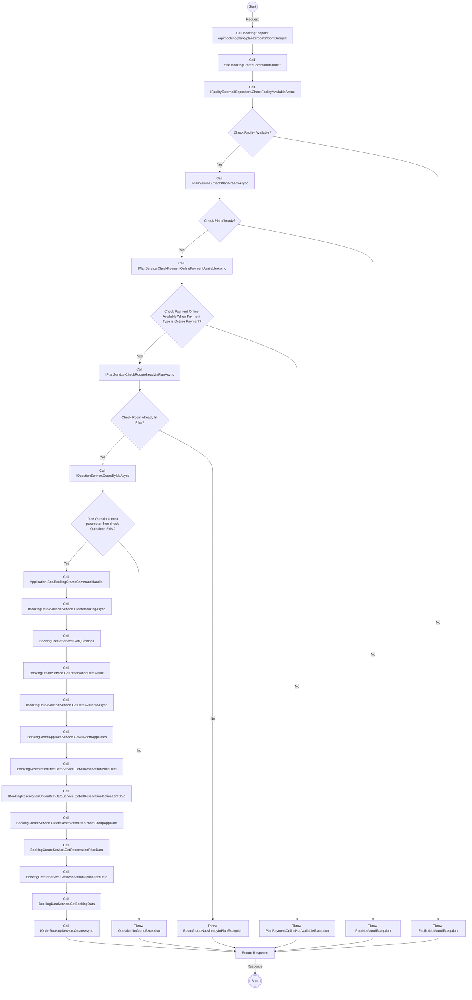
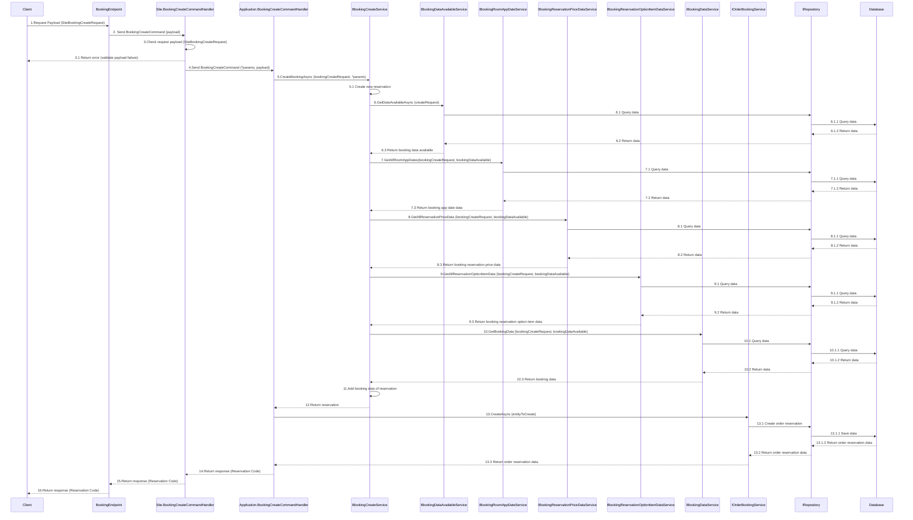

# Detail Design - Reservation - Member - Local Payment

------------------------------------------------------------------

## 1. Activity Diagram

> **Note**: The `Activity Diagram` describes the sequence of activities and interactions between components in the process of creating
> booking a member (user login).
> The **`BookingEndPoint`** have route request parameters **`planId`**, **`roomGroupId`** and request payload **`SiteBookingCreateRequest`
**.
> End of `Activity Diagram` return response the booking code.

### 1.1 Request (SiteBookingCreateRequest)

#### SiteBookingCreateRequest

| No | Parameter        | Description                                              |
|----|------------------|----------------------------------------------------------|
| 1  | CheckInDate      | The check-in date (required).                            |
| 2  | CheckInTime      | The check-in time (optional).                            |
| 3  | CheckOutTime     | The check-out time (optional).                           |
| 4  | PaymentType      | The payment type (required).                             |
| 5  | Adjust           | The booking adjustment details (required).               |
| 6  | PlanQuestions    | The plan questions (optional).                           |
| 7  | OptionsQuestions | The options questions (optional).                        |
| 8  | BookingDate      | The booking date (default to current UTC date and time). |

> **Note**: Ensure that the **`CheckInTime`** and **`CheckOutTime`** are in the correct format **`mm:ss`** and that all required parameters
> are provided.
**`Adjust`** parameter is of **`BookingAdjustRequest`**, **`PlanQuestions`** parameter is list of **`QuestionOfBookingCreateRequest`**, *
*`OptionsQuestions`** parameter is list of **`QuestionOfBookingCreateRequest`**,

#### BookingAdjustRequest

| No | Parameter           | Description                                       |
|----|---------------------|---------------------------------------------------|
| 1  | IsAgree             | Indicates if the adjustment is agreed (required). |
| 2  | CheckInTime         | The check-in time (required).                     |
| 3  | NumberOfNights      | The number of nights (required).                  |
| 4  | NumberOfRooms       | The number of rooms (required).                   |
| 5  | FreeInput           | Free input text (optional).                       |
| 6  | Reserver            | The reserver details (required).                  |
| 7  | MainUser            | The main user details (optional).                 |
| 8  | NightPeoples        | The night peoples details (optional).             |
| 9  | NightOptions        | The night options details (optional).             |
| 10 | RoomRepresentatives | The room representatives details (optional).      |
| 11 | Id                  | The ID of the adjustment (required).              |
| 12 | CheckInDateId       | The check-in date ID (required).                  |

> **Note**: Ensure that the **`CheckInTime`** are in the correct format **`mm:ss`**.
**`NightPeoples`** parameter is list of **`NightPeopleOfReservationAdjustRequest`**, **`NightOptions`** parameter is list of *
*`NightOptionOfReservationAdjustRequest`**,  **`RoomRepresentatives`** parameter is list of **`RoomRepresentativeOfReservationAdjustRequest`**.

#### ReserverOfReservationAdjustRequest

| No | Parameter   | Description                                  |
|----|-------------|----------------------------------------------|
| 1  | FullName    | The full name of the reserver (required).    |
| 2  | Kana        | The kana of the reserver (optional).         |
| 3  | Email       | The email of the reserver (required).        |
| 4  | PostCode    | The postal code of the reserver (required).  |
| 5  | Address1    | The first line of the address (required).    |
| 6  | Address2    | The second line of the address (required).   |
| 7  | Address3    | The third line of the address (required).    |
| 8  | PhoneNumber | The phone number of the reserver (required). |

#### QuestionOfBookingCreateRequest

| No | Parameter  | Description                                  |
|----|------------|----------------------------------------------|
| 1  | QuestionId | The ID of the question (required).           |
| 2  | AnswerData | The answer data for the question (optional). |

#### GuestOfReservationAdjustRequest

| No | Parameter   | Description                                |
|----|-------------|--------------------------------------------|
| 1  | FullName    | The full name of the guest (required).     |
| 2  | Kana        | The kana of the guest (optional).          |
| 3  | Gender      | The gender of the guest (required).        |
| 4  | Birthday    | The birthday of the guest (required).      |
| 5  | PostCode    | The postal code of the guest (required).   |
| 6  | Address1    | The first line of the address (required).  |
| 7  | Address2    | The second line of the address (required). |
| 8  | Address3    | The third line of the address (required).  |
| 9  | PhoneNumber | The phone number of the guest (required).  |

#### NightPeopleOfReservationAdjustRequest

| No | Parameter | Description                               |
|----|-----------|-------------------------------------------|
| 1  | AppDateId | The date stay for the booking (required). |
| 2  | Rooms     | The rooms details (required).             |

#### RoomNightOfReservationAdjustRequest

| No | Parameter | Description                       |
|----|-----------|-----------------------------------|
| 1  | RoomIndex | The index of the room (required). |
| 2  | Peoples   | The peoples details (required).   |

**Note**: **`Peoples`** parameter is list of **`PeopleOfReservationAdjustRequest`**.

#### PeopleOfReservationAdjustRequest

| No | Parameter       | Description                                              |
|----|-----------------|----------------------------------------------------------|
| 1  | PersonAgeTypeId | The ID representing the type of person's age (required). |
| 2  | NumberOfPeoples | The number of peoples (required).                        |
| 3  | Gender          | The gender of the peoples (required).                    |

#### NightOptionOfReservationAdjustRequest

| No | Parameter | Description                               |
|----|-----------|-------------------------------------------|
| 1  | AppDateId | The date stay for the booking (required). |
| 2  | Rooms     | The rooms details (required).             |

> **Note**: **`Rooms`** parameter is list of **`RoomOptionOfReservationAdjustRequest`**.

#### RoomOptionOfReservationAdjustRequest

| No | Parameter   | Description                          |
|----|-------------|--------------------------------------|
| 1  | RoomIndex   | The index of the room (required).    |
| 2  | OptionItems | The option items details (required). |

> **Note**: **`OptionItems`** parameter is list of **`OptionOfReservationAdjustRequest`**.

#### OptionOfReservationAdjustRequest

| No | Parameter    | Description                            |
|----|--------------|----------------------------------------|
| 1  | OptionItemId | The ID of the option item (required).  |
| 2  | Number       | The number of option items (required). |

#### RoomRepresentativeOfReservationAdjustRequest

| No | Parameter | Description                                          |
|----|-----------|------------------------------------------------------|
| 1  | RoomIndex | The index of the room (required).                    |
| 2  | FullName  | The full name of the room representative (required). |
| 3  | Kana      | The kana of the room representative (optional).      |

#### FlattenedNightPeople

| No | Parameter       | Description                                              |
|----|-----------------|----------------------------------------------------------|
| 1  | AppDateId       | The date stay for the booking (required).                |
| 2  | RoomIndex       | The index of the room (required).                        |
| 3  | PersonAgeTypeId | The ID representing the type of person's age (required). |
| 4  | NumberOfPeoples | The number of peoples (required).                        |
| 5  | Gender          | The gender of the peoples (required).                    |

#### FlattenedNightOptionItem

| No | Parameter    | Description                               |
|----|--------------|-------------------------------------------|
| 1  | AppDateId    | The date stay for the booking (required). |
| 2  | RoomIndex    | The index of the room (required).         |
| 3  | OptionItemId | The ID of the option item (required).     |
| 4  | Number       | The number of option items (required).    |

### 1.2. Response (Booking Code)

The `BookingEndPoint` return the booking code of a reservation created.

## 2. Sequence Diagram

### Description

| No.    | Activity                                                                   | Description                                                                               |
|--------|----------------------------------------------------------------------------|-------------------------------------------------------------------------------------------|
| 1      | Client → BookingEndpoint                                                   | The `Client` sends a `SiteBookingCreateRequest` payload to the `BookingEndpoint`.         |
| 2      | BookingEndpoint → Site.BookingCreateCommandHandler                         | `BookingEndpoint` forwards the request to `Site.BookingCreateCommandHandler`.             |
| 3      | Site.BookingCreateCommandHandler                                           | Checks the request payload.                                                               |
| 3.1    | Site.BookingCreateCommandHandler → Client                                  | Returns an error if the payload validation fails.                                         |
| 4      | Site.BookingCreateCommandHandler → Application.BookingCreateCommandHandler | Sends the booking create command to `Application.BookingCreateCommandHandler`.            |
| 5      | Application.BookingCreateCommandHandler → IBookingCreateService            | Calls `IBookingCreateService` to create the booking.                                      |
| 5.1    | IBookingCreateService                                                      | Creates a new reservation.                                                                |
| 6      | IBookingCreateService → IBookingDataAvailableService                       | Calls `IBookingDataAvailableService` to get data available.                               |
| 6.1    | IBookingDataAvailableService → IRepository                                 | Queries the data from `IRepository`.                                                      |
| 6.1.1  | IRepository → Database                                                     | Queries the data from `Database`.                                                         |
| 6.1.2  | Database → IRepository                                                     | Returns the data to `IRepository`.                                                        |
| 6.2    | IRepository → IBookingDataAvailableService                                 | Returns the data to `IBookingDataAvailableService`.                                       |
| 6.3    | IBookingDataAvailableService → IBookingCreateService                       | Returns the booking data available to `IBookingCreateService`.                            |
| 7      | IBookingCreateService → IBookingRoomAppDateService                         | Calls `IBookingRoomAppDateService` to get all room app dates.                             |
| 7.1    | IBookingRoomAppDateService → IRepository                                   | Queries the data from `IRepository`.                                                      |
| 7.1.1  | IRepository → Database                                                     | Queries the data from `Database`.                                                         |
| 7.1.2  | Database → IRepository                                                     | Returns the data to `IRepository`.                                                        |
| 7.2    | IRepository → IBookingRoomAppDateService                                   | Returns the data to `IBookingRoomAppDateService`.                                         |
| 7.3    | IBookingRoomAppDateService → IBookingCreateService                         | Returns the booking app date data to `IBookingCreateService`.                             |
| 8      | IBookingCreateService → IBookingReservationPriceDataService                | Calls `IBookingReservationPriceDataService` to get all reservation price data.            |
| 8.1    | IBookingReservationPriceDataService → IRepository                          | Queries the data from `IRepository`.                                                      |
| 8.1.1  | IRepository → Database                                                     | Queries the data from `Database`.                                                         |
| 8.1.2  | Database → IRepository                                                     | Returns the data to `IRepository`.                                                        |
| 8.2    | IRepository → IBookingReservationPriceDataService                          | Returns the data to `IBookingReservationPriceDataService`.                                |
| 8.3    | IBookingReservationPriceDataService → IBookingCreateService                | Returns the booking reservation price data to `IBookingCreateService`.                    |
| 9      | IBookingCreateService → IBookingReservationOptionItemDataService           | Calls `IBookingReservationOptionItemDataService` to get all reservation option item data. |
| 9.1    | IBookingReservationOptionItemDataService → IRepository                     | Queries the data from `IRepository`.                                                      |
| 9.1.1  | IRepository → Database                                                     | Queries the data from `Database`.                                                         |
| 9.1.2  | Database → IRepository                                                     | Returns the data to `IRepository`.                                                        |
| 9.2    | IRepository → IBookingReservationOptionItemDataService                     | Returns the data to `IBookingReservationOptionItemDataService`.                           |
| 9.3    | IBookingReservationOptionItemDataService → IBookingCreateService           | Returns the booking reservation option item data to `IBookingCreateService`.              |
| 10     | IBookingCreateService → IBookingDataService                                | Calls `IBookingDataService` to get booking data.                                          |
| 10.1   | IBookingDataService → IRepository                                          | Queries the data from `IRepository`.                                                      |
| 10.1.1 | IRepository → Database                                                     | Queries the data from `Database`.                                                         |
| 10.1.2 | Database → IRepository                                                     | Returns the data to `IRepository`.                                                        |
| 10.2   | IRepository → IBookingDataService                                          | Returns the data to `IBookingDataService`.                                                |
| 10.3   | IBookingDataService → IBookingCreateService                                | Returns the booking data to `IBookingCreateService`.                                      |
| 11     | IBookingCreateService                                                      | Adds the booking data of the reservation.                                                 |
| 12     | IBookingCreateService → Application.BookingCreateCommandHandler            | Returns the reservation to `Application.BookingCreateCommandHandler`.                     |
| 13     | Application.BookingCreateCommandHandler → IOrderBookingService             | Calls `IOrderBookingService` to create the order reservation.                             |
| 13.1   | IOrderBookingService → IRepository                                         | Creates the order reservation in `IRepository`.                                           |
| 13.1.1 | IRepository → Database                                                     | Saves the data in `Database`.                                                             |
| 13.1.2 | Database → IRepository                                                     | Returns the order reservation data to `IRepository`.                                      |
| 13.2   | IRepository → IOrderBookingService                                         | Returns the order reservation data to `IOrderBookingService`.                             |
| 13.3   | IOrderBookingService → Application.BookingCreateCommandHandler             | Returns the order reservation data to `Application.BookingCreateCommandHandler`.          |
| 14     | Application.BookingCreateCommandHandler → Site.BookingCreateCommandHandler | Returns the response (Reservation Code) to `Site.BookingCreateCommandHandler`.            |
| 15     | Site.BookingCreateCommandHandler → BookingEndpoint                         | Returns the response (Reservation Code) to `BookingEndpoint`.                             |
| 16     | BookingEndpoint → Client                                                   | Returns the response (Reservation Code) to `Client`.                                      |

> **Note**: The `Sequence Diagram` illustrates the interactions between the client, booking endpoint, query handler, services, and database
> during the booking search process, including the case where the facility is not available.
> `Description` provides a detailed explanation of each step in the sequence diagram.
