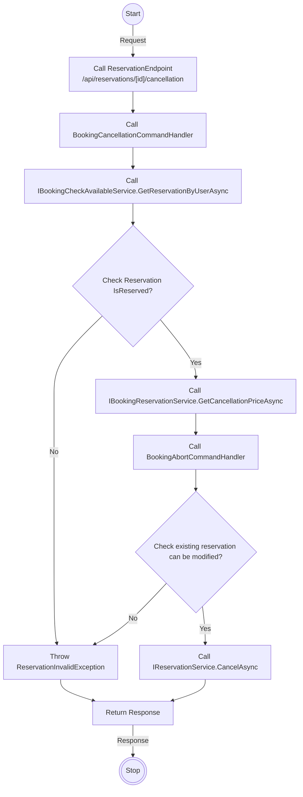
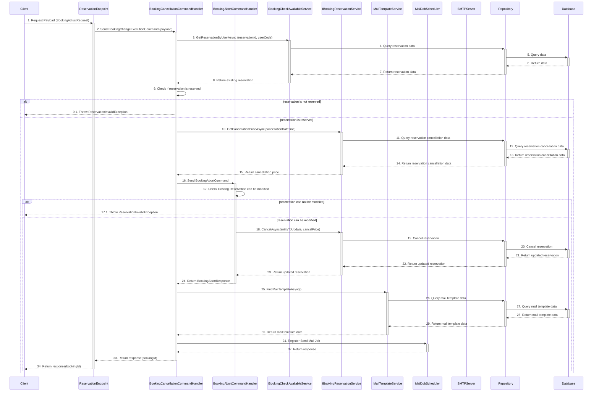

# Detail Design - Reservation Cancellation - Member - Local Payment

------------------------------------------------------------------

## 1. Activity Diagram

> **Note**: The **`Activity Diagram`** illustrate the sequence of activities and interactions between different components during the
> booking cancellation process by member.
> The **`ReservationEndpoint` `CancellationOfReservation`** use input parameters **`BookingCancellationRequest`** from body and **`id`**
> from route to filter existing reservation and adjust.
> The **`id`** in the **`ReservationEndpoint`** is parameter from route, it indicates the id of reservation.

### 1.1. Request (BookingCancellationRequest)

#### **BookingCancellationRequest Detail**

| No | Parameter | Description                                  |
|----|-----------|----------------------------------------------|
| 1  | Id        | Indicate the ID of the reservation to cancel |

### 1.2 Response

The **`ReservationEndpoint` `CancellationOfReservation`** return code 204 no content with booking id in header when change execute
successfully.

## 2. Sequence Diagram

### Member Booking Reservation Cancellation Sequence Diagram

### Description

| No.  | Activity                                                               | Description                                                                                            |
|------|------------------------------------------------------------------------|--------------------------------------------------------------------------------------------------------|
| 1    | Client -> ReservationEndpoint                                          | The client sends a `BookingAdjustRequest` to the ReservationEndpoint.                                  |
| 2    | ReservationEndpoint -> BookingCancellationCommandHandler               | `ReservationEndpoint` sends a request to the `BookingCancellationCommandHandler`.                      |
| 3    | BookingCancellationCommandHandler -> IBookingCheckAvailableService     | `BookingCancellationCommandHandler` requests booking information from `IBookingCheckAvailableService`. |
| 4    | IBookingCheckAvailableService -> IRepository                           | `IBookingCheckAvailableService` requests booking information from `IRepository`.                       |
| 5    | IRepository -> Database                                                | `IRepository` queries the database to retrieve booking information.                                    |
| 6    | Database -> IRepository                                                | The database returns the requested data.                                                               |
| 7    | IRepository -> IBookingCheckAvailableService                           | `IRepository` returns booking information to `IBookingCheckAvailableService`.                          |
| 8    | IBookingCheckAvailableService -> BookingCancellationCommandHandler     | `IBookingCheckAvailableService` returns booking data to `BookingCancellationCommandHandler`.           |
| 9    | BookingCancellationCommandHandler -> BookingCancellationCommandHandler | `BookingCancellationCommandHandler` checks the booking status (whether it is valid or not).            |
| 9.1  | BookingCancellationCommandHandler -> Client                            | If the booking is invalid, throw the exception `ReservationInvalidException`.                          |
| 10   | BookingCancellationCommandHandler -> IBookingReservationService        | If the booking is valid, request the cancellation price calculation via `GetCancellationPriceAsync`.   |
| 11   | IBookingReservationService -> IRepository                              | `IBookingReservationService` requests cancellation data from `IRepository`.                            |
| 12   | IRepository -> Database                                                | `IRepository` queries the database to retrieve cancellation data.                                      |
| 13   | Database -> IRepository                                                | The database returns the cancellation data.                                                            |
| 14   | IRepository -> IBookingReservationService                              | `IRepository` returns the cancellation data to `IBookingReservationService`.                           |
| 15   | IBookingReservationService -> BookingCancellationCommandHandler        | `IBookingReservationService` returns the cancellation price to `BookingCancellationCommandHandler`.    |
| 16   | BookingCancellationCommandHandler -> BookingAbortCommandHandler        | `BookingCancellationCommandHandler` sends a `BookingAbortCommand` request.                             |
| 17   | BookingAbortCommandHandler -> BookingAbortCommandHandler               | `BookingAbortCommandHandler` checks whether the booking can be modified.                               |
| 17.1 | BookingAbortCommandHandler -> Client                                   | If the booking cannot be modified, throw the exception `ReservationInvalidException`.                  |
| 18   | BookingAbortCommandHandler -> IBookingReservationService               | If the booking can be modified, send a cancellation request via `CancelAsync`.                         |
| 19   | IBookingReservationService -> IRepository                              | `IBookingReservationService` requests to cancel the booking from `IRepository`.                        |
| 20   | IRepository -> Database                                                | `IRepository` sends a cancellation request to the database.                                            |
| 21   | Database -> IRepository                                                | The database returns the updated booking information.                                                  |
| 22   | IRepository -> IBookingReservationService                              | `IRepository` returns the updated data to `IBookingReservationService`.                                |
| 23   | IBookingReservationService -> BookingAbortCommandHandler               | `IBookingReservationService` returns the updated data to `BookingAbortCommandHandler`.                 |
| 24   | BookingAbortCommandHandler -> BookingCancellationCommandHandler        | `BookingAbortCommandHandler` returns a `BookingAbortResponse` to `BookingCancellationCommandHandler`.  |
| 25   | BookingCancellationCommandHandler -> IMailTemplateService              | `BookingCancellationCommandHandler` requests an email template from `IMailTemplateService`.            |
| 26   | IMailTemplateService -> IRepository                                    | `IMailTemplateService` requests an email template from `IRepository`.                                  |
| 27   | IRepository -> Database                                                | `IRepository` queries the database to retrieve email template data.                                    |
| 28   | Database -> IRepository                                                | The database returns the email template.                                                               |
| 29   | IRepository -> IMailTemplateService                                    | `IRepository` returns the email template to `IMailTemplateService`.                                    |
| 30   | IMailTemplateService -> BookingCancellationCommandHandler              | `IMailTemplateService` returns the email template to `BookingCancellationCommandHandler`.              |
| 31   | BookingCancellationCommandHandler -> MailJobScheduler                  | `BookingCancellationCommandHandler` schedules an email job via `MailJobScheduler`.                     |
| 32   | MailJobScheduler -> BookingCancellationCommandHandler                  | `MailJobScheduler` returns a response to `BookingCancellationCommandHandler`.                          |
| 33   | BookingCancellationCommandHandler -> ReservationEndpoint               | `BookingCancellationCommandHandler` returns booking information to `ReservationEndpoint`.              |
| 34   | ReservationEndpoint -> Client                                          | `ReservationEndpoint` returns the result (`bookingId`) to the client.                                  |

> **Note**: The `Sequence Diagram` illustrates the interactions between the client, guest endpoint, command handler, services, repository
> and database during the booking cancellation process by member.
