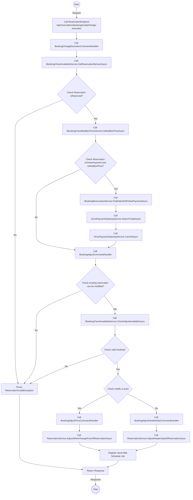

# Detail Design - Reservation Change - Member - Local Payment

------------------------------------------------------------------

## 1. Activity Diagram

> **Note**: The **`Activity Diagram`** illustrate the sequence of activities and interactions between different components during the
> booking change process by guest.
> The **`ReservationEndpoint` `ChangeExecutionOfReservation`** use input parameters **`BookingAdjustRequest`** from body and **`id`** from
> route to filter existing reservation and adjust.
> The **`id`** in the **`ReservationEndpoint`** is parameter from route, it indicates the id of reservation.

### 1.1. Request (BookingAdjustRequest)

#### **BookingAdjustRequest Detail**

| No | Parameter           | Description                                                      |
|----|---------------------|------------------------------------------------------------------|
| 1  | IsAgree             | Indicate the adjust is agreed or not                             |
| 2  | CheckInTime         | The check-in time.                                               |
| 3  | NumberOfNights      | The number of nights to stay.                                    |
| 4  | NumberOfRooms       | The number of rooms to stay.                                     |
| 5  | FreeInput           | The memo information of reservation (optional).                  |
| 6  | Reserver            | The information of the representative.                           |
| 7  | MainUser            | The information of the customer.                                 |
| 8  | NightPeoples        | The information of person age type group by room and night.      |
| 9  | NightOptions        | The information of option item age type group by room and night. |
| 10 | RoomRepresentatives | The information of rooms in reservation.                         |

> **Note**: Ensure that the **`CheckInTime`** are in the correct format **`mm:ss`**.
**`NightPeoples`** parameter indicates a list of **`NightPeopleOfReservationAdjustRequest`**.
**`NightOptions`** parameter indicates a list of **`NightOptionOfReservationAdjustRequest`**. **`RoomRepresentatives`** parameter indicates
> a list of **`RoomRepresentativeOfReservationAdjustRequest`**.

##### **NightPeopleOfReservationAdjustRequest Detail**

| No | Parameter | Description                                        |
|----|-----------|----------------------------------------------------|
| 1  | AppDateId | The app date of night.                             |
| 2  | Rooms     | The person age type information of rooms in night. |

> **Note**: **`Rooms`** parameter indicates a list of **`RoomNightOfReservationAdjustRequest`**.

###### **RoomNightOfReservationAdjustRequest Detail**

| No | Parameter | Description                                 |
|----|-----------|---------------------------------------------|
| 1  | RoomIndex | The index of the room in night.             |
| 2  | Peoples   | The information of person age type in room. |

> **Note**: **`Peoples`** parameter indicates a list of **`PeopleOfReservationAdjustRequest`**.

###### **PeopleOfReservationAdjustRequest Detail**

| No | Parameter       | Description                                                          |
|----|-----------------|----------------------------------------------------------------------|
| 1  | PersonAgeTypeId | The id of person age type.                                           |
| 2  | NumberOfPeoples | The number of people in range of min and max age of person age type. |
| 2  | Gender          | The gender of person age type in room.                               |

##### **NightOptionOfReservationAdjustRequest Detail**

| No | Parameter | Description                                    |
|----|-----------|------------------------------------------------|
| 1  | AppDateId | The app date of night.                         |
| 2  | Rooms     | The option item information of rooms in night. |

> **Note**: **`Rooms`** parameter indicates a list of **`RoomOptionOfReservationAdjustRequest`**.

###### **RoomOptionOfReservationAdjustRequest Detail**

| No | Parameter   | Description                             |
|----|-------------|-----------------------------------------|
| 1  | RoomIndex   | The index of the room in night.         |
| 2  | OptionItems | The information of option item in room. |

> **Note**: **`OptionItems`** parameter indicates a list of **`OptionOfReservationAdjustRequest`**.

###### **OptionOfReservationAdjustRequest Detail**

| No | Parameter    | Description                        |
|----|--------------|------------------------------------|
| 1  | OptionItemId | The id of option item.             |
| 2  | Number       | The number of option item in room. |

##### **RoomRepresentativeOfReservationAdjustRequest Detail**

| No | Parameter | Description                                    |
|----|-----------|------------------------------------------------|
| 1  | AppDateId | The app date of night.                         |
| 2  | Rooms     | The option item information of rooms in night. |

### 1.2 Response

The **`ReservationEndpoint` `ChangeExecutionOfReservation`** return code 204 no content with booking id in header when change execute
successfully.

## 2. Sequence Diagram

### Member Booking Reservation Change Execute Sequence Diagram

```mermaid
sequenceDiagram
  participant Client
  participant ReservationEndpoint
  participant BookingChangeExecutionCommandHandler
  participant BookingAdjustCommandHandler
  participant BookingAdjustPriceCommandHandler
  participant BookingAdjustHeaderDataCommandHandler
  participant IBookingCheckAvailableService
  participant IBookingCheckModifyInPriceService
  participant IBookingReservationService
  participant IBookingCreateService
  participant IBookingDataAvailableService
  participant IBookingRoomAppDateService
  participant IBookingReservationPriceDataService
  participant IBookingReservationOptionItemDataService
  participant IMailTemplateService
  participant IRepository
  participant Database
  participant MailJobScheduler
  Client ->>+ ReservationEndpoint: 1. Request Payload (BookingAdjustRequest)
  ReservationEndpoint ->>+ BookingChangeExecutionCommandHandler: 2. Send BookingChangeExecutionCommand (payload)
  BookingChangeExecutionCommandHandler ->>+ IBookingCheckAvailableService: 3. GetReservationByUserAsync (reservationId, userCode)
  IBookingCheckAvailableService ->>+ IRepository: 4. Query reservation data
  IRepository ->>+ Database: 5. Query data
  Database -->>- IRepository: 6. Return data
  IRepository -->>- IBookingCheckAvailableService: 7. Return reservation data
  IBookingCheckAvailableService -->>- BookingChangeExecutionCommandHandler: 8. Return existing reservation
  BookingChangeExecutionCommandHandler ->> BookingChangeExecutionCommandHandler: 9. Check if reservation is reserved
  alt reservation is not reserved
    BookingChangeExecutionCommandHandler -->> Client: 9.1. Throw Exception
  else reservation is reserved
    BookingChangeExecutionCommandHandler ->>+ IBookingCheckModifyInPriceService: 10. IsModifyInPriceAsync(existingReservation, adjustRequest)
    IBookingCheckModifyInPriceService ->>+ IRepository: 11. Query data
    IRepository ->>+ Database: 12. Query data
    Database -->>- IRepository: 13. Return data
    IRepository -->>- IBookingCheckModifyInPriceService: 14. Return data
    IBookingCheckModifyInPriceService -->>- BookingChangeExecutionCommandHandler: 15. Return isModifyInPrice
    BookingChangeExecutionCommandHandler ->> BookingChangeExecutionCommandHandler: 16. Check if reservation is online payment and modify in price
    BookingChangeExecutionCommandHandler ->>+ BookingAdjustCommandHandler: 17. Send BookingAdjustCommand
    BookingAdjustCommandHandler ->>+ IBookingCheckAvailableService: 18. CheckAdjustAvailableAsync(facilityId, planId, adjustRequest)
    IBookingCheckAvailableService ->>+ IRepository: 19. Query data
    IRepository ->>+ Database: 20. Query data
    Database -->>- IRepository: 21. Return data
    IRepository -->>- IBookingCheckAvailableService: 22. Return data
    IBookingCheckAvailableService -->>- BookingAdjustCommandHandler: 23. Return booking validity
    BookingAdjustCommandHandler ->> BookingAdjustCommandHandler: 24. Validate booking, check modify in price
    alt modify in price
      BookingAdjustCommandHandler ->>+ BookingAdjustPriceCommandHandler: 24.1.a. Send BookingAdjustPriceCommand
      BookingAdjustPriceCommandHandler ->>+ IBookingCreateService: 24.2.a. CreateBookingAsync (bookingCreateRequest, bookingExternalInfoRequest, existingReservation)
      IBookingCreateService ->>+ IBookingCreateService: 24.3.a. Create new reservation
      IBookingCreateService ->>+ IBookingDataAvailableService: 24.4.a. GetDataAvailableAsync (createRequest)
      IBookingDataAvailableService ->>+ IRepository: 24.5.a. Query data
      IRepository ->>+ Database: 24.6.a. Query data
      Database -->>- IRepository: 24.7.a. Return data
      IRepository -->>- IBookingDataAvailableService: 24.8.a. Return data
      IBookingDataAvailableService -->>- IBookingCreateService: 24.9.a. Return booking data available
      IBookingCreateService ->>+ IBookingRoomAppDateService: 24.10.a. GetAllRoomAppDates(bookingCreateRequest, bookingDataAvailable)
      IBookingRoomAppDateService -->>- IBookingCreateService: 24.11.a. Return booking app date data
      IBookingCreateService ->>+ IBookingReservationPriceDataService: 24.12.a. GetAllReservationPriceData (bookingCreateRequest, bookingDataAvailable)
      IBookingReservationPriceDataService -->>- IBookingCreateService: 24.13.a. Return booking reservation price data
      IBookingCreateService ->>+ IBookingReservationOptionItemDataService: 24.14.a. GetAllReservationOptionItemData (bookingCreateRequest, bookingDataAvailable)
      IBookingReservationOptionItemDataService -->>- IBookingCreateService: 24.15.a. Return booking reservation option item data
      IBookingCreateService ->>+ IBookingCreateService: 24.16.a. Add booking data of reservation
      IBookingCreateService -->>- BookingAdjustPriceCommandHandler: 24.17.a. Return reservation
      BookingAdjustPriceCommandHandler -->>- BookingAdjustCommandHandler: 24.18.a. Return response (newReservationOfOrder.Reservation.Code)
    else not modify in price
      BookingAdjustCommandHandler ->>+ BookingAdjustHeaderDataCommandHandler: 24.1.b. Send BookingAdjustHeaderDataCommand
      BookingAdjustHeaderDataCommandHandler ->>+ IBookingReservationService: 24.2.b. AdjustHeaderDataOfReservationAsync(entityToUpdate)
      IBookingReservationService ->>+ IRepository: 24.3.b. Update reservation
      IRepository ->>+ Database: 24.4.b. Save data
      Database -->>- IRepository: 24.5.b. Return data
      IRepository -->>- IBookingReservationService: 24.6.b. Return data
      IBookingReservationService -->>- BookingAdjustHeaderDataCommandHandler: 24.7.b. Return updated reservation
      BookingAdjustHeaderDataCommandHandler -->>- BookingAdjustCommandHandler: 24.8.b. Return reservation ID
    end
    BookingAdjustCommandHandler -->>- BookingChangeExecutionCommandHandler: 25. Return reservation ID
    BookingChangeExecutionCommandHandler ->>+ IMailTemplateService: 26. FindMailTemplateAsync()
    IMailTemplateService ->>+ IRepository: 27. Query mail template data
    IRepository ->>+ Database: 28. Query mail template data
    Database -->>- IRepository: 29. Return mail template data
    IRepository -->>- IMailTemplateService: 30. Return mail template data
    IMailTemplateService -->>- BookingChangeExecutionCommandHandler: 31. Return mail template data
    BookingChangeExecutionCommandHandler ->>+ MailJobScheduler: 32. Register Send Mail Job
    MailJobScheduler -->>- BookingChangeExecutionCommandHandler: 33. Return response
    BookingChangeExecutionCommandHandler -->>- ReservationEndpoint: 34. Return reservation ID
    ReservationEndpoint -->>- Client: 35. Return reservation ID
  end
```

### Description

| No.     | Activity                                                                    | Description                                                                                                      |
|---------|-----------------------------------------------------------------------------|------------------------------------------------------------------------------------------------------------------|
| 1       | Client → ReservationEndpoint                                                | The client sends a `BookingAdjustRequest` payload to the `ReservationEndpoint`.                                  |
| 2       | ReservationEndpoint → BookingChangeExecutionCommandHandler                  | `ReservationEndpoint` forwards the request as a `BookingChangeExecutionCommand`.                                 |
| 3       | BookingChangeExecutionCommandHandler → IBookingCheckAvailableService        | Queries reservation data by calling `GetReservationByUserAsync` with `reservationId` and `userCode`.             |
| 4       | IBookingCheckAvailableService → IRepository                                 | Queries reservation data from `IRepository`.                                                                     |
| 5       | IRepository → Database                                                      | Queries the database for reservation data.                                                                       |
| 6       | Database → IRepository                                                      | Returns reservation data to `IRepository`.                                                                       |
| 7       | IRepository → IBookingCheckAvailableService                                 | Returns reservation data to `IBookingCheckAvailableService`.                                                     |
| 8       | IBookingCheckAvailableService → BookingChangeExecutionCommandHandler        | Returns existing reservation data.                                                                               |
| 9       | BookingChangeExecutionCommandHandler → BookingChangeExecutionCommandHandler | Checks if the reservation is reserved.                                                                           |
| 9.1     | BookingChangeExecutionCommandHandler → Client                               | Sends an exception if the reservation is not reserved.                                                           |
| 10      | BookingChangeExecutionCommandHandler → IBookingCheckModifyInPriceService    | Checks if the reservation price can be modified.                                                                 |
| 11      | IBookingCheckModifyInPriceService → IRepository                             | Queries the database for data to check if the reservation can be modified in price.                              |
| 12      | IRepository → Database                                                      | Sends the query to the database to retrieve data related to price modification.                                  |
| 13      | Database → IRepository                                                      | Returns the relevant data to `IRepository`.                                                                      |
| 14      | IRepository → IBookingCheckModifyInPriceService                             | Returns the data to `IBookingCheckModifyInPriceService`.                                                         |
| 15      | IBookingCheckModifyInPriceService → BookingChangeExecutionCommandHandler    | Returns the information on whether the reservation can be modified in price.                                     |
| 16      | BookingChangeExecutionCommandHandler → BookingChangeExecutionCommandHandler | Checks if the reservation is eligible for online payment and if the price can be modified.                       |
| 17      | BookingChangeExecutionCommandHandler → BookingAdjustCommandHandler          | Sends `BookingAdjustCommand` to proceed with adjusting the booking.                                              |
| 18      | BookingAdjustCommandHandler → IBookingCheckAvailableService                 | Requests to check the availability of the adjustment with the given `facilityId`, `planId`, and `adjustRequest`. |
| 19      | IBookingCheckAvailableService → IRepository                                 | Queries the database for adjustment data to check if the booking can be adjusted.                                |
| 20      | IRepository → Database                                                      | Sends a query to the database for booking availability data.                                                     |
| 21      | Database → IRepository                                                      | Returns the booking availability data to `IRepository`.                                                          |
| 22      | IRepository → IBookingCheckAvailableService                                 | Returns the booking availability data to `IBookingCheckAvailableService`.                                        |
| 23      | IBookingCheckAvailableService → BookingAdjustCommandHandler                 | Returns the validity status of the booking adjustment.                                                           |
| 24      | BookingAdjustCommandHandler → BookingAdjustCommandHandler                   | Validates the booking and checks if modifying the price is possible.                                             |
| 24.1.a  | BookingAdjustCommandHandler → BookingAdjustPriceCommandHandler              | Sends `BookingAdjustPriceCommand` to adjust the price of the booking if modification is allowed.                 |
| 24.2.a  | BookingAdjustPriceCommandHandler → IBookingCreateService                    | Calls `CreateBookingAsync` to create a new reservation.                                                          |
| 24.3.a  | IBookingCreateService → IBookingCreateService                               | Creates a new reservation.                                                                                       |
| 24.4.a  | IBookingCreateService → IBookingDataAvailableService                        | Requests available data to create a new booking.                                                                 |
| 24.5.a  | IBookingDataAvailableService → IRepository                                  | Queries the database for data availability.                                                                      |
| 24.6.a  | IRepository → Database                                                      | Queries the database to retrieve available data for the new booking.                                             |
| 24.7.a  | Database → IRepository                                                      | Returns data to `IRepository`.                                                                                   |
| 24.8.a  | IRepository → IBookingDataAvailableService                                  | Sends available data to `IBookingDataAvailableService`.                                                          |
| 24.9.a  | IBookingDataAvailableService → IBookingCreateService                        | Returns the available booking data to `IBookingCreateService`.                                                   |
| 24.10.a | IBookingCreateService → IBookingRoomAppDateService                          | Requests all room application date data for the new booking.                                                     |
| 24.11.a | IBookingRoomAppDateService → IBookingCreateService                          | Returns the room application date data to `IBookingCreateService`.                                               |
| 24.12.a | IBookingCreateService → IBookingReservationPriceDataService                 | Requests all reservation price data for the new booking.                                                         |
| 24.13.a | IBookingReservationPriceDataService → IBookingCreateService                 | Returns the reservation price data to `IBookingCreateService`.                                                   |
| 24.14.a | IBookingCreateService → IBookingReservationOptionItemDataService            | Requests all reservation option item data for the new booking.                                                   |
| 24.15.a | IBookingReservationOptionItemDataService → IBookingCreateService            | Returns the reservation option item data to `IBookingCreateService`.                                             |
| 24.16.a | IBookingCreateService → IBookingCreateService                               | Adds the data of the new reservation into the system.                                                            |
| 24.17.a | IBookingCreateService → BookingAdjustPriceCommandHandler                    | Returns the newly created reservation to `BookingAdjustPriceCommandHandler`.                                     |
| 24.18.a | BookingAdjustPriceCommandHandler → BookingAdjustCommandHandler              | Returns the reservation code (new reservation ID) to `BookingAdjustCommandHandler`.                              |
| 24.1.b  | BookingAdjustCommandHandler → BookingAdjustHeaderDataCommandHandler         | Sends `BookingAdjustHeaderDataCommand` to adjust the booking header data when no price modification is needed.   |
| 24.2.b  | BookingAdjustHeaderDataCommandHandler → IBookingReservationService          | Requests the adjustment of header data of the reservation.                                                       |
| 24.3.b  | IBookingReservationService → IRepository                                    | Requests the database to update the reservation data.                                                            |
| 24.4.b  | IRepository → Database                                                      | Sends the updated reservation data to be saved in the database.                                                  |
| 24.5.b  | Database → IRepository                                                      | Confirms the data update to `IRepository`.                                                                       |
| 24.6.b  | IRepository → IBookingReservationService                                    | Returns the updated reservation data to `IBookingReservationService`.                                            |
| 24.7.b  | IBookingReservationService → BookingAdjustHeaderDataCommandHandler          | Returns the updated reservation data to `BookingAdjustHeaderDataCommandHandler`.                                 |
| 24.8.b  | BookingAdjustHeaderDataCommandHandler → BookingAdjustCommandHandler         | Returns the updated reservation ID to `BookingAdjustCommandHandler`.                                             |
| 25      | BookingAdjustCommandHandler → BookingChangeExecutionCommandHandler          | Returns the reservation ID to `BookingChangeExecutionCommandHandler`.                                            |
| 26      | BookingChangeExecutionCommandHandler → IMailTemplateService                 | Requests to find the mail template for sending the booking update notification.                                  |
| 27      | IMailTemplateService → IRepository                                          | Queries the database for mail template data.                                                                     |
| 28      | IRepository → Database                                                      | Sends a query to retrieve mail template data from the database.                                                  |
| 29      | Database → IRepository                                                      | Returns the mail template data to `IRepository`.                                                                 |
| 30      | IRepository → IMailTemplateService                                          | Sends the mail template data to `IMailTemplateService`.                                                          |
| 31      | IMailTemplateService → BookingChangeExecutionCommandHandler                 | Provides the required mail template data to `BookingChangeExecutionCommandHandler`.                              |
| 32      | BookingChangeExecutionCommandHandler → MailJobScheduler                     | Registers the mail sending job with `MailJobScheduler`.                                                          |
| 33      | MailJobScheduler → BookingChangeExecutionCommandHandler                     | Confirms the completion of the mail sending job to `BookingChangeExecutionCommandHandler`.                       |
| 34      | BookingChangeExecutionCommandHandler → ReservationEndpoint                  | Returns the reservation ID to `ReservationEndpoint` after processing.                                            |
| 35      | ReservationEndpoint → Client                                                | Returns the reservation ID to the client, confirming the successful booking adjustment.                          |

> **Note**: The `Sequence Diagram` illustrates the interactions between the client, guest endpoint, command handler, services, repository
> and database during the booking change process by member.
