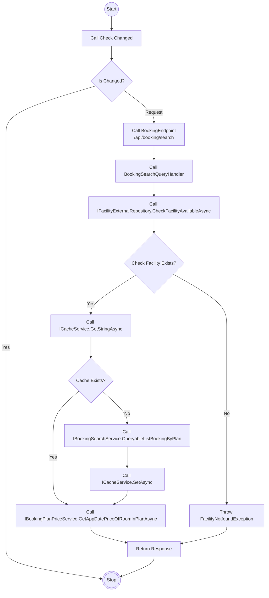
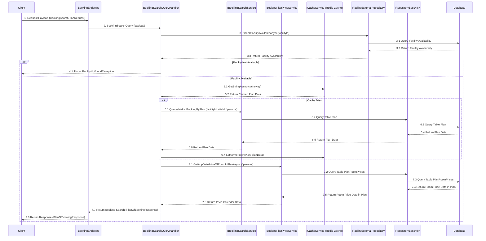

# Detail Design - Reservation - Search Plan

------------------------------------------------------------------

## 1. Activity Diagram

> **Note**: The `Activity Diagram` illustrate the sequence of activities and interactions between different components during the booking
> search process.
> The `BookingEndPoint` `QueryableListBookingByPlan` and `GetAppDatePriceOfRoomInPlanAsync` use input parameters `BookingSearchPlanRequest`
> to filter the returned plan and room rate calendar data.

### 1.1. Request (BookingSearchPlanRequest)

#### **BookingSearchPlanRequest**

| No | Parameter     | Description                                              |
|----|---------------|----------------------------------------------------------|
| 1  | CheckInDate   | The check-in date (required).                            |
| 2  | CheckOutDate  | The check-out date (required).                           |
| 3  | RestNumber    | The number of nights to stay (required).                 |
| 4  | RoomNumber    | The number of rooms (required).                          |
| 5  | MinPrice      | The minimum price (optional).                            |
| 6  | MaxPrice      | The maximum price (optional).                            |
| 7  | Secret        | A secret get plans private (optional).                   |
| 8  | GuestsPerRoom | Details of guests per room (`GuestsPerRoom Parameters`). |

> **Note**: Ensure that the `CheckInDate` and `CheckOutDate` are in the correct format (yyyymmdd) and that all required parameters are
> provided.

##### **GuestsPerRoom Parameters**

| No | Parameter       | Description                                                       |
|----|-----------------|-------------------------------------------------------------------|
| 1  | AppDateId       | The date stay for the booking (required).                         |
| 2  | RestIndex       | The index indicating the number of nights in the stay (required). |
| 3  | RoomGroupIndex  | The index of the room group within the booking (required).        |
| 4  | PersonAgeTypeId | The ID representing the type of person's age (required).          |
| 5  | Persons         | The total number of persons (required).                           |
| 6  | MalePersons     | The total number of male persons (optional).                      |
| 7  | FemalePersons   | The total number of female persons (optional).                    |

> **Note**: This `Input Parameters` describes the `BookingSearchPlanRequest` input parameter to search for a plan for a booking.

### 1.2. Response (PlanOfBookingResponse)

#### **PlanOfBookingResponse**

| No | Data            | Description                                                                |
|----|-----------------|----------------------------------------------------------------------------|
| 1  | Id              | The unique identifier for the plan.                                        |
| 2  | Name            | The name of the plan.                                                      |
| 3  | Tag             | An optional tag associated with the plan.                                  |
| 4  | IsOnLinePayment | Indicates if the plan supports online payments.                            |
| 5  | IsOnSidePayment | Indicates if the plan supports on-site payments.                           |
| 6  | Description     | A detailed description of the plan.                                        |
| 7  | BasePrice       | The base price of the plan (optional).                                     |
| 8  | Categories      | A list of categories associated with the plan ( `CategoryOfPlanResponse`). |
| 9  | Files           | A list of files or media related to the plan (`FileOfPlanResponse`).       |
| 10 | Meals           | A list of meals included in the plan (`MealOfPlanResponse`).               |
| 11 | Rooms           | A list of rooms associated with the plan (`RoomOfPlanResponse`).           |

> **Note**: This `PlanOfBookingResponse` describes the API's return data field.

##### **CategoryOfPlanResponse**

| No | Data | Description                            |
|----|------|----------------------------------------|
| 1  | Id   | The unique identifier of the category. |
| 2  | Name | The name of the category.              |

##### **FileOfPlanResponse**

| No | Data        | Description                                      |
|----|-------------|--------------------------------------------------|
| 1  | Code        | The code for the file (e.g., file identifier).   |
| 2  | ContentType | The content type of the file (e.g., image/jpeg). |

##### **MealOfPlanResponse**

| No | Data            | Description                                        |
|----|-----------------|----------------------------------------------------|
| 1  | Id              | The unique identifier of the meal.                 |
| 2  | MealTypeEatType | The type of meal (e.g., breakfast, lunch, dinner). |
| 3  | Name            | The name of the meal.                              |

##### **RoomOfPlanResponse**

| No | Data             | Description                                                       |
|----|------------------|-------------------------------------------------------------------|
| 1  | Id               | The unique identifier for the room.                               |
| 2  | Name             | The name of the room.                                             |
| 3  | IsEnabledSmoking | Indicates whether smoking is allowed in the room.                 |
| 4  | Files            | List of files related to the room (`FileOfPlanResponse`).         |
| 5  | AppDatePrices    | List of prices for specific dates (`AppDatePriceOfPlanResponse`). |

##### **AppDatePriceOfPlanResponse**

| No | Data         | Description                                                               |
|----|--------------|---------------------------------------------------------------------------|
| 1  | AppDateId    | The unique identifier for the applicable date.                            |
| 2  | RemainNumber | The remaining availability for the specific date.                         |
| 3  | BasePrice    | The base price for the specific date (optional).                          |
| 4  | Price        | The price for the specific date (optional).                               |
| 5  | TotalSpaTax  | The total spa tax for the specific date (optional).                       |
| 6  | TotalPrice   | The total price (Price + TotalSpaTax) for the specific date (calculated). |

> **Note**: The `TotalPrice` is calculated as the sum of `Price` and `TotalSpaTax`.

## 2. Sequence Diagram

### Description

| No. | Activity                                                | Description                                                                                                                                                                                                        |
|-----|---------------------------------------------------------|--------------------------------------------------------------------------------------------------------------------------------------------------------------------------------------------------------------------|
| 1   | Client → BookingEndpoint                                | The `Client` sends a `BookingSearchPlanRequest` payload to the `BookingEndpoint`.                                                                                                                                  |
| 2   | BookingEndpoint → BookingSearchQueryHandler             | `BookingEndpoint` forwards the request to `BookingSearchQueryHandler` via `BookingSearchQuery` with the payload.                                                                                                   |
| 3   | BookingSearchQueryHandler → IFacilityExternalRepository | The `BookingSearchQueryHandler` calls `CheckFacilityAvailableAsync` to check if the facility is available.                                                                                                         |
| 3.1 | IFacilityExternalRepository → Database                  | The `IFacilityExternalRepository` queries the `Database` for facility availability.                                                                                                                                |
| 3.2 | Database → IFacilityExternalRepository                  | The `Database` returns the facility availability status to the `IFacilityExternalRepository`.                                                                                                                      |
| 3.3 | IFacilityExternalRepository → BookingSearchQueryHandler | The `IFacilityExternalRepository` returns the facility availability status to the `BookingSearchQueryHandler`.                                                                                                     |
| 4.1 | BookingSearchQueryHandler → BookingEndpoint             | The `BookingSearchQueryHandler` returns a `Throw FacilityNotfoundException` response to the `BookingEndpoint`.                                                                                                     |
| 5.1 | BookingSearchQueryHandler → ICacheService               | The `BookingSearchQueryHandler` calls `GetStringAsync` to retrieve cached data.                                                                                                                                    |
| 5.2 | ICacheService → BookingSearchQueryHandler               | The `ICacheService` returns the cached plan data to the `BookingSearchQueryHandler`.                                                                                                                               |
| 6.1 | BookingSearchQueryHandler → IBookingSearchService       | The `BookingSearchQueryHandler` calls `QueryableListBookingByPlan` the `IBookingSearchService` to query booking plans using parameters like `facilityId`, `siteId` and parameters from `BookingSearchPlanRequest`. |
| 6.2 | IBookingSearchService → IRepository                     | The `IBookingSearchService` queries the `Plan` table in the database for relevant data.                                                                                                                            |
| 6.3 | IRepository → Database                                  | The `IRepository` queries the `Plan` table in the database for relevant data.                                                                                                                                      |
| 6.4 | Database → IRepository                                  | The `Database` returns the queried plan data to the `IRepository`.                                                                                                                                                 |
| 6.5 | IRepository → IBookingSearchService                     | The `IRepository` returns the queried plan data to the `IBookingSearchService`.                                                                                                                                    |
| 6.6 | IBookingSearchService → BookingSearchQueryHandler       | The `IBookingSearchService` sends the retrieved plan data back to the `BookingSearchQueryHandler`.                                                                                                                 |
| 6.7 | BookingSearchQueryHandler → ICacheService               | The `BookingSearchQueryHandler` calls `SetAsync` to cache the retrieved plan data.                                                                                                                                 |
| 7.1 | BookingSearchQueryHandler → IBookingPlanPriceService    | The `BookingSearchQueryHandler` calls `GetAppDatePriceOfRoomInPlanAsync` the `IBookingPlanPriceService` to get date and price details for rooms in the plan using parameters from `BookingSearchPlanRequest`.      |
| 7.2 | IBookingPlanPriceService → IRepository                  | The `IBookingPlanPriceService` queries the `PlanRoomSiteDatePrices` table in the database for room prices.                                                                                                         |
| 7.3 | IRepository → Database                                  | The `IRepository` queries the `PlanRoomSiteDatePrices` table in the database for room prices.                                                                                                                      |
| 7.4 | Database → IRepository                                  | The `Database` returns room price data of `PlanRoomSiteDatePrices` for the requested dates to the `IRepository`.                                                                                                   |
| 7.5 | IRepository → IBookingPlanPriceService                  | The `IRepository` returns room price data of `PlanRoomSiteDatePrices` for the requested dates to the `IBookingPlanPriceService`.                                                                                   |
| 7.6 | IBookingPlanPriceService → BookingSearchQueryHandler    | The `IBookingPlanPriceService` sends the price calendar data back to the `BookingSearchQueryHandler`.                                                                                                              |
| 7.7 | BookingSearchQueryHandler → BookingEndpoint             | The `BookingSearchQueryHandler` returns the complete booking search result (`PlanOfBookingResponse`) to the `BookingEndpoint`.                                                                                     |
| 7.8 | BookingEndpoint → Client                                | The `BookingEndpoint` sends the final response (`PlanOfBookingResponse`) back to the `Client`.                                                                                                                     |

> **Note**: The `Sequence Diagram` illustrates the interactions between the client, booking endpoint, query handler, services, and database
> during the booking search process, including the case where the facility is not available.
>
