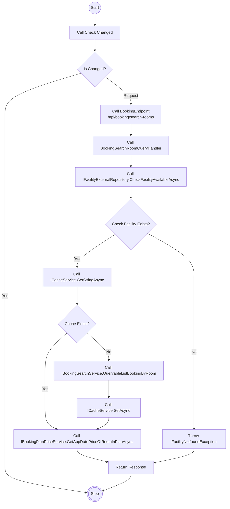
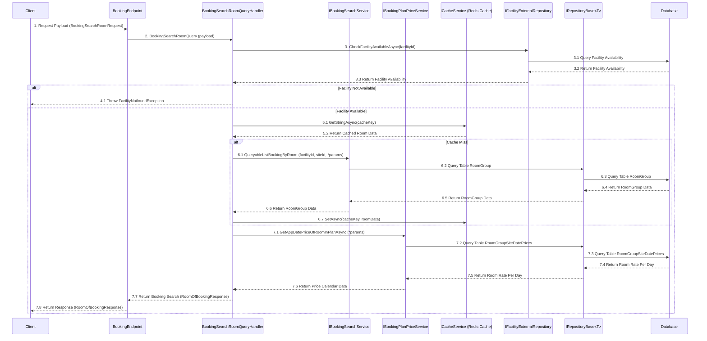

# Detail Design - Reservation - Search Room

------------------------------------------------------------------

## 1. Activity Diagram

> **Note**: The `Activity Diagram` illustrate the sequence of activities and interactions between different components during the booking
> search process.
> The `BookingEndPoint` `QueryableListBookingByRoom` and `GetAppDatePriceOfRoomInPlanAsync` use input parameters `BookingSearchRoomRequest`
> to filter the returned rooms and room rate calendar data.

### 1.1. Request (BookingSearchRoomRequest)

#### **BookingSearchRoomRequest**

| No | Parameter     | Description                                              |
|----|---------------|----------------------------------------------------------|
| 1  | CheckInDate   | The check-in date (required).                            |
| 2  | CheckOutDate  | The check-out date (required).                           |
| 3  | RestNumber    | The number of nights to stay (required).                 |
| 4  | RoomNumber    | The number of rooms (required).                          |
| 5  | MinPrice      | The minimum price (optional).                            |
| 6  | MaxPrice      | The maximum price (optional).                            |
| 7  | Secret        | A secret get rooms private (optional).                   |
| 8  | GuestsPerRoom | Details of guests per room (`GuestsPerRoom Parameters`). |

> **Note**: Ensure that the `CheckInDate` and `CheckOutDate` are in the correct format (yyyymmdd) and that all required parameters are
> provided.

##### **GuestsPerRoom Parameters**

| No | Parameter       | Description                                                       |
|----|-----------------|-------------------------------------------------------------------|
| 1  | AppDateId       | The date stay for the booking (required).                         |
| 2  | RestIndex       | The index indicating the number of nights in the stay (required). |
| 3  | RoomGroupIndex  | The index of the room group within the booking (required).        |
| 4  | PersonAgeTypeId | The ID representing the type of person's age (required).          |
| 5  | Persons         | The total number of persons (required).                           |
| 6  | MalePersons     | The total number of male persons (optional).                      |
| 7  | FemalePersons   | The total number of female persons (optional).                    |

> **Note**: This `Input Parameters` describes the `BookingSearchRoomRequest` input parameter to search for room for a booking.

### 1.2. Response (RoomOfBookingResponse)

#### **RoomOfBookingResponse**

| No | Data             | Description                                                                |
|----|------------------|----------------------------------------------------------------------------|
| 1  | Id               | The unique identifier for the room.                                        |
| 2  | Name             | The name of the room.                                                      |
| 3  | Tag              | An optional tag associated with the room.                                  |
| 4  | IsOnLinePayment  | Indicates if the room supports online payments.                            |
| 5  | IsOnSidePayment  | Indicates if the room supports on-site payments.                           |
| 6  | Description      | A detailed description of the room.                                        |
| 7  | BasePrice        | The base price of the room (optional).                                     |
| 8  | Categories       | A list of categories associated with the room ( `CategoryOfRoomResponse`). |
| 9  | Files            | A list of files or media related to the room (`FileOfRoomResponse`).       |
| 10 | Meals            | A list of meals included in the room (`MealOfRoomResponse`).               |
| 11 | IsEnabledSmoking | Indicates whether smoking is allowed in the room.                          |
| 12 | AppDatePrices    | List of prices for specific dates (`AppDatePriceOfRoomResponse`).          |

> **Note**: This `RoomOfBookingResponse` describes the API's return data field.

##### **CategoryOfRoomResponse**

| No | Data | Description                            |
|----|------|----------------------------------------|
| 1  | Id   | The unique identifier of the category. |
| 2  | Name | The name of the category.              |

##### **FileOfRoomResponse**

| No | Data        | Description                                      |
|----|-------------|--------------------------------------------------|
| 1  | Code        | The code for the file (e.g., file identifier).   |
| 2  | ContentType | The content type of the file (e.g., image/jpeg). |

##### **MealOfRoomResponse**

| No | Data            | Description                                        |
|----|-----------------|----------------------------------------------------|
| 1  | Id              | The unique identifier of the meal.                 |
| 2  | MealTypeEatType | The type of meal (e.g., breakfast, lunch, dinner). |
| 3  | Name            | The name of the meal.                              |

##### **AppDatePriceOfRoomResponse**

| No | Data         | Description                                                               |
|----|--------------|---------------------------------------------------------------------------|
| 1  | AppDateId    | The unique identifier for the applicable date.                            |
| 2  | RemainNumber | The remaining availability for the specific date.                         |
| 3  | BasePrice    | The base price for the specific date (optional).                          |
| 4  | Price        | The price for the specific date (optional).                               |
| 5  | TotalSpaTax  | The total spa tax for the specific date (optional).                       |
| 6  | TotalPrice   | The total price (Price + TotalSpaTax) for the specific date (calculated). |

> **Note**: The `TotalPrice` is calculated as the sum of `Price` and `TotalSpaTax`.

## 2. Sequence Diagram

### Description

| No. | Activity                                                    | Description                                                                                                                                                                                                            |
|-----|-------------------------------------------------------------|------------------------------------------------------------------------------------------------------------------------------------------------------------------------------------------------------------------------|
| 1   | Client → BookingEndpoint                                    | The `Client` sends a `BookingSearchRoomRequest` payload to the `BookingEndpoint`.                                                                                                                                      |
| 2   | BookingEndpoint → BookingSearchRoomQueryHandler             | `BookingEndpoint` forwards the request to `BookingSearchRoomQueryHandler` via `BookingSearchRoomQuery` with the payload.                                                                                               |
| 3   | BookingSearchRoomQueryHandler → IFacilityExternalRepository | The `BookingSearchRoomQueryHandler` calls `CheckFacilityAvailableAsync` to check if the facility is available.                                                                                                         |
| 3.1 | IFacilityExternalRepository → Database                      | The `IFacilityExternalRepository` queries the `Database` for facility availability.                                                                                                                                    |
| 3.2 | Database → IFacilityExternalRepository                      | The `Database` returns the facility availability status to the `IFacilityExternalRepository`.                                                                                                                          |
| 3.3 | IFacilityExternalRepository → BookingSearchRoomQueryHandler | The `IFacilityExternalRepository` returns the facility availability status to the `BookingSearchRoomQueryHandler`.                                                                                                     |
| 4.1 | BookingSearchRoomQueryHandler → BookingEndpoint             | The `BookingSearchRoomQueryHandler` returns a `Throw FacilityNotfoundException` response to the `BookingEndpoint`.                                                                                                     |
| 5.1 | BookingSearchRoomQueryHandler → ICacheService               | The `BookingSearchRoomQueryHandler` calls `GetStringAsync` to retrieve cached data.                                                                                                                                    |
| 5.2 | ICacheService → BookingSearchRoomQueryHandler               | The `ICacheService` returns the cached room data to the `BookingSearchRoomQueryHandler`.                                                                                                                               |
| 6.1 | BookingSearchRoomQueryHandler → IBookingSearchService       | The `BookingSearchRoomQueryHandler` calls `QueryableListBookingByRoom` the `IBookingSearchService` to query booking rooms using parameters like `facilityId`, `siteId` and parameters from `BookingSearchRoomRequest`. |
| 6.2 | IBookingSearchService → IRepository                         | The `IBookingSearchService` queries the `RoomGroup` table in the database for relevant data.                                                                                                                           |
| 6.3 | IRepository → Database                                      | The `IRepository` queries the `RoomGroup` table in the database for relevant data.                                                                                                                                     |
| 6.4 | Database → IRepository                                      | The `Database` returns the queried room data to the `IRepository`.                                                                                                                                                     |
| 6.5 | IRepository → IBookingSearchService                         | The `IRepository` returns the queried room data to the `IBookingSearchService`.                                                                                                                                        |
| 6.6 | IBookingSearchService → BookingSearchRoomQueryHandler       | The `IBookingSearchService` sends the retrieved room data back to the `BookingSearchRoomQueryHandler`.                                                                                                                 |
| 6.7 | BookingSearchRoomQueryHandler → ICacheService               | The `BookingSearchRoomQueryHandler` calls `SetAsync` to cache the retrieved room data.                                                                                                                                 |
| 7.1 | BookingSearchRoomQueryHandler → IBookingPlanPriceService    | The `BookingSearchRoomQueryHandler` calls `GetAppDatePriceOfRoomInPlanAsync` the `IBookingPlanPriceService` to get date and price details for rooms in the room using parameters from `BookingSearchRoomRequest`.      |
| 7.2 | IBookingPlanPriceService → IRepository                      | The `IBookingPlanPriceService` queries the `RoomSiteDatePrices` table in the database for room prices.                                                                                                                 |
| 7.3 | IRepository → Database                                      | The `IRepository` queries the `RoomGroupSiteDatePrices` table in the database for room prices.                                                                                                                         |
| 7.4 | Database → IRepository                                      | The `Database` returns room price data of `RoomGroupSiteDatePrices` for the requested dates to the `IRepository`.                                                                                                      |
| 7.5 | IRepository → IBookingPlanPriceService                      | The `IRepository` returns room price data of `RoomGroupSiteDatePrices` for the requested dates to the `IBookingPlanPriceService`.                                                                                      |
| 7.6 | IBookingPlanPriceService → BookingSearchRoomQueryHandler    | The `IBookingPlanPriceService` sends the price calendar data back to the `BookingSearchRoomQueryHandler`.                                                                                                              |
| 7.7 | BookingSearchRoomQueryHandler → BookingEndpoint             | The `BookingSearchRoomQueryHandler` returns the complete booking search result (`RoomOfBookingResponse`) to the `BookingEndpoint`.                                                                                     |
| 7.8 | BookingEndpoint → Client                                    | The `BookingEndpoint` sends the final response (`RoomOfBookingResponse`) back to the `Client`.                                                                                                                         |

> **Note**: The `Sequence Diagram` illustrates the interactions between the client, booking endpoint, query handler, services, and database
> during the booking search process, including the case where the facility is not available.
>
