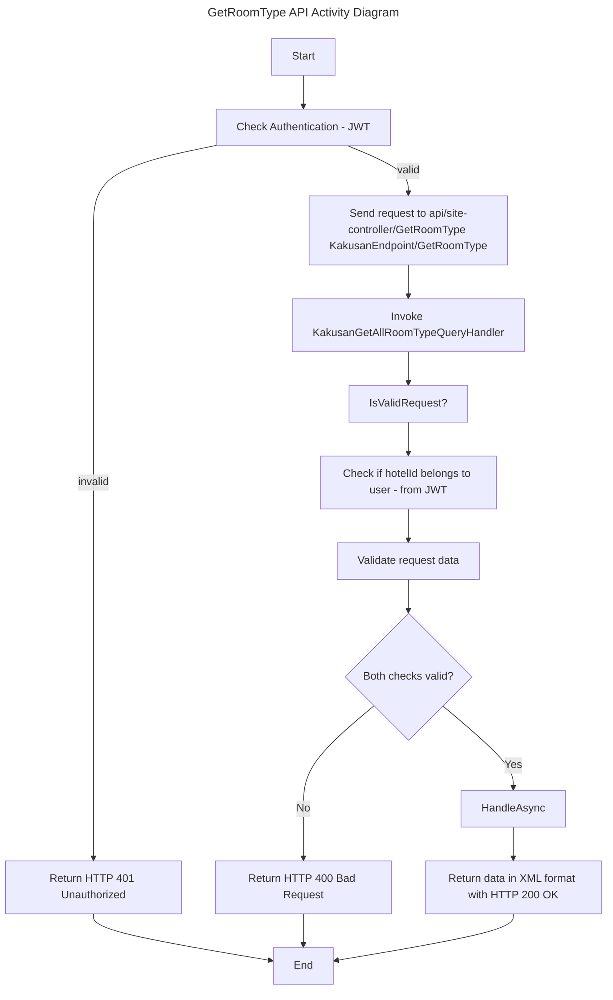
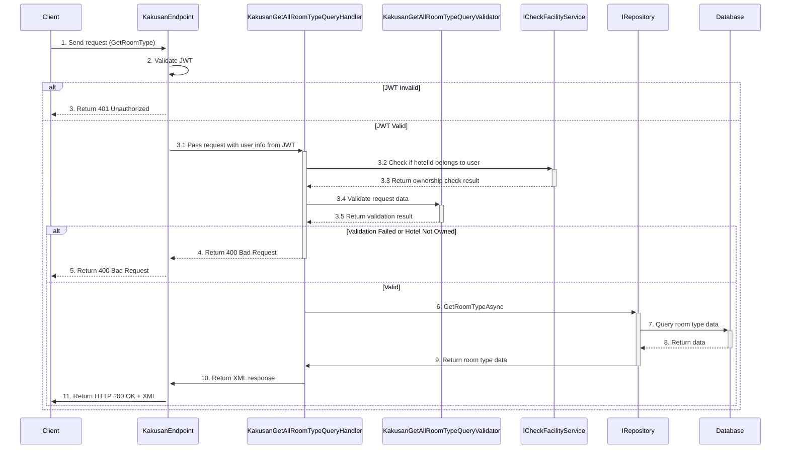

# Detail Design - C001 GetRoomType

------------------------------------------------------------------

## 1. Activity Diagram

```mermaid
---
title: GetRoomType API Activity Diagram
---

flowchart TD
  A[Start] --> A1[Check Authentication - JWT]
  A1 -- valid --> B[Send request to api/site-controller/GetRoomType KakusanEndpoint/GetRoomType]
  A1 -- invalid --> E1[Return HTTP 401 Unauthorized] --> Z[End]

  B --> C[Invoke KakusanGetAllRoomTypeQueryHandler]
  C --> D[IsValidRequest?]

  D --> D1[Check if hotelId belongs to user - from JWT]
  D1 --> D2[Validate request data]

  D2 --> Decision{Both checks valid?}
  Decision -- No --> E[Return HTTP 400 Bad Request] --> Z
  Decision -- Yes --> F[HandleAsync]
  F --> G[Return data in XML format with HTTP 200 OK]
  G --> Z[End]
```

## 2. Sequence Diagram

### GetRoomType API Sequence Diagram

```mermaid
sequenceDiagram
  participant Client
  participant KakusanEndpoint
  participant KakusanGetAllRoomTypeQueryHandler
  participant KakusanGetAllRoomTypeQueryValidator
  participant ICheckFacilityService
  participant IRepository
  participant Database

  Client ->>+ KakusanEndpoint: 1. Send request (GetRoomType)
  KakusanEndpoint ->> KakusanEndpoint: 2. Validate JWT

  alt JWT Invalid
    KakusanEndpoint -->> Client: 3. Return 401 Unauthorized
  else JWT Valid
    KakusanEndpoint ->>+ KakusanGetAllRoomTypeQueryHandler: 3.1 Pass request with user info from JWT
    KakusanGetAllRoomTypeQueryHandler ->>+ ICheckFacilityService: 3.2 Check if hotelId belongs to user
    ICheckFacilityService -->>- KakusanGetAllRoomTypeQueryHandler: 3.3 Return ownership check result

    KakusanGetAllRoomTypeQueryHandler ->>+ KakusanGetAllRoomTypeQueryValidator: 3.4 Validate request data
    KakusanGetAllRoomTypeQueryValidator -->>- KakusanGetAllRoomTypeQueryHandler: 3.5 Return validation result

    alt Validation Failed or Hotel Not Owned
      KakusanGetAllRoomTypeQueryHandler -->>- KakusanEndpoint: 4. Return 400 Bad Request
      KakusanEndpoint -->> Client: 5. Return 400 Bad Request
    else Valid
      KakusanGetAllRoomTypeQueryHandler ->>+ IRepository: 6. GetRoomTypeAsync
      IRepository ->>+ Database: 7. Query room type data
      Database -->>- IRepository: 8. Return data
      IRepository ->>- KakusanGetAllRoomTypeQueryHandler: 9. Return room type data
      KakusanGetAllRoomTypeQueryHandler ->> KakusanEndpoint: 10. Return XML response
      KakusanEndpoint ->> Client: 11. Return HTTP 200 OK + XML
    end
  end
```
