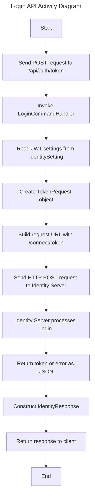
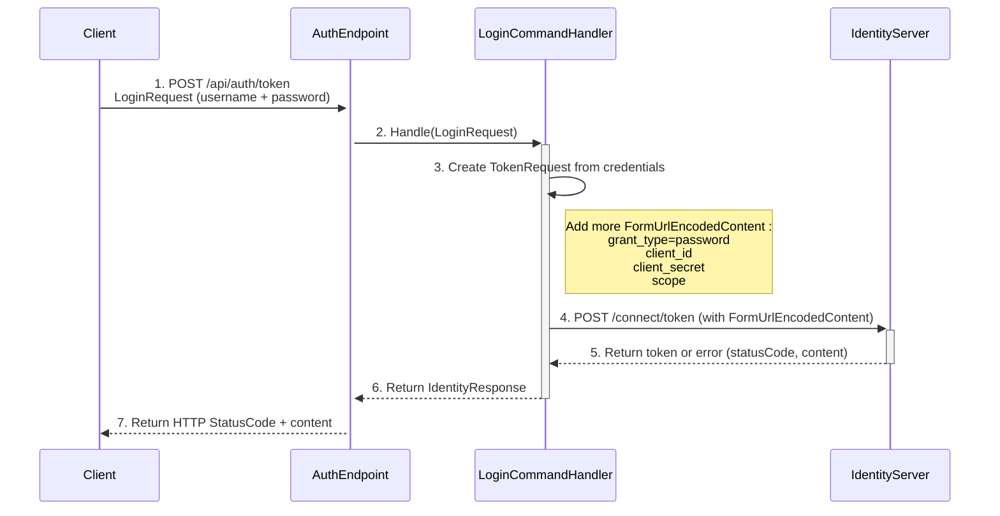

# Detail Design - Login

------------------------------------------------------------------

## 1. Activity Diagram

```mermaid
---
title: Login API Activity Diagram
---

flowchart TD
    A[Start] --> B[Send POST request to /api/auth/token]
    B --> D[Invoke LoginCommandHandler]
    D --> E[Read JWT settings from IdentitySetting]
    E --> F[Create TokenRequest object]
    F --> G[Build request URL with /connect/token]
    G --> H[Send HTTP POST request to Identity Server]
    H --> I[Identity Server processes login]
    I --> J[Return token or error as JSON]
    J --> K[Construct IdentityResponse]
    K --> L[Return response to client]
    L --> M[End]

```

## 2. Sequence Diagram

### Login API Sequence Diagram

```mermaid
sequenceDiagram
  participant Client
  participant AuthEndpoint
  participant LoginCommandHandler
  participant IdentityServer

Client->>+AuthEndpoint: 1. POST /api/auth/token <br>LoginRequest (username + password)
  AuthEndpoint ->>+ LoginCommandHandler: 2. Handle(LoginRequest)

  LoginCommandHandler ->> LoginCommandHandler: 3. Create TokenRequest from credentials
  Note right of LoginCommandHandler: Add more FormUrlEncodedContent :<br>grant_type=password<br>client_id<br>client_secret<br>scope
  LoginCommandHandler ->>+ IdentityServer: 4. POST /connect/token (with FormUrlEncodedContent)
  IdentityServer -->>- LoginCommandHandler: 5. Return token or error (statusCode, content)

  LoginCommandHandler -->>- AuthEndpoint: 6. Return IdentityResponse
  AuthEndpoint -->> Client: 7. Return HTTP StatusCode + content


```
