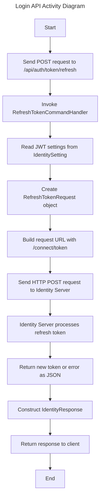
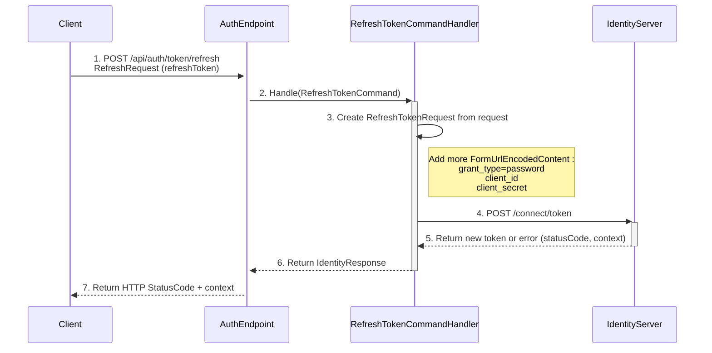

# Detail Design - Refresh Token

------------------------------------------------------------------

## 1. Activity Diagram

```mermaid
---
title: Login API Activity Diagram
---

flowchart TD
    A[Start] --> B[Send POST request to /api/auth/token/refresh]
    B --> C[Invoke RefreshTokenCommandHandler]
    C --> D[Read JWT settings from IdentitySetting]
    D --> E[Create RefreshTokenRequest object]
    E --> F[Build request URL with /connect/token]
    F --> G[Send HTTP POST request to Identity Server]
    G --> H[Identity Server processes refresh token]
    H --> I[Return new token or error as JSON]
    I --> J[Construct IdentityResponse]
    J --> K[Return response to client]
    K --> L[End]


```

## 2. Sequence Diagram

### RefreshToken API Sequence Diagram

```mermaid
sequenceDiagram
    participant Client
    participant AuthEndpoint
    participant RefreshTokenCommandHandler
    participant IdentityServer

    Client ->>+ AuthEndpoint: 1. POST /api/auth/token/refresh <br>RefreshRequest (refreshToken)
    AuthEndpoint ->>+ RefreshTokenCommandHandler: 2. Handle(RefreshTokenCommand)

    RefreshTokenCommandHandler ->> RefreshTokenCommandHandler: 3. Create RefreshTokenRequest from request

    Note right of RefreshTokenCommandHandler: Add more FormUrlEncodedContent :<br>grant_type=password<br>client_id<br>client_secret
    RefreshTokenCommandHandler ->>+ IdentityServer: 4. POST /connect/token
    IdentityServer -->>- RefreshTokenCommandHandler: 5. Return new token or error (statusCode, context)

    RefreshTokenCommandHandler -->>- AuthEndpoint: 6. Return IdentityResponse
    AuthEndpoint -->> Client: 7. Return HTTP StatusCode + context


```
