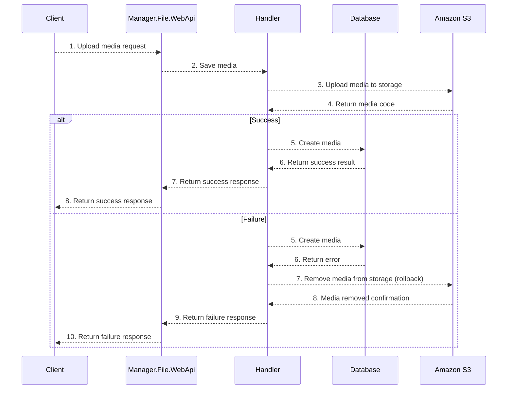
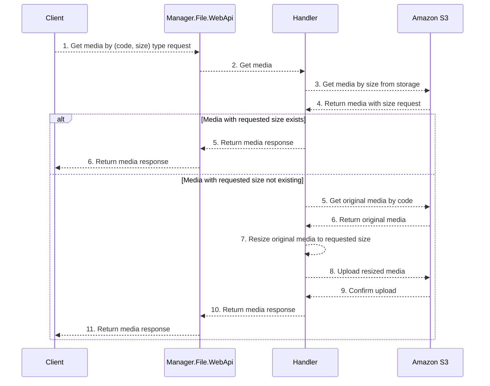
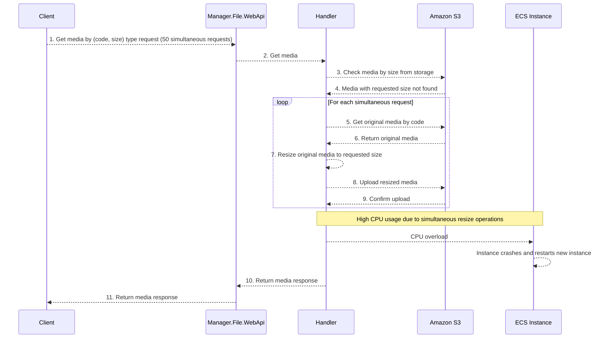
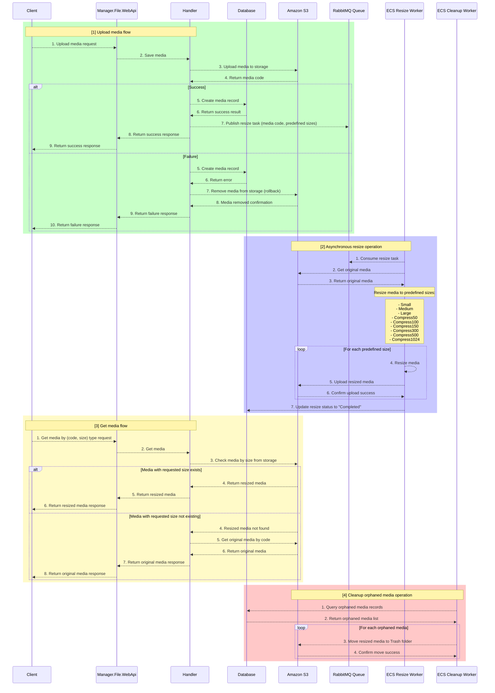

# Liberty Media Management With Amazon S3

## Table of Contents

- [Liberty Media Management With Amazon S3](#liberty-media-management-with-amazon-s3)
  - [Table of Contents](#table-of-contents)
  - [1. Current sequence diagram for Media](#1-current-sequence-diagram-for-media)
    - [Upload media sequence diagram](#upload-media-sequence-diagram)
    - [Get media sequence diagram](#get-media-sequence-diagram)
  - [2. Impact of High Concurrent Media Resize Requests on ECS Instance Performance](#2-impact-of-high-concurrent-media-resize-requests-on-ecs-instance-performance)
    - [Scenario](#scenario)
    - [Current Workflow](#current-workflow)
    - [Performance Issues](#performance-issues)
    - [Impact](#impact)
  - [3. Asynchronous Media Resizing Solution using RabbitMQ and Amazon S3 with Original Media Fallback](#3-asynchronous-media-resizing-solution-using-rabbitmq-and-amazon-s3-with-original-media-fallback)
    - [Context and Problem Statement](#context-and-problem-statement)
    - [This workflow results in critical performance issues](#this-workflow-results-in-critical-performance-issues)
    - [Proposed Comprehensive Solution](#proposed-comprehensive-solution)
    - [Solution Overview (Key Points)](#solution-overview-key-points)

## 1. Current sequence diagram for Media

### Upload media sequence diagram

### Get media sequence diagram

## 2. Impact of High Concurrent Media Resize Requests on ECS Instance Performance

### Scenario

- Approximately 50 simultaneous requests to retrieve media by specific code and requested size.

### Current Workflow

1. Client requests media by (code, size).
2. Handler checks Amazon S3 for the requested resized media.
3. If the resized media doesn’t exist:

    - Handler retrieves the original media from Amazon S3.
    - Performs on-demand resizing directly within the Handler.
    - Uploads resized media back to Amazon S3.

4. Finally, returns the resized media response to the client.

### Performance Issues

- CPU-intensive resizing operations running concurrently cause high CPU utilization.
- Leads to ECS instance overload, resulting in frequent instance crashes.
- ECS must restart or provision new instances, causing downtime and instability.

### Impact

- Reduced service availability.
- Degraded performance and reliability.
- Negative user experience due to delays or service interruption.

## 3. Asynchronous Media Resizing Solution using RabbitMQ and Amazon S3 with Original Media Fallback

### Context and Problem Statement

Given the current scenario where approximately 50 concurrent requests trigger the resizing of non-existent media, the system follows these steps for each request:

  1. Retrieve the original media file from Amazon S3.
  2. Resize the media directly on the ECS instance.
  3. Upload the resized media back to Amazon S3.

### This workflow results in critical performance issues

- High CPU utilization due to intensive, concurrent resizing tasks.
- ECS instance overload, leading to instance crashes and automatic instance recreation.

### Proposed Comprehensive Solution

To thoroughly address and resolve the described issue, the following comprehensive solution is proposed:

### Solution Overview (Key Points)

1. Media Upload Flow:

    - Client uploads original media files via API.
    - Original media is stored on Amazon S3, and metadata saved to the database.
    - **A resize task is published to a RabbitMQ queue upon successful upload.**

2. Asynchronous Resizing:

    - **ECS Resize Worker asynchronously processes media resize tasks from RabbitMQ.**
    - Original media files are resized into predefined sizes.
    - Resized images are stored back on Amazon S3.

3. Media Retrieval with Fallback:

    - When clients request media of specific sizes:
    - If resized media exists, it’s returned immediately.
    - If resized media is unavailable, the original media is returned as a fallback.

4. Cleanup of Orphaned Media:

    - A dedicated Cleanup Worker periodically identifies orphaned media files.
    - Orphaned resized media files (no longer associated with any entity) are moved into a Trash folder on Amazon S3 to optimize storage use.
