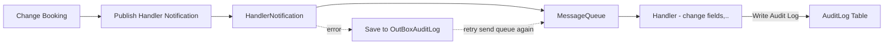

# Audit log - Change Reservation

1. [Audit log - Change Reservation](#audit-log---change-reservation)

- [Purpose](#purpose)
- [Solution : Use Domain Events](#solution--use-domain-events)
  - [Advantages](#-advantages)
  - [Disadvantages](#-disadvantages)
  - [Proposed Approach](#-proposed-approach-)
- [Implement](#implement)

## Purpose

Provide the ability to track and audit changes made to bookings. The design should store the history of bookings specifically while being flexible enough to extend to other entities in the future.

## Solution : Use Event Sourcing

Here, INotification comes from MediatR (or MartinOthamar's Mediator). It allows for easy switching between the two libraries if other issues arise.

## 📌 Flow Diagram



### ✅ Advantages

- **Separation of logic:** The logic for handling booking change logs is decoupled from the main domain, making the codebase easier to maintain and test.
- **Easy to extend:** New handlers can be added to process events (e.g., sending emails, updating cache) without modifying the core domain.
- **Ensures domain consistency:** Domain events are raised as soon as the domain state changes, preventing missing logs.
- **Supports event-driven architecture:** Facilitates the adoption of an event-driven architecture.
- **Integration with other systems:** Domain events can be published to message brokers (RabbitMQ, Kafka) for integration with other services.

### ⚠️ Disadvantages

- **Increased complexity:** Requires managing events, handlers, subscriptions, and asynchronous processing, which can be difficult for newcomers.
- **Harder to debug:** Asynchronous event handling can make tracking the execution flow more challenging.
- **Requires transaction handling:** If events are processed outside of the main transaction, logs may not be persisted when the domain transaction rolls back.
- **Event table growth:** The event store (or outbox table) can grow significantly in high-traffic systems due to the accumulation of events.

### 🔹 Proposed Approach :

#### 1. Requires transaction handling

✅ **1. Transactional Outbox Pattern**
When raising an event, instead of publishing it directly → write the event to an **Outbox table** within the same transaction as the entity.

A **background worker (or HostedService)** then reads the Outbox, publishes the event, and marks the event as processed.

👉 Ensures that the event is only published if the transaction is successfully committed.

#### 2. Event table growth

✅ **1. Design tables by aggregate boundaries**
To avoid performance issues due to an oversized centralized AuditLog table, we will separate audit logs into individual tables per aggregate. Each aggregate will have its own dedicated audit log table to ensure better scalability and maintainability

## Implement

### 1️⃣. Create Base AuditLog

#### 1.Base AuditLog

```csharp
public class BaseAuditLog<T> : EntityBase
{
    public string AggregateName { get; set; } = default!;
    public string AggregateCode { get; set; } = default!;
    public string Action { get; set; } = default!;

    public T? Request {get; set; }

    public string ChangedFields { get; set; } = "{}";

    public string UserName { get; set; } = default!;
    public string UserCode { get; set; } = default!;
    public string Email { get; set; } = default!;
}
```

### 2. Create BookingAuditLog

```csharp
public class BookingAuditLog
{
    public int AggregateId { get; set; }
}
```

### 2️⃣. Create Domain Event

```csharp
public class AggregateUpdatedEvent(
    string? aggregateName,
    string? aggregateId,
    string? aggregateCode,
    string? changeFields,
    string? userName,
    string? userCode,
    string? action,
    string? email
)
    : INotification
{
    public string? AggregateName { get; } = aggregateName;
    public string? AggregateCode { get; } = aggregateCode;
    public string? AggregateId { get; } = aggregateId;
    public string? UserName { get; set; } = userName;
    public string? UserCode { get; set; } = userCode;
    public string? Email { get; set; } = email;
    public string? Action { get; set; } = action;
    public string? ChangeFields { get; set; } = changeFields;
}
```

### 3️⃣ Event Handler for Saving Audit Logs

```csharp
public class AggregateUpdatedEventHandler(
   IBus bus,
   IAudidLogEventOutboxService audidLogEventOutboxService
) : INotificationHandler<AggregateUpdatedEvent>
{
    public async Task HandleAsnyc(AggregateUpdatedEvent notification, CancellationToken cancellationToken)
    {
       var bookingAuditLogModel = new BookingAuditLogModel() //data
        try
        {
            await bus.Send(bookingAuditLogModel, cancellationToken);
        } catch (Exception ex)
        {
            logger.LogError(ex, $"Failed to process {nameof(AggregateUpdatedEventHandler)}");
            await audidLogEventOutboxService.CreateAsync(bookingAuditLogModel, true, cancellationToken)
        }
    }
}
```

### 4️⃣ Create Queue handle

#### 1. Create auditLogAggregationQueue

```csharp
public const string AuditLogAggregationQueue = nameof(AuditLogAggregationQueue);
```

#### 2. Create event

```csharp
public class AuditLogAggregationEvent : ScheduleJobEvent
{
    public AuditLogAggregationEvent()
    {
        EventName = nameof(AuditLogAggregationEvent);
    }
}
```

#### 3. Setup consumer

```csharp
busFactoryConfigurator.ReceiveEndpoint(
    ReservationQueues.AuditLogAggregationQueue,
    endpointConfigurator =>
    {
        endpointConfigurator.Durable = true;
        endpointConfigurator.PrefetchCount = 1;
        endpointConfigurator.ConcurrentMessageLimit = 1;
        endpointConfigurator.UseMessageRetry(
            retryConfig => retryConfig.Incremental(
                5,
                TimeSpan.FromSeconds(30),
                TimeSpan.FromSeconds(30)
            )
        );
        endpointConfigurator.Consumer<AuditLogAggregationConsumer>(context);
    }
);
```

#### 4. Create consumer handler

```csharp
public class AuditLogAggregationConsumer(
    ILogger<AuditLogAggregationConsumer> logger,
    IBookingAuditLogService bookingAuditLogService
) : IConsumer<AuditLogAggregationEvent>
{
    public async Task Consume(
        ConsumeContext<AuditLogAggregationEvent> context
    )
    {
        var jsonContext = context.Message.JsonData;

        if (string.IsNullOrWhiteSpace(jsonContext))
        {
            logger.LogWarning("Aggregation skipped: JsonData is null or empty");
            return;
        }

        try
        {
            var model = JsonSerializer.Deserialize<BookingAuditLogModel>(jsonContext);
            if (model is null)
            {
                logger.LogWarning("Aggregation skipped: Model invalid");
                return;
            }

            var oldValue = JsonSerializer.Deserialize<Reservation.Application.Contexts.DataContexts.Entities.Data.Reservation>(model.OldValues!);
            var newValue = JsonSerializer.Deserialize<Reservation.Application.Contexts.DataContexts.Entities.Data.Reservation>(model.NewValues!);
            var (oldJson, newJson, changedJson) = GetAuditData(oldValue, newValue);

            var log = new BookingAuditLog
            {
                AggregateName = model.AggregateName,
                AggregateCode = model.AggregateCode
                AggregateId = model.AggregateId,
                Action = model.Action,
                OldValues = oldJson,
                NewValues = newJsone,
                ChangedFields = changedJson
                UserName =  model.UserName,
                UserCode = model.UserCode,
                Email = model.Email
            };

            await bookingAuditLogService.AddAsync(log, autoSave: true, cancellationToken);

        }
        catch (Exception ex)
        {
            logger.LogError(ex, $"Failed to process {nameof(AuditLogAggregationEvent)}");
        }
    }

    private static (string OldJson, string NewJson, string ChangedFieldsJson) GetAuditData<T>(T oldEntity, T newEntity)
    {
        var diffs = new Dictionary<string, object[]>();

        foreach (var prop in typeof(T).GetProperties())
        {
            var oldVal = prop.GetValue(oldEntity);
            var newVal = prop.GetValue(newEntity);

            if (!Equals(oldVal, newVal))
            {
                diffs[prop.Name] = [oldVal!, newVal!];
            }
        }

        return (
            JsonSerializer.Serialize(oldEntity),
            JsonSerializer.Serialize(newEntity),
            JsonSerializer.Serialize(diffs)
        );
    }
}
```

### 5. Setup hosted service

```csharp
protected override async Task HandlerExecuteAsync(
        object? state
    )
    {
        logger.LogInformation("Start background job {JobName}", nameof(AuditLogEventOutboxHostedService));

        await Semaphore.WaitAsync();

        try
        {
            using var scope = serviceScopeFactory.CreateScope();
            var eventOutboxService = scope.ServiceProvider.GetRequiredService<IAuditLogEventOutboxService>();

            var auditLogEvents = await eventOutboxService.GetUnpublishedEventsAsync(
                DefaultValues.ServiceNameOfManager,
                Pageable.Of(1, _pageSize)
            );

            var eventsToRemove = new List<AuditLogEventOutbox>();
            foreach (var eventOutbox in auditLogEvents)
            {
                await bus.Send(integrationEvents.jsonData)

                if (!isSuccess)
                {
                    continue;
                }

                eventsToRemove.Add(eventOutbox);

                await eventOutboxService.DeletePhysicalAsync(
                    eventOutbox.Id
                );
            }

            logger.LogInformation(
                "End background job {JobName}, {Count} events processed: {EventIds}",
                nameof(EventOutboxHostedService),
                eventsToRemove.Count,
                string.Join(", ", eventsToRemove.Select(x => x.Id))
            );
        }
        catch (Exception ex)
        {
            Logger.LogError(ex, "{JobName} error occurred", nameof(EventOutboxHostedService));
        }
        finally
        {
            Semaphore.Release();
        }
    }
```

### 5️⃣ Save data and publish notification

```csharp
await UnitOfWork.BeginTransactionAsync(cancellationToken: cancellationToken);

 if (existingReservation.IsOnlinePayment && isModifyInPrice)
 {
     _ = await OnlinePaymentRefundAsync(
         existingReservation.Id
     );
 }

 var bookingResponse = await mediator.Send(
     new BookingAdjustCommand(
         existingReservation,
         isModifyInPrice ? ReservationStatus.ManagerModified : ReservationStatus.Modified,
         isModifyInPrice
     ) { Payload = payload },
     cancellationToken
 );
 await UnitOfWork.CommitAsync(cancellationToken);

  var aggregateEvent = new AggregateUpdatedEvent(
      nameOf(Reservation),
      bookingResponse.Id,
      bookingResponse.Code,
      changedJson,
      oldJson,
      newJson,
      userName,
      userCode,
      "Update",
      userEmail
  );
  await mediator.Puslish(aggregateEvent, cancellationToken)
```
