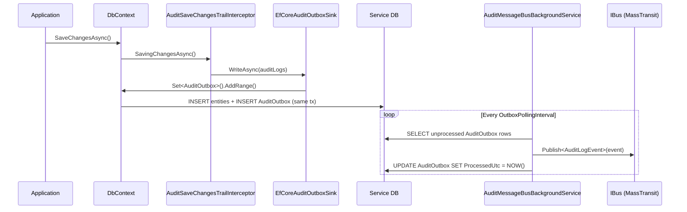
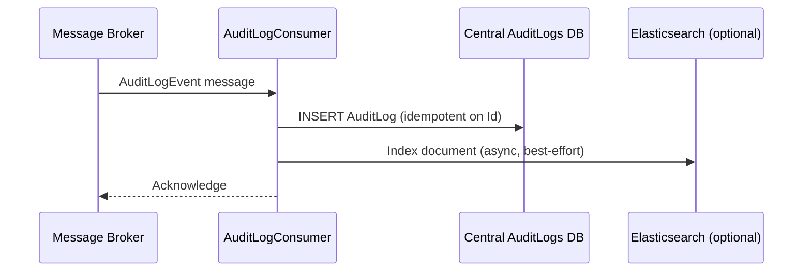

# Audit Logging — Cross-Service Platform Design

- [Audit Logging — Cross-Service Platform Design](#audit-logging--cross-service-platform-design)
  - [1. Why Local-DB Audit Is Insufficient](#1-why-local-db-audit-is-insufficient)
  - [2. Target Architecture](#2-target-architecture)
    - [2.1 System Diagram](#21-system-diagram)
    - [2.2 Flow — Per-Service (Producer Side)](#22-flow--per-service-producer-side)
    - [2.3 Flow — Central Platform (Consumer Side)](#23-flow--central-platform-consumer-side)
  - [3. Module Split](#3-module-split)
  - [4. AuditLogEvent — Message Contract](#4-auditlogevent--message-contract)
  - [5. Changes to SharedKernel.AuditLogging](#5-changes-to-sharedkernelauditlogging)
    - [5.1 New Mode: MessageBus](#51-new-mode-messagebus)
    - [5.2 IAuditEventPublisher](#52-iauditeventpublisher)
    - [5.3 AuditMessageBusBackgroundService](#53-auditmessagebusbackgroundservice)
    - [5.4 What Does NOT Change](#54-what-does-not-change)
  - [6. New Module: SharedKernel.AuditLogging.MassTransit](#6-new-module-sharedkernelauditloggingmasstransit)
    - [6.1 MassTransitAuditEventPublisher](#61-masstransitauditeventpublisher)
    - [6.2 AddAuditLoggingMassTransit() Extension](#62-addauditloggingmasstransit-extension)
  - [7. Central Audit Platform Service](#7-central-audit-platform-service)
    - [7.1 Responsibilities](#71-responsibilities)
    - [7.2 AuditLogConsumer](#72-auditlogconsumer)
    - [7.3 Central Schema](#73-central-schema)
    - [7.4 Query API](#74-query-api)
  - [8. Reliability Guarantees](#8-reliability-guarantees)
    - [8.1 At-Least-Once Delivery via Outbox](#81-at-least-once-delivery-via-outbox)
    - [8.2 Idempotency in the Consumer](#82-idempotency-in-the-consumer)
  - [9. Multi-Tenancy and Cross-Service Correlation](#9-multi-tenancy-and-cross-service-correlation)
  - [10. Integration Guide — Producer Service](#10-integration-guide--producer-service)
    - [10.1 Package References](#101-package-references)
    - [10.2 Register Services](#102-register-services)
    - [10.3 DbContext Setup](#103-dbcontext-setup)
    - [10.4 appsettings.json](#104-appsettingsjson)
    - [10.5 What the Service No Longer Needs](#105-what-the-service-no-longer-needs)
  - [11. Deployment Topology](#11-deployment-topology)
  - [12. Trade-offs](#12-trade-offs)
  - [13. Migration from Local-DB Mode](#13-migration-from-local-db-mode)

---

## 1. Why Local-DB Audit Is Insufficient

The current `SharedKernel.AuditLogging` implementation writes audit rows directly into each service's own database. This creates a set of structural problems:

| Problem | Impact |
| --- | --- |
| Each service has its own `AuditLogs` table | No unified view across the system |
| "What did user X do?" requires querying every service DB | Compliance queries are operationally infeasible |
| `AuditLogs` table is coupled to the service's migration lifecycle | Schema changes to the audit model require coordinated migrations across all services |
| Retention and archival must be implemented per-service | No consistent policy enforcement |
| Hash-chain tamper detection only covers one service's rows | Gaps across service boundaries are undetectable |
| No cross-service correlation on audit data | `TraceId` exists in the row but there is no tool to use it |

Treating audit as a local concern means it scales the same way the service scales, but does not produce the shared capability that compliance, security, and operations teams actually need.

---

## 2. Target Architecture

### 2.1 System Diagram

```text
┌────────────────────────────────────────────────────────────────────────────────┐
│  Each Microservice (Order, Payment, Inventory, Booking, ...)                    │
│                                                                                │
│  ┌─────────────────────────────────────────────────────────────┐              │
│  │  EF Core SaveChanges                                        │              │
│  │       ↓                                                     │              │
│  │  AuditSaveChangesTrailInterceptor  (unchanged)              │              │
│  │       ↓                                                     │              │
│  │  EfCoreAuditOutboxSink  →  AuditOutbox table (same tx)      │              │
│  └─────────────────────────────────────────────────────────────┘              │
│                    ↓ (every OutboxPollingInterval)                             │
│  ┌─────────────────────────────────────────────────────────────┐              │
│  │  AuditMessageBusBackgroundService                           │              │
│  │       reads AuditOutbox rows                                │              │
│  │       → IBus.Publish<AuditLogEvent>()  (MassTransit)        │              │
│  │       → marks AuditOutbox row as processed                  │              │
│  └─────────────────────────────────────────────────────────────┘              │
│                                                                                │
│  (No AuditLogs table in this service's DB)                                    │
└────────────────────────────────────────────────────────────────────────────────┘
                              │
                    Message Broker (RabbitMQ or Kafka)
                    Exchange/Topic: audit.log.events
                              │
┌─────────────────────────────▼──────────────────────────────────────────────────┐
│  AuditPlatform Service (central, dedicated)                                    │
│                                                                                │
│  ┌──────────────────────┐   ┌────────────────────────────────────┐            │
│  │ AuditLogConsumer     │   │ AuditLogs table (central PostgreSQL)│            │
│  │ (MassTransit)        │ → │ Indexed by: entity, user, tenant,  │            │
│  │                      │   │ timestamp, service, traceId        │            │
│  └──────────────────────┘   └────────────────────────────────────┘            │
│                                          ↓ (optional)                         │
│  ┌──────────────────────────────────────────────────────────────┐             │
│  │  Elasticsearch / OpenSearch projection                        │             │
│  │  (free-text search, aggregation dashboards)                   │             │
│  └──────────────────────────────────────────────────────────────┘             │
│                                                                                │
│  ┌──────────────────────────────────────────────────────────────┐             │
│  │  Query REST API  GET /audit-logs?...                         │             │
│  └──────────────────────────────────────────────────────────────┘             │
└────────────────────────────────────────────────────────────────────────────────┘
```

### 2.2 Flow — Per-Service (Producer Side)



### 2.3 Flow — Central Platform (Consumer Side)



---

## 3. Module Split

| Module | Role | Dependency |
| --- | --- | --- |
| `SharedKernel.AuditLogging` | Core: interceptor, models, `EfCoreAuditOutboxSink`, options | EF Core, ASP.NET Core |
| `SharedKernel.AuditLogging.MassTransit` | MassTransit publishing integration | `SharedKernel.AuditLogging` + `SharedKernel.MassTransit` |
| `AuditPlatform` service | Central consumer + storage + query API | Standalone deployable; references `SharedKernel.AuditLogging.MassTransit` for the message contract |

The **`SharedKernel.AuditLogging` core module is not changed** — the interceptor, redaction, context snapshot, and outbox sink remain identical. Only the delivery layer changes.

Producer services add **both** modules. The `AuditPlatform` service only needs the message contract from `SharedKernel.AuditLogging.MassTransit` and its own consumer logic.

---

## 4. AuditLogEvent — Message Contract

Defined in `SharedKernel.AuditLogging.MassTransit` so both producers and the `AuditPlatform` consumer share the same type.

```csharp
namespace SharedKernel.AuditLogging.MassTransit.Contracts;

public sealed record AuditLogEvent
{
    // Stable identifier — used for idempotency in the consumer.
    // Copied from AuditLog.Id (set by the interceptor before outbox write).
    public Guid Id { get; init; }

    // Source service name — from AuditLoggingOptions.Source
    public string ServiceName { get; init; } = string.Empty;

    public string EntityName { get; init; } = string.Empty;
    public string EntityId   { get; init; } = string.Empty;

    // "Insert" | "Update" | "SoftDelete" | "Delete"
    public string Operation  { get; init; } = string.Empty;

    public string  UserId   { get; init; } = string.Empty;
    public string  UserName { get; init; } = string.Empty;
    public string? TenantId  { get; init; }
    public string? IpAddress { get; init; }
    public string? TraceId   { get; init; }

    public DateTime TimestampUtc { get; init; }

    // JSON delta: { "Field": { "old": ..., "new": ... } }
    public string ChangesJson  { get; init; } = "{}";
    public string MetadataJson { get; init; } = "{}";
}
```

**Design rules for the contract:**
- No EF Core or domain types leak into it — it is a plain record.
- `Id` is assigned by the interceptor (`AuditLog.Id = Guid.NewGuid()`) so it is stable across outbox retries.
- `Operation` is a `string`, not an enum, to avoid versioning friction as new operations are added.
- `ChangesJson` and `MetadataJson` remain opaque strings — the consumer stores them verbatim.

---

## 5. Changes to SharedKernel.AuditLogging

### 5.1 New Mode: MessageBus

```csharp
public enum AuditLoggingMode
{
    Sync       = 1,  // write directly to local AuditLogs (dev/test only)
    Outbox     = 2,  // write to local AuditLogs via AuditOutbox + background processor
    MessageBus = 3   // NEW: write to AuditOutbox + background processor publishes to IBus
}
```

In `MessageBus` mode:
- `EfCoreAuditOutboxSink` is used (unchanged) — writes `AuditOutbox` rows in the same transaction.
- `AuditMessageBusBackgroundService` (new) replaces `AuditOutboxBackgroundService` — reads `AuditOutbox` and publishes to the bus instead of inserting into a local `AuditLogs` table.
- The service's `DbContext` **does not** need `modelBuilder.Entity<AuditLog>()` configured. Only `AuditOutbox` needs to exist in the schema.

### 5.2 IAuditEventPublisher

New abstraction in `SharedKernel.AuditLogging`:

```csharp
namespace SharedKernel.AuditLogging.Abstractions;

public interface IAuditEventPublisher
{
    Task PublishAsync(AuditLog auditLog, CancellationToken cancellationToken = default);
}
```

`AuditMessageBusBackgroundService` depends on `IAuditEventPublisher`, not on `IBus` directly. This keeps `SharedKernel.AuditLogging` free of a MassTransit dependency. The concrete `MassTransitAuditEventPublisher` lives in the separate integration module.

### 5.3 AuditMessageBusBackgroundService

Replaces `AuditOutboxBackgroundService` when `Mode = MessageBus`:

```csharp
public sealed class AuditMessageBusBackgroundService<TDbContext>(
    IServiceScopeFactory scopeFactory,
    IOptions<AuditLoggingOptions> options,
    ILogger<AuditMessageBusBackgroundService<TDbContext>> logger
) : BackgroundService where TDbContext : DbContext
{
    protected override async Task ExecuteAsync(CancellationToken stoppingToken)
    {
        while (!stoppingToken.IsCancellationRequested)
        {
            try
            {
                await ProcessBatchAsync(stoppingToken);
            }
            catch (OperationCanceledException) when (stoppingToken.IsCancellationRequested)
            {
                return;
            }
            catch (Exception ex)
            {
                logger.LogError(ex, "Audit event publishing failed.");
            }

            await Task.Delay(options.Value.OutboxPollingInterval, stoppingToken);
        }
    }

    private async Task ProcessBatchAsync(CancellationToken ct)
    {
        if (!options.Value.Enabled || options.Value.Mode != AuditLoggingMode.MessageBus)
            return;

        using var scope = scopeFactory.CreateScope();
        var dbContext  = scope.ServiceProvider.GetRequiredService<TDbContext>();
        var publisher  = scope.ServiceProvider.GetRequiredService<IAuditEventPublisher>();

        var batch = await dbContext.Set<AuditOutbox>()
            .Where(static m => m.ProcessedUtc == null)
            .OrderBy(static m => m.CreatedUtc)
            .Take(options.Value.OutboxBatchSize)
            .ToListAsync(ct);

        if (batch.Count == 0) return;

        foreach (var outbox in batch)
        {
            try
            {
                var auditLog = JsonSerializer.Deserialize<AuditLog>(
                    outbox.PayloadJson,
                    AuditJsonSerializer.Options
                ) ?? throw new InvalidOperationException("Empty audit outbox payload.");

                await publisher.PublishAsync(auditLog, ct);
                outbox.ProcessedUtc = DateTime.UtcNow;
                outbox.LastError    = null;
            }
            catch (Exception ex) when (ex is JsonException or InvalidOperationException)
            {
                outbox.Attempts++;
                outbox.LastError = ex.Message;
            }
        }

        await dbContext.SaveChangesAsync(ct);
    }
}
```

### 5.4 What Does NOT Change

All of the following remain **identical** to the current implementation:

- `AuditSaveChangesTrailInterceptor` — change capture logic
- `EfCoreAuditOutboxSink` — outbox write in same transaction
- `IAuditContextAccessor` / `DefaultAuditContextAccessor` — identity propagation
- `IAuditEntityIdResolver` / `DefaultAuditEntityIdResolver`
- `AuditRedactAttribute`, `AuditIgnoreAttribute`
- `AuditLoggingOptions` (except adding `Mode = MessageBus` and `ReloadDatabaseValuesOnUpdate`)
- `AuditHashService` — removed from `MessageBus` mode (hash chain is computed centrally by the platform)
- `ModelBuilderExtensions.ApplyAuditLogging()` — still configures `AuditOutbox`; `AuditLog` entity mapping is optional (only needed in `Sync`/`Outbox` modes)

---

## 6. New Module: SharedKernel.AuditLogging.MassTransit

### 6.1 MassTransitAuditEventPublisher

```csharp
using MassTransit;
using SharedKernel.AuditLogging.Abstractions;
using SharedKernel.AuditLogging.MassTransit.Contracts;
using SharedKernel.AuditLogging.Models;

namespace SharedKernel.AuditLogging.MassTransit;

internal sealed class MassTransitAuditEventPublisher(
    IPublishEndpoint publishEndpoint
) : IAuditEventPublisher
{
    public async Task PublishAsync(AuditLog auditLog, CancellationToken cancellationToken = default)
    {
        ArgumentNullException.ThrowIfNull(auditLog);

        var message = new AuditLogEvent
        {
            Id           = auditLog.Id,
            ServiceName  = auditLog.Source,
            EntityName   = auditLog.EntityName,
            EntityId     = auditLog.EntityId,
            Operation    = auditLog.Operation.ToString(),
            UserId       = auditLog.UserId,
            UserName     = auditLog.UserName,
            TenantId     = auditLog.TenantId,
            IpAddress    = auditLog.IpAddress,
            TraceId      = auditLog.TraceId,
            TimestampUtc = auditLog.TimestampUtc,
            ChangesJson  = auditLog.ChangesJson,
            MetadataJson = auditLog.MetadataJson
        };

        await publishEndpoint.Publish(message, cancellationToken);
    }
}
```

`IPublishEndpoint` is resolved from the scoped container — it is the MassTransit-recommended way to publish from non-consumer code.

### 6.2 AddAuditLoggingMassTransit() Extension

```csharp
public static class ServiceCollectionExtensions
{
    public static IServiceCollection AddAuditLoggingMassTransit<TDbContext>(
        this IServiceCollection services
    ) where TDbContext : DbContext
    {
        ArgumentNullException.ThrowIfNull(services);

        services.TryAddScoped<IAuditEventPublisher, MassTransitAuditEventPublisher>();
        services.AddHostedService<AuditMessageBusBackgroundService<TDbContext>>();

        return services;
    }
}
```

---

## 7. Central Audit Platform Service

`AuditPlatform` is a dedicated microservice operated by the platform team. It is the single source of truth for all audit data across all services.

### 7.1 Responsibilities

| Responsibility | Details |
| --- | --- |
| Consume `AuditLogEvent` messages | From all services via MassTransit |
| Store in central `AuditLogs` table | PostgreSQL with indexes for compliance queries |
| Project to Elasticsearch | Optional — enables full-text and faceted search |
| Expose query REST API | Filterable by service, entity, user, tenant, time range |
| Enforce retention policy | Archive rows older than N days to cold storage |
| Integrity verification | Validate hash chain per-service per-entity on demand |

### 7.2 AuditLogConsumer

```csharp
public sealed class AuditLogConsumer(
    AuditPlatformDbContext dbContext,
    ILogger<AuditLogConsumer> logger
) : IConsumer<AuditLogEvent>
{
    public async Task Consume(ConsumeContext<AuditLogEvent> context)
    {
        var msg = context.Message;

        // Idempotency: skip if already stored (at-least-once delivery from outbox)
        var exists = await dbContext.AuditLogs
            .AnyAsync(a => a.SourceEventId == msg.Id, context.CancellationToken);

        if (exists)
        {
            logger.LogDebug("Duplicate AuditLogEvent {Id} skipped.", msg.Id);
            return;
        }

        dbContext.AuditLogs.Add(new CentralAuditLog
        {
            Id            = Guid.NewGuid(),
            SourceEventId = msg.Id,          // ← for idempotency
            ServiceName   = msg.ServiceName,
            EntityName    = msg.EntityName,
            EntityId      = msg.EntityId,
            Operation     = msg.Operation,
            UserId        = msg.UserId,
            UserName      = msg.UserName,
            TenantId      = msg.TenantId,
            IpAddress     = msg.IpAddress,
            TraceId       = msg.TraceId,
            TimestampUtc  = msg.TimestampUtc,
            ChangesJson   = msg.ChangesJson,
            MetadataJson  = msg.MetadataJson,
            ReceivedUtc   = DateTime.UtcNow
        });

        await dbContext.SaveChangesAsync(context.CancellationToken);
    }
}
```

**Consumer configuration in MassTransit:**

```csharp
busConfigurator.AddConsumer<AuditLogConsumer>(cfg =>
{
    cfg.UseConcurrentMessageLimit(10);
    cfg.UseMessageRetry(r => r.Exponential(5, TimeSpan.FromSeconds(1), TimeSpan.FromSeconds(30), TimeSpan.FromSeconds(2)));
});
```

### 7.3 Central Schema

```sql
CREATE TABLE "AuditLogs" (
    "Id"            UUID          NOT NULL PRIMARY KEY,
    "SourceEventId" UUID          NOT NULL,          -- AuditLogEvent.Id, for idempotency
    "ServiceName"   VARCHAR(256)  NOT NULL,
    "EntityName"    VARCHAR(256)  NOT NULL,
    "EntityId"      VARCHAR(256)  NOT NULL,
    "Operation"     VARCHAR(50)   NOT NULL,
    "UserId"        VARCHAR(256)  NOT NULL,
    "UserName"      VARCHAR(256)  NOT NULL,
    "TenantId"      VARCHAR(256),
    "IpAddress"     VARCHAR(128),
    "TraceId"       VARCHAR(128),
    "TimestampUtc"  TIMESTAMPTZ   NOT NULL,
    "ChangesJson"   TEXT          NOT NULL,
    "MetadataJson"  TEXT          NOT NULL,
    "ReceivedUtc"   TIMESTAMPTZ   NOT NULL
);

-- Compliance query patterns
CREATE UNIQUE INDEX "UIX_AuditLogs_SourceEventId"            ON "AuditLogs" ("SourceEventId");
CREATE INDEX "IX_AuditLogs_UserId_TimestampUtc"              ON "AuditLogs" ("UserId", "TimestampUtc" DESC);
CREATE INDEX "IX_AuditLogs_TenantId_TimestampUtc"            ON "AuditLogs" ("TenantId", "TimestampUtc" DESC);
CREATE INDEX "IX_AuditLogs_ServiceName_EntityName_EntityId"  ON "AuditLogs" ("ServiceName", "EntityName", "EntityId");
CREATE INDEX "IX_AuditLogs_TimestampUtc"                     ON "AuditLogs" ("TimestampUtc" DESC);
CREATE INDEX "IX_AuditLogs_TraceId"                          ON "AuditLogs" ("TraceId") WHERE "TraceId" IS NOT NULL;
```

### 7.4 Query API

```http
GET /audit-logs
  ?serviceName=OrderService
  &entityName=Order
  &entityId=ORD-001
  &userId=user-1
  &tenantId=tenant-acme
  &traceId=00-abc...
  &from=2026-01-01T00:00:00Z
  &to=2026-01-31T23:59:59Z
  &operation=Update
  &page=1
  &pageSize=50

Response 200:
{
  "total": 142,
  "items": [
    {
      "id": "...",
      "serviceName": "OrderService",
      "entityName": "Order",
      "entityId": "ORD-001",
      "operation": "Update",
      "userId": "user-1",
      "userName": "Alice",
      "tenantId": "tenant-acme",
      "traceId": "00-abc...",
      "timestampUtc": "2026-01-15T10:23:44Z",
      "changes": {
        "Status": { "old": "Pending", "new": "Shipped" }
      }
    }
  ]
}
```

---

## 8. Reliability Guarantees

### 8.1 At-Least-Once Delivery via Outbox

The `AuditOutbox` row is written in the same EF Core transaction as the entity change. If the publish step fails (broker down, pod restart), the `AuditMessageBusBackgroundService` retries on the next polling cycle. The `AuditOutbox.Attempts` counter tracks failed attempts; `LastError` stores the failure reason for diagnosis.

```text
Entity change committed
       ↓
AuditOutbox row committed (same tx)   ← guaranteed atomicity
       ↓
[any failure here does not lose the event]
       ↓
AuditMessageBusBackgroundService polls
       ↓
IBus.Publish<AuditLogEvent>() succeeds
       ↓
AuditOutbox.ProcessedUtc = NOW() committed
```

**Dead-letter handling:** Configure a max attempt threshold (e.g., 20). After that many failures, the background service skips the row and logs an alert. A separate admin endpoint or job processes dead-letter rows.

### 8.2 Idempotency in the Consumer

MassTransit guarantees at-least-once delivery. The consumer guards against duplicates using `SourceEventId` (the original `AuditLog.Id` from the producer):

```sql
CREATE UNIQUE INDEX "UIX_AuditLogs_SourceEventId" ON "AuditLogs" ("SourceEventId");
```

If the same event is delivered twice, the second `INSERT` violates the unique constraint. The consumer catches the `DbUpdateException`, logs a debug message, and acknowledges the message — the event was already stored on the first delivery.

---

## 9. Multi-Tenancy and Cross-Service Correlation

**Multi-tenancy** is handled automatically. `AuditContextSnapshot.TenantId` is captured from the JWT claim and flows through `AuditLogEvent.TenantId` into the central store. The query API filters by `tenantId` so each tenant only sees their own audit data.

**Cross-service correlation** uses two fields:

| Field | Purpose |
| --- | --- |
| `TraceId` | W3C TraceContext ID — links all audit events generated during a single distributed request across services |
| `UserId` | Identifies all actions by one user across all services |

A single request that touches Order → Payment → Inventory produces three audit events (one per entity change), each with the same `TraceId`. The query API can reconstruct the full cross-service timeline for that request:

```http
GET /audit-logs?traceId=00-0af7651916cd43dd8448eb211c80319c-b9c7c989f97918e1-01
```

For this to work, services must propagate the `Activity.Current` context. The `DefaultAuditContextAccessor` already reads `Activity.Current?.TraceId`, so services using OpenTelemetry get this for free. Services using `SharedKernel.Grpc` must propagate via header forwarding (`HeaderPropagationHandler`).

---

## 10. Integration Guide — Producer Service

### 10.1 Package References

```xml
<PackageReference Include="SharedKernel.AuditLogging" />
<PackageReference Include="SharedKernel.AuditLogging.MassTransit" />
```

### 10.2 Register Services

```csharp
// Program.cs

// Core audit capture — mode must be MessageBus
builder.Services.AddAuditLogging(options =>
{
    options.Mode   = AuditLoggingMode.MessageBus;
    options.Source = "OrderService";
});

// MassTransit transport (already configured via SharedKernel.MassTransit)
builder.Services.AddMassTransitCustom(builder.Configuration, configure: bus =>
{
    // no consumer registration needed on the producer side
});

// Publisher + background service
builder.Services.AddAuditLoggingMassTransit<AppDbContext>();
```

### 10.3 DbContext Setup

```csharp
builder.Services.AddDbContext<AppDbContext>((serviceProvider, options) =>
{
    options
        .UseNpgsql(connectionString)
        .AddAuditLoggingInterceptor(serviceProvider);
});
```

```csharp
// AppDbContext.OnModelCreating
protected override void OnModelCreating(ModelBuilder modelBuilder)
{
    base.OnModelCreating(modelBuilder);
    modelBuilder.ApplyConfigurationsFromAssembly(Assembly.GetExecutingAssembly());

    // Only AuditOutbox is needed — no AuditLog entity in this service's schema
    modelBuilder.Entity<AuditOutbox>(builder =>
    {
        builder.ToTable("AuditOutbox");
        builder.HasKey(x => x.Id);
        builder.Property(x => x.PayloadJson).IsRequired();
        builder.Property(x => x.LastError).HasMaxLength(2048);
        builder.HasIndex(x => x.ProcessedUtc);
    });
}
```

Migration:

```bash
dotnet ef migrations add AddAuditOutbox
dotnet ef database update
```

### 10.4 appsettings.json

```json
{
  "AuditLogging": {
    "Enabled": true,
    "Mode": "MessageBus",
    "Source": "OrderService",
    "OutboxBatchSize": 100,
    "OutboxPollingInterval": "00:00:05"
  },
  "MessageQueueSettings": {
    "QueueType": "RabbitMq",
    "RabbitMqOptions": {
      "Url": "amqp://rabbitmq:5672",
      "Username": "guest",
      "Password": "guest"
    }
  }
}
```

### 10.5 What the Service No Longer Needs

| Old requirement | Status in MessageBus mode |
| --- | --- |
| `AuditLogs` table in service DB | Not needed |
| `modelBuilder.ApplyAuditLogging()` (full) | Replaced with `AuditOutbox`-only mapping |
| `AddAuditOutboxProcessor<TDbContext>()` | Replaced by `AddAuditLoggingMassTransit<TDbContext>()` |
| EF migration for `AuditLogs` table | Not needed |

---

## 11. Deployment Topology

```text
                       ┌──────────────────────┐
                       │   Message Broker      │
                       │   (RabbitMQ / Kafka)  │
                       │                       │
                       │  Exchange:             │
                       │  audit.log.events      │
                       └──────────┬────────────┘
                                  │
                     ┌────────────▼───────────────┐
                     │   AuditPlatform Service     │
                     │                            │
                     │   - 1-3 replicas           │
                     │   - ConcurrentMessageLimit │
                     │     = 10 per replica       │
                     │                            │
                     │   PostgreSQL (central)     │
                     │   - AuditLogs              │
                     │   - Retention jobs         │
                     │                            │
                     │   Elasticsearch (optional) │
                     └────────────────────────────┘
```

**Scaling the consumer:** Because the consumer is idempotent (unique index on `SourceEventId`), multiple replicas can safely consume from the same queue without coordination. Increase replicas to keep up with event volume.

**Broker topology:**
- **RabbitMQ**: MassTransit creates a fanout exchange `audit.log.events` and a durable queue `audit-platform` bound to it. All producer services publish to the exchange; the consumer reads from the queue.
- **Kafka**: Each service publishes to the `audit.log.events` topic. The consumer group `audit-platform` reads from it. Partitioning by `TenantId` keeps per-tenant ordering.

---

## 12. Trade-offs

| Dimension | Local-DB (current) | Cross-Service (this design) |
| --- | --- | --- |
| Unified compliance query | No — per-service DBs | Yes — single query endpoint |
| Availability of audit data | Immediate (Sync mode) | Delayed by broker + consumer lag |
| Service DB coupling | `AuditLogs` in every service | Only `AuditOutbox` (temporary) |
| Operational complexity | Low — no extra services | Higher — broker + AuditPlatform |
| At-least-once guarantee | Yes (same tx, Sync mode) | Yes (outbox + broker + idempotent consumer) |
| Cross-service correlation | TraceId stored but no tool | Query by TraceId on central store |
| Retention/archival governance | Per-service | Centralized policy in AuditPlatform |
| Suitable for dev/local testing | Yes | Requires broker — use `Mode=Outbox` locally |

**Recommended mode by environment:**

| Environment | Mode |
| --- | --- |
| `Development` / `Testing` | `Outbox` — writes to local `AuditLogs`, no broker needed |
| `Staging` / `Production` | `MessageBus` — routes to central `AuditPlatform` |

---

## 13. Migration from Local-DB Mode

For services already running `Mode = Sync` or `Mode = Outbox`:

1. **Add** `SharedKernel.AuditLogging.MassTransit` package reference.
2. **Add** `AddAuditLoggingMassTransit<TDbContext>()` registration.
3. **Create** an EF migration that adds the `AuditOutbox` table (if not already present) and **drops** the `AuditLogs` table.
4. **Change** `AuditLoggingOptions.Mode` to `MessageBus` in the production config.
5. **Backfill** existing `AuditLogs` rows into the central `AuditPlatform` DB by reading the old table and calling the query API or inserting directly — one-time data migration.
6. **Drop** `ApplyAuditLogging()` from `OnModelCreating`; replace with the `AuditOutbox`-only mapping.
