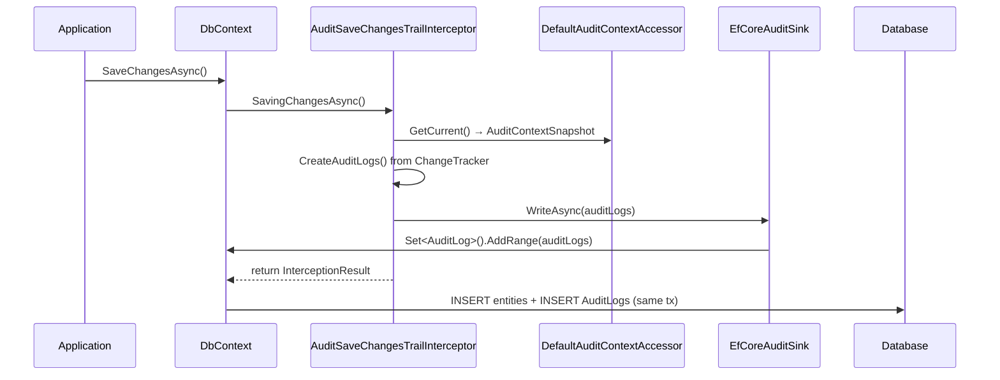
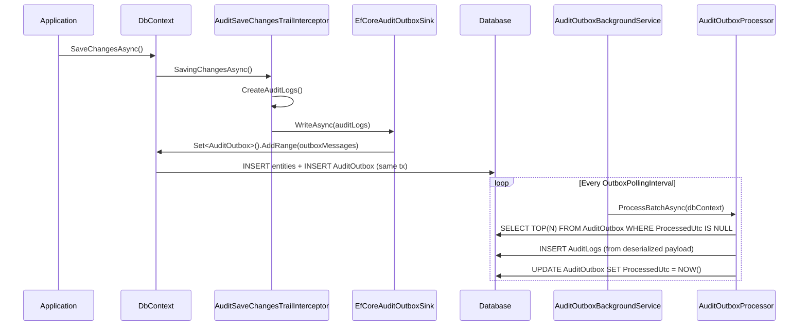

# SharedKernel.AuditLogging — Technical Design

- [SharedKernel.AuditLogging — Technical Design](#sharedkernelauditlogging--technical-design)
  - [1. Purpose](#1-purpose)
  - [2. Module Overview](#2-module-overview)
    - [2.1 What It Solves](#21-what-it-solves)
    - [2.2 Scope](#22-scope)
  - [3. Architecture](#3-architecture)
    - [3.1 Component Map](#31-component-map)
    - [3.2 Data Flow — Sync Mode](#32-data-flow--sync-mode)
    - [3.3 Data Flow — Outbox Mode](#33-data-flow--outbox-mode)
  - [4. Data Model](#4-data-model)
    - [4.1 AuditLog](#41-auditlog)
    - [4.2 AuditOutbox](#42-auditoutbox)
    - [4.3 AuditContextSnapshot](#43-auditcontextsnapshot)
    - [4.4 ChangesJson — Delta Format](#44-changesjson--delta-format)
    - [4.5 Database Schema (EF Core mapping)](#45-database-schema-ef-core-mapping)
  - [5. Core Components](#5-core-components)
    - [5.1 AuditSaveChangesTrailInterceptor](#51-auditsavechangestrailinterceptor)
    - [5.2 IAuditSink / EfCoreAuditSink / EfCoreAuditOutboxSink](#52-iauditsink--efcoreauditsink--efcoreauditoutboxsink)
    - [5.3 IAuditContextAccessor / DefaultAuditContextAccessor](#53-iauditcontextaccessor--defaultauditcontextaccessor)
    - [5.4 IAuditEntityIdResolver / DefaultAuditEntityIdResolver](#54-iauditentityidresolver--defaultauditentityidresolver)
    - [5.5 AuditHashService](#55-audithashservice)
    - [5.6 AuditOutboxProcessor + AuditOutboxBackgroundService](#56-auditoutboxprocessor--auditoutboxbackgroundservice)
  - [6. Delta Capture — Old vs New Value Comparison](#6-delta-capture--old-vs-new-value-comparison)
    - [6.1 How EF Core Tracks Values](#61-how-ef-core-tracks-values)
    - [6.2 What Is Currently Implemented](#62-what-is-currently-implemented)
    - [6.3 Gap: Owned Types / Value Objects — Nested Delta (Not Implemented)](#63-gap-owned-types--value-objects--nested-delta-not-implemented)
    - [6.4 Gap: Many-to-Many Relationship Semantics (Not Implemented)](#64-gap-many-to-many-relationship-semantics-not-implemented)
    - [6.5 Gap: Historical Reconstruction / Time-Travel Queries (Not Implemented)](#65-gap-historical-reconstruction--time-travel-queries-not-implemented)
  - [6.6 Critical Gap: AsNoTracking + DbSet.Update() Loses Original Values](#66-critical-gap-asnotracking--dbsetupdate-loses-original-values)
  - [7. Attributes](#7-attributes)
  - [8. Modes of Operation](#8-modes-of-operation)
    - [8.1 Sync Mode (default)](#81-sync-mode-default)
    - [8.2 Outbox Mode](#82-outbox-mode)
    - [8.3 Mode Comparison](#83-mode-comparison)
  - [9. Hash Chaining](#9-hash-chaining)
  - [10. Configuration Reference](#10-configuration-reference)
  - [11. Integration Guide](#11-integration-guide)
    - [11.1 Register Services](#111-register-services)
    - [11.2 Register the Interceptor on DbContext](#112-register-the-interceptor-on-dbcontext)
    - [11.3 Apply EF Core Table Mappings](#113-apply-ef-core-table-mappings)
    - [11.4 Enable Outbox Processor (Outbox mode only)](#114-enable-outbox-processor-outbox-mode-only)
    - [11.5 Custom Context (Override UserId / TenantId)](#115-custom-context-override-userid--tenantid)
    - [11.6 Custom Entity-Id Resolution](#116-custom-entity-id-resolution)
  - [12. Security Considerations](#12-security-considerations)
    - [12.1 PII / PHI Redaction](#121-pii--phi-redaction)
    - [12.2 Immutability](#122-immutability)
    - [12.3 Separation of Duties](#123-separation-of-duties)
  - [13. Trade-offs & Design Decisions](#13-trade-offs--design-decisions)
  - [14. Testing Strategy](#14-testing-strategy)

---

## 1. Purpose

Track every `INSERT`, `UPDATE`, `SOFT-DELETE`, and `DELETE` made through EF Core and persist a structured, queryable audit trail. Each record answers:

| Question | Field |
| --- | --- |
| **Who** | `UserId`, `UserName`, `IpAddress`, `TenantId` |
| **What** | `EntityName`, `EntityId`, `Operation`, `ChangesJson` |
| **When** | `TimestampUtc` |
| **Where** | `Source`, `TraceId` |

The module is a standalone `SharedKernel` library. Downstream services add it once via DI and it self-attaches to EF Core through an interceptor — no changes to command handlers or domain objects are required.

---

## 2. Module Overview

### 2.1 What It Solves

Auditing requirements appear across multiple services. Building per-service audit logic leads to duplication and inconsistency. `SharedKernel.AuditLogging` provides a single, reusable implementation with:

- Zero intrusion into domain entities
- Attribute-driven field redaction and exclusion
- Two persistence strategies (synchronous inline write or decoupled outbox)
- Optional SHA-256 hash chaining for tamper detection
- Context propagation from HTTP requests, background jobs, or gRPC calls

### 2.2 Scope

**In scope:**

- EF Core entity-level change capture (Added / Modified / Deleted / SoftDeleted)
- HTTP + background job identity propagation
- Outbox-based async persistence
- Hash-chain tamper detection

**Out of scope:**

- Application-layer (request/response) audit logging — use ASP.NET middleware
- Free-text search projections — project `AuditLog` rows to Elasticsearch separately
- Bulk-import audit recording — use `SharedKernel.BulkInsert` conventions at call-site

---

## 3. Architecture

### 3.1 Component Map

```text
┌─────────────────────────────────────────────────────────────────┐
│                      Downstream DbContext                        │
│                                                                 │
│  DbContext.SaveChangesAsync()                                   │
│        │                                                        │
│        ▼                                                        │
│  AuditSaveChangesTrailInterceptor  ◄── IAuditContextAccessor   │
│  (SaveChangesInterceptor)              (HTTP claims / SYSTEM)   │
│        │                          ◄── IAuditEntityIdResolver   │
│        │ CreateAuditLogs()             (PK resolution)          │
│        │ AuditHashService              (hash chain, optional)   │
│        │                                                        │
│        ▼                                                        │
│     IAuditSink                                                  │
│       ├─ EfCoreAuditSink          → AuditLogs table (Sync)     │
│       └─ EfCoreAuditOutboxSink    → AuditOutbox table (Outbox) │
└─────────────────────────────────────────────────────────────────┘
                                          │
                               (Outbox mode only)
                                          ▼
                          AuditOutboxBackgroundService<TDbContext>
                                          │
                                AuditOutboxProcessor
                                          │
                                    AuditLogs table
```

### 3.2 Data Flow — Sync Mode



### 3.3 Data Flow — Outbox Mode



---

## 4. Data Model

### 4.1 AuditLog

| Property | Type | Description |
| --- | --- | --- |
| `Id` | `Guid` | Primary key (auto-generated) |
| `EntityName` | `string` | CLR type name of the changed entity |
| `EntityId` | `string` | Serialized primary key value(s) |
| `Operation` | `AuditOperation` | `Insert` / `Update` / `SoftDelete` / `Delete` |
| `UserId` | `string` | Identity claim (`sub`, `user_id`, `code`) or `"SYSTEM"` |
| `UserName` | `string` | Display name or `"SYSTEM"` |
| `TenantId` | `string?` | Claim `tenant_id` / `tenantId` |
| `IpAddress` | `string?` | `HttpContext.Connection.RemoteIpAddress` |
| `TraceId` | `string?` | `Activity.Current.TraceId` or `HttpContext.TraceIdentifier` |
| `Source` | `string` | Configured application name (`AuditLoggingOptions.Source`) |
| `TimestampUtc` | `DateTime` | UTC timestamp of the change |
| `ChangesJson` | `string` | JSON delta — only fields that actually changed |
| `MetadataJson` | `string` | Reserved for extensible metadata (default `{}`) |
| `PreviousHash` | `string?` | Hash of the preceding record (hash chain only) |
| `Hash` | `string?` | SHA-256 of this record's canonical payload (hash chain only) |

### 4.2 AuditOutbox

| Property | Type | Description |
| --- | --- | --- |
| `Id` | `Guid` | Primary key |
| `PayloadJson` | `string` | Serialized `AuditLog` |
| `CreatedUtc` | `DateTime` | When the outbox message was written |
| `ProcessedUtc` | `DateTime?` | When the background processor moved it to `AuditLogs` |
| `Attempts` | `int` | Retry counter (incremented on deserialization error) |
| `LastError` | `string?` | Last exception message (capped at 2 048 chars) |

### 4.3 AuditContextSnapshot

Immutable snapshot captured once per interceptor call:

```csharp
public sealed class AuditContextSnapshot
{
    public string UserId   { get; init; } = "SYSTEM";
    public string UserName { get; init; } = "SYSTEM";
    public string? TenantId   { get; init; }
    public string? IpAddress  { get; init; }
    public string? TraceId    { get; init; }
    public string Source { get; init; } = "Application";
}
```

### 4.4 ChangesJson — Delta Format

`ChangesJson` stores only the fields that actually changed. Keys are sorted alphabetically (`StringComparer.Ordinal`) for deterministic output required by hash chaining.

**Update example** — two fields changed:

```json
{
  "Email":  { "old": "alice@old.com",  "new": "alice@new.com" },
  "Status": { "old": "Pending",        "new": "Active"        }
}
```

**Insert example** — all `old` values are `null`:

```json
{
  "Email":  { "old": null, "new": "alice@new.com" },
  "Name":   { "old": null, "new": "Alice"         },
  "Status": { "old": null, "new": "Pending"        }
}
```

**Delete example** — all `new` values are `null`:

```json
{
  "Email":  { "old": "alice@old.com", "new": null },
  "Name":   { "old": "Alice",         "new": null },
  "Status": { "old": "Active",        "new": null }
}
```

**Redacted field** — value is hidden but the key is visible:

```json
{
  "SocialSecurityNumber": { "old": "***REDACTED***", "new": "***REDACTED***" }
}
```

> **Current limitation:** properties are always captured at the **flat root level**. Owned types (value objects) are not yet serialized as nested objects. See [Section 6.3](#63-gap-owned-types--value-objects--nested-delta-not-implemented).

### 4.5 Database Schema (EF Core mapping)

`ModelBuilder.ApplyAuditLogging()` creates:

```sql
-- AuditLogs
CREATE TABLE "AuditLogs" (
    "Id"           UUID          NOT NULL DEFAULT gen_random_uuid() PRIMARY KEY,
    "EntityName"   VARCHAR(256)  NOT NULL,
    "EntityId"     VARCHAR(256)  NOT NULL,
    "Operation"    INT           NOT NULL,
    "UserId"       VARCHAR(256)  NOT NULL,
    "UserName"     VARCHAR(256)  NOT NULL,
    "TenantId"     VARCHAR(256),
    "IpAddress"    VARCHAR(128),
    "TraceId"      VARCHAR(128),
    "Source"       VARCHAR(256)  NOT NULL,
    "TimestampUtc" TIMESTAMP     NOT NULL,
    "ChangesJson"  TEXT          NOT NULL,
    "MetadataJson" TEXT          NOT NULL,
    "PreviousHash" VARCHAR(128),
    "Hash"         VARCHAR(128)
);

CREATE INDEX "IX_AuditLogs_TimestampUtc"        ON "AuditLogs" ("TimestampUtc");
CREATE INDEX "IX_AuditLogs_EntityName_EntityId" ON "AuditLogs" ("EntityName", "EntityId");

-- AuditOutbox (Outbox mode only)
CREATE TABLE "AuditOutbox" (
    "Id"           UUID          NOT NULL DEFAULT gen_random_uuid() PRIMARY KEY,
    "PayloadJson"  TEXT          NOT NULL,
    "CreatedUtc"   TIMESTAMP     NOT NULL,
    "ProcessedUtc" TIMESTAMP,
    "Attempts"     INT           NOT NULL DEFAULT 0,
    "LastError"    VARCHAR(2048)
);

CREATE INDEX "IX_AuditOutbox_ProcessedUtc" ON "AuditOutbox" ("ProcessedUtc");
```

---

## 5. Core Components

### 5.1 AuditSaveChangesTrailInterceptor

File: `Interceptors/AuditSaveChangesTrailInterceptor.cs`

The entry point. Registered as a scoped `ISaveChangesInterceptor` on the downstream `DbContext`. The `SavingChangesAsync` hook calls `CreateAuditLogs()` which:

1. Skips if `AuditLoggingOptions.Enabled = false`
2. Calls `ChangeTracker.DetectChanges()`
3. Filters entries by state (`Added` / `Modified` / `Deleted`) and `[AuditIgnore]`
4. Skips `AuditLog` and `AuditOutbox` entities (prevents recursive audit)
5. Builds `SortedDictionary<string, AuditPropertyChange>` — only differing properties
6. Optionally applies `AuditHashService.ApplyHashChain()`
7. Passes results to `IAuditSink.WriteAsync()`

**Operation inference:**

| EF State | `IsDeleted` changed `false → true` | Result |
| --- | --- | --- |
| `Added` | — | `Insert` |
| `Modified` | No | `Update` |
| `Modified` | Yes | `SoftDelete` |
| `Deleted` | — | `Delete` |

Shadow properties are included only when `IncludeShadowProperties = true`.
Unchanged owned types are included only when `IncludeUnchangedOwnedTypes = true`.

### 5.2 IAuditSink / EfCoreAuditSink / EfCoreAuditOutboxSink

File: `Services/EfCoreAuditSink.cs`, `Services/EfCoreAuditOutboxSink.cs`

Both implement `IAuditSink`:

```csharp
public interface IAuditSink
{
    void Write(DbContext dbContext, IReadOnlyCollection<AuditLog> auditLogs);
    ValueTask WriteAsync(DbContext dbContext, IReadOnlyCollection<AuditLog> auditLogs, CancellationToken cancellationToken);
}
```

- **`EfCoreAuditSink`** — calls `dbContext.Set<AuditLog>().AddRange(auditLogs)`. Rows are committed in the same transaction as the originating entity changes.
- **`EfCoreAuditOutboxSink`** — serializes each `AuditLog` to JSON and calls `dbContext.Set<AuditOutbox>().AddRange(outboxMessages)`. The `AuditLog` is written later by the background processor.

`ServiceCollectionExtensions` selects the sink at startup based on `AuditLoggingOptions.Mode`:

```csharp
services.TryAddScoped<IAuditSink>(serviceProvider =>
{
    var options = serviceProvider.GetRequiredService<IOptions<AuditLoggingOptions>>().Value;
    return options.Mode == AuditLoggingMode.Outbox
        ? serviceProvider.GetRequiredService<EfCoreAuditOutboxSink>()
        : serviceProvider.GetRequiredService<EfCoreAuditSink>();
});
```

### 5.3 IAuditContextAccessor / DefaultAuditContextAccessor

File: `Services/DefaultAuditContextAccessor.cs`

Reads identity from the current HTTP request. Claim resolution order for `UserId`:

```text
ClaimTypes.NameIdentifier → "sub" → "user_id" → "userId" → "code"
```

Falls back to `"SYSTEM"` when no HTTP context is present (background jobs, message consumers, hosted services).

`TraceId` is resolved from `Activity.Current?.TraceId` (OpenTelemetry) first, falling back to `HttpContext.TraceIdentifier`.

Downstream services that use gRPC or MassTransit consumers must implement `IAuditContextAccessor` and register it with `TryAddSingleton` if the default HTTP-based resolution is insufficient.

### 5.4 IAuditEntityIdResolver / DefaultAuditEntityIdResolver

File: `Services/DefaultAuditEntityIdResolver.cs`

Resolution priority:

1. If the entity implements `EntityData` and has a non-empty `Code` → use `Code`
2. Otherwise serialize all PK property values joined by `"|"`

Override this interface when entities use a non-standard PK convention.

### 5.5 AuditHashService

File: `Services/AuditHashService.cs`

Optional tamper-detection feature enabled by `EnableHashChain = true`. When applied:

1. Reads the `Hash` of the latest existing `AuditLog` row (ordered by `TimestampUtc DESC`, `Id DESC`).
2. For each new `AuditLog` in the batch:
   - Sets `PreviousHash = lastHash`
   - Computes `Hash = SHA256(canonicalPayload + PreviousHash)` using a sorted, deterministic JSON payload
   - Advances `lastHash` to the new hash

**Canonical payload fields** used in hash computation:

```text
ChangesJson, EntityId, EntityName, Id, IpAddress,
MetadataJson, Operation, Source, TenantId, TimestampUtc, TraceId, UserId, UserName
```

If any row is altered or deleted, downstream hash verification will detect the break.

> **Note:** Hash chaining adds a synchronous database read on every `SaveChanges` call. Use only when compliance requires tamper evidence.

### 5.6 AuditOutboxProcessor + AuditOutboxBackgroundService

Files: `Services/AuditOutboxProcessor.cs`, `Services/AuditOutboxBackgroundService.cs`

`AuditOutboxProcessor.ProcessBatchAsync()`:

1. Queries up to `OutboxBatchSize` unprocessed rows from `AuditOutbox` (`ProcessedUtc IS NULL`), ordered by `CreatedUtc`.
2. Deserializes each `PayloadJson` into `AuditLog`.
3. Inserts the `AuditLog` rows and marks the outbox rows as processed.
4. On `JsonException` / `InvalidOperationException`: increments `Attempts`, records `LastError`, skips that row.

`AuditOutboxBackgroundService<TDbContext>`:

- Runs as a `BackgroundService` (IHostedService).
- Polls every `OutboxPollingInterval` (default: 5 s).
- Checks that `Enabled = true` and `Mode = Outbox` before doing any work.
- Creates a new DI scope per iteration (avoids scoped-DbContext issues).

---

## 6. Delta Capture — Old vs New Value Comparison

This section describes how the module captures the exact data that changed, what EF Core provides out of the box, and where the current implementation has known gaps.

### 6.1 How EF Core Tracks Values

For every tracked property, EF Core maintains two value snapshots:

| Snapshot | Available when |
| --- | --- |
| `OriginalValues` | Entity is `Modified` or `Deleted` — holds the value as loaded from the database |
| `CurrentValues` | Always — holds the in-memory value at the time of `SaveChanges` |

Mapping per operation:

| Operation | `Old` value source | `New` value source |
| --- | --- | --- |
| `Insert` | `null` (entity did not exist) | `property.CurrentValue` |
| `Update` | `property.OriginalValue` (from DB) | `property.CurrentValue` |
| `SoftDelete` | `property.OriginalValue` | `property.CurrentValue` |
| `Delete` | `property.OriginalValue` | `null` (entity will be removed) |

### 6.2 What Is Currently Implemented

The interceptor method `CreateChangeSet(EntityEntry entry)` iterates `entry.Properties` and produces a `SortedDictionary<string, AuditPropertyChange>`.

**Property inclusion rules:**

- **Added entities** — all non-shadow (unless `IncludeShadowProperties = true`), non-`[AuditIgnore]` properties are captured. `Old = null`, `New = CurrentValue`.
- **Deleted entities** — same set of properties. `Old = OriginalValue`, `New = null`.
- **Modified entities** — only properties where `property.IsModified && OriginalValue != CurrentValue`. Both old and new captured.
- **Unchanged owned types** — captured when `IncludeUnchangedOwnedTypes = true` and `entry.Metadata.IsOwned()`. All properties of the owned entity are included (EF may not report individual property modifications for some owned-type configurations).

**Equality check:**

```csharp
private static bool ValuesDiffer(object? oldValue, object? newValue)
{
    return oldValue is null
        ? newValue is not null
        : !oldValue.Equals(newValue);
}
```

Value types, strings, and any type with a correct `Equals` override are handled correctly. Collection-valued navigation properties are not iterated — only scalar properties are captured.

**Redaction** is applied per-property before the `AuditPropertyChange` is created, so the raw value never appears in `ChangesJson`.

### 6.3 Gap: Owned Types / Value Objects — Nested Delta (Not Implemented)

**What the article recommends:**

When an entity owns a value object (e.g., `Address`, `Money`), the audit delta should preserve the nested structure:

```json
{
  "Address": {
    "City":       { "old": "Austin", "new": "Dallas"  },
    "PostalCode": { "old": "73301",  "new": "75201"   }
  }
}
```

**Current behavior:**

The interceptor flattens all properties at the root level, regardless of owned-type hierarchy:

```json
{
  "Address_City":       { "old": "Austin", "new": "Dallas" },
  "Address_PostalCode": { "old": "73301",  "new": "75201"  }
}
```

EF Core uses the convention `{OwnedTypeName}_{PropertyName}` for shadow column names of owned types.

**Proposed implementation:**

Detect owned-type properties by inspecting `property.Metadata.DeclaringEntityType.IsOwned()` and group them under their owning navigation name. This requires post-processing the flat `SortedDictionary` into a nested structure before serialization.

```csharp
private static Dictionary<string, object> GroupOwnedTypeChanges(
    SortedDictionary<string, AuditPropertyChange> flat,
    EntityEntry entry)
{
    var result = new Dictionary<string, object>(StringComparer.Ordinal);

    foreach (var (key, change) in flat)
    {
        var property = entry.Property(key);
        var declaringType = property.Metadata.DeclaringEntityType;

        if (declaringType.IsOwned())
        {
            var navigationName = declaringType.GetNavigations().First().Name; // cspell:ignore navigations
            if (!result.TryGetValue(navigationName, out var nested))
            {
                nested = new Dictionary<string, AuditPropertyChange>(StringComparer.Ordinal);
                result[navigationName] = nested;
            }
            ((Dictionary<string, AuditPropertyChange>)nested)[property.Metadata.Name] = change;
        }
        else
        {
            result[key] = change;
        }
    }

    return result;
}
```

This produces the nested JSON expected by downstream consumers and aligns with DDD's aggregate boundary semantics.

**Status:** Not implemented. Tracked as a future enhancement.

### 6.4 Gap: Many-to-Many Relationship Semantics (Not Implemented)

**What the article recommends:**

When a many-to-many join table row is inserted or deleted (e.g., `ProductCategory` join), the raw audit entry is not meaningful to consumers:

```text
-- Raw (current):
AuditLog: EntityName=ProductCategoryJoin, Operation=Insert, Changes={"ProductId":{...},"CategoryId":{...}}

-- Desired semantic translation:
AuditLog: EntityName=Product, EntityId=33, Operation=Update,
          Changes={"Categories":{"old":[],"new":["Hardware"]}}
```

**Current behavior:**

Join-table entities produce an `AuditLog` row for the join entity itself. There is no translation to semantic business meaning. If the join entity class is not in the `ChangeTracker` (skip navigation properties), no audit row is produced at all.

**Proposed implementation:**

Introduce a `IAuditRelationshipTranslator` extension point. Implementations register translations between join entity types and the root aggregate they represent. The interceptor calls translators before falling back to raw property capture:

```csharp
public interface IAuditRelationshipTranslator
{
    bool CanTranslate(EntityEntry entry);
    AuditLog? Translate(EntityEntry entry, AuditContextSnapshot context);
}

// Example registration
services.AddSingleton<IAuditRelationshipTranslator, ProductCategoryTranslator>();
```

**Status:** Not implemented. Each service should implement domain-specific translation at the call-site until a generic solution is designed.

### 6.5 Gap: Historical Reconstruction / Time-Travel Queries (Not Implemented)

**What the article recommends:**

Given a sequence of delta `AuditLog` rows for an entity, reconstruct what the entity looked like at any point in time by replaying the deltas:

```csharp
public async Task<T> ReconstructAsync<T>(string entityId, DateTimeOffset atTime)
    where T : class, new()
{
    var auditEvents = await db.AuditLogs
        .Where(a => a.EntityName == typeof(T).Name
                 && a.EntityId   == entityId
                 && a.TimestampUtc <= atTime)
        .OrderBy(a => a.TimestampUtc)
        .ToListAsync();

    var instance = new T();
    foreach (var audit in auditEvents)
    {
        var changes = JsonSerializer.Deserialize<Dictionary<string, ChangeDelta>>(audit.ChangesJson);
        if (changes is null) continue;
        foreach (var (key, delta) in changes)
        {
            var prop = typeof(T).GetProperty(key);
            prop?.SetValue(instance, delta.New);
        }
    }
    return instance;
}
```

For performance, the article recommends **periodic snapshots**: store the full entity state at regular intervals, then replay only the deltas that occurred after the nearest snapshot.

```csharp
// Step 1: find the nearest snapshot before atTime
var snapshot = await db.AuditSnapshots
    .Where(s => s.EntityId == entityId && s.CreatedUtc <= atTime)
    .OrderByDescending(s => s.CreatedUtc)
    .FirstOrDefaultAsync();

// Step 2: apply only deltas after the snapshot
var startTime = snapshot?.CreatedUtc ?? DateTimeOffset.MinValue;
var deltas = await db.AuditLogs
    .Where(a => a.EntityName == entityName
             && a.EntityId   == entityId
             && a.TimestampUtc > startTime
             && a.TimestampUtc <= atTime)
    .OrderBy(a => a.TimestampUtc)
    .ToListAsync();
```

**Current behavior:**

The module stores `ChangesJson` deltas only. There is no:

- `ReconstructAsync<T>` service or utility
- `AuditSnapshot` table or model
- Reverse-reconstruction helper (applying `Old` values backwards)

**Proposed additions to `SharedKernel.AuditLogging`:**

| Component | Responsibility |
| --- | --- |
| `AuditSnapshot` model | Full entity state snapshot as JSON at a point in time |
| `IAuditReconstructionService<T>` | Forward and reverse delta replay |
| `AuditSnapshotService` | Generates periodic snapshots from current entity state |

**AuditSnapshot model:**

```csharp
public class AuditSnapshot
{
    public Guid Id { get; set; } = Guid.NewGuid();
    public string EntityName { get; set; } = string.Empty;
    public string EntityId   { get; set; } = string.Empty;
    public string StateJson  { get; set; } = "{}";
    public DateTime CreatedUtc { get; set; } = DateTime.UtcNow;
}
```

**IAuditReconstructionService interface:**

```csharp
public interface IAuditReconstructionService<T> where T : class, new()
{
    // Forward: apply deltas from the oldest available snapshot up to atTime
    Task<T?> ReconstructAtAsync(string entityId, DateTime atTime, CancellationToken ct = default);

    // Reverse: walk backwards from current state to produce a previous version
    Task<T?> ReconstructPreviousVersionAsync(string entityId, int stepsBack, CancellationToken ct = default);
}
```

**Status:** Not implemented. Planned as a future addition to this module.

### 6.6 Critical Gap: AsNoTracking + DbSet.Update() Loses Original Values

This is the most impactful gap in the current implementation. It affects **every service that follows the standard repository pattern** in this codebase.

#### Root Cause

`GenericRepository.UpdateAsync()` calls `dbContext.Set<T>().Update(entity)`:

```csharp
// SharedKernel.RepositoryBase/Implementations/GenericRepository.cs
public async Task<T> UpdateAsync(T entity, bool autoSave = false, ...)
{
    dbContext.Set<T>().Update(entity);   // ← this is the problem
    if (autoSave) { await SaveChangesAsync(cancellationToken); }
    return entity;
}
```

`DbSet<T>.Update(entity)` in EF Core attaches the entity and marks **all** properties as `Modified`. Critically, it sets `OriginalValue = CurrentValue` for every property because it has no access to what the values were in the database.

#### What the Interceptor Sees

A typical update flow in downstream services:

```csharp
// Step 1 — load with no tracking (standard pattern in this codebase)
var order = await repo.GetQueryableWithAsNoTracking()
    .FirstAsync(x => x.Id == id, ct);

// Step 2 — modify in memory
order.Status = OrderStatus.Shipped;
order.ShippedAt = DateTime.UtcNow;

// Step 3 — update via repository
await repo.UpdateAsync(order, autoSave: true, ct);
```

When `DbSet.Update(order)` runs, EF Core attaches the entity. At the moment `SavingChangesAsync` fires in the interceptor, the `ChangeTracker` shows:

| Property | `OriginalValue` | `CurrentValue` | `IsModified` |
| --- | --- | --- | --- |
| `Status` | `Shipped` | `Shipped` | `true` |
| `ShippedAt` | `2026-06-06T...` | `2026-06-06T...` | `true` |
| `Name` | `"Order #1"` | `"Order #1"` | `true` |

Every `OriginalValue` equals `CurrentValue` because EF has no snapshot of the pre-update state. The `ValuesDiffer()` check returns `false` for all properties. `changes.Count == 0` → `CreateAuditLog` returns `null` → **no AuditLog row is written**.

#### Affected Patterns

| Pattern | Audit result |
| --- | --- |
| `GetQueryableWithAsNoTracking()` + `UpdateAsync()` | **Silent: no AuditLog** |
| `GetAllAsync()` + `UpdateAsync()` | **Silent: no AuditLog** |
| `GetPagedAsync()` + `UpdateAsync()` | **Silent: no AuditLog** |
| `FindAsync()` (tracked) + property mutation + `SaveChangesAsync()` | Works correctly |
| `Set<T>().SingleAsync()` (tracked) + property mutation | Works correctly |

#### Solution A — Load with Tracking Before Updating (Recommended)

For operations that must produce accurate audit deltas, load the entity with the default tracking behavior before modification:

```csharp
// Correct: load with tracking — do NOT call GetQueryableWithAsNoTracking()
var order = await dbContext.Set<Order>().FindAsync(id, ct);
// or: var order = await dbContext.Orders.SingleAsync(x => x.Id == id, ct);

order!.Status = OrderStatus.Shipped;
order.ShippedAt = DateTime.UtcNow;

await dbContext.SaveChangesAsync(ct);
// ChangeTracker has OriginalValues from the initial load → correct delta captured
```

This is the correct pattern and should be the standard for any write operation in audit-critical command handlers.

#### Solution B — DatabaseValues Reload in Interceptor (Proposed, Opt-in)

For services that cannot change the repository call pattern, the interceptor can reload the actual database values when it detects that a Modified entity has no differing properties. This is transparent to consumers.

Add a new option:

```csharp
public sealed class AuditLoggingOptions
{
    // ... existing options ...

    /// When true, the interceptor calls entry.GetDatabaseValuesAsync() for Modified entities
    /// where no property changes are detected (typically caused by DbSet.Update() on
    /// a no-tracking entity). Adds one SELECT per affected entity per SaveChanges call.
    public bool ReloadDatabaseValuesOnUpdate { get; set; } = false;
}
```

Updated interceptor logic (async path only):

```csharp
private async ValueTask WriteAuditEntriesAsync(DbContext dbContext, CancellationToken ct)
{
    var auditLogs = await CreateAuditLogsAsync(dbContext, ct);
    if (auditLogs.Count == 0) return;
    await auditSink.WriteAsync(dbContext, auditLogs, ct);
}

private async Task<IReadOnlyList<AuditLog>> CreateAuditLogsAsync(DbContext dbContext, CancellationToken ct)
{
    var currentOptions = options.Value;
    if (!currentOptions.Enabled) return [];

    dbContext.ChangeTracker.DetectChanges();
    var contextSnapshot = auditContextAccessor.GetCurrent();
    var result = new List<AuditLog>();

    foreach (var entry in dbContext.ChangeTracker.Entries().Where(e => ShouldAudit(e, currentOptions)))
    {
        // If the entity is Modified but no changes are detected and ReloadDatabaseValuesOnUpdate
        // is enabled, reload original values from the database to capture the real diff.
        if (entry.State == EntityState.Modified
            && currentOptions.ReloadDatabaseValuesOnUpdate
            && !HasAnyDifferingProperty(entry, currentOptions))
        {
            var dbValues = await entry.GetDatabaseValuesAsync(ct);
            if (dbValues != null)
            {
                entry.OriginalValues.SetValues(dbValues);
            }
        }

        var auditLog = CreateAuditLog(entry, contextSnapshot, currentOptions);
        if (auditLog != null) result.Add(auditLog);
    }

    if (currentOptions.EnableHashChain)
    {
        AuditHashService.ApplyHashChain(dbContext, result);
    }

    return result;
}

private static bool HasAnyDifferingProperty(EntityEntry entry, AuditLoggingOptions opts)
{
    return entry.Properties
        .Where(p => ShouldAuditProperty(p, opts))
        .Any(p => p.IsModified && ValuesDiffer(p.OriginalValue, p.CurrentValue));
}
```

Trade-off: `GetDatabaseValuesAsync()` issues one `SELECT` per affected entity per `SaveChanges` call. It is safe but adds latency and database load. Only enable it when the tracked-load pattern (Solution A) is not feasible.

#### Decision Guide

| Scenario | Recommendation |
| --- | --- |
| New command handlers (CQRS) | Always load with tracking (Solution A) — no extra cost |
| Existing services using `UpdateAsync()` broadly | Enable `ReloadDatabaseValuesOnUpdate = true` (Solution B) |
| Bulk operations where audit precision is not required | Leave as-is; document that `ChangesJson` will be empty for these paths |
| Read-only queries (reports, lists) | `AsNoTracking` is correct — no audit needed for reads |

#### Configuration (Solution B)

```json
{
  "AuditLogging": {
    "ReloadDatabaseValuesOnUpdate": true
  }
}
```

**Status:** `ReloadDatabaseValuesOnUpdate` option is not yet implemented in the interceptor. Solution A (load with tracking) is the currently supported approach.

---

## 7. Attributes

| Attribute | Target | Effect |
| --- | --- | --- |
| `[AuditIgnore]` | Class or Property | Entire entity or individual property is excluded from audit. No `AuditLog` row is generated for that entity; annotated properties are omitted from `ChangesJson`. |
| `[AuditRedact]` | Property | Property **is** included in `ChangesJson` but both `old` and `new` values are replaced with `"***REDACTED***"` (configurable via `AuditLoggingOptions.RedactedValue`). |

Usage example:

```csharp
public class Patient
{
    public int Id { get; set; }

    public string Name { get; set; } = string.Empty;

    [AuditRedact]
    public string SocialSecurityNumber { get; set; } = string.Empty;

    [AuditIgnore]
    public string InternalAdminNote { get; set; } = string.Empty;
}

[AuditIgnore]
public class TemporaryProcessingEntity { }
```

> **Note:** `[AuditRedact]` on shadow properties may not work because shadow properties have no `PropertyInfo`. Use `[AuditIgnore]` on shadow properties that must be excluded.

---

## 8. Modes of Operation

### 8.1 Sync Mode (default)

```json
{ "AuditLogging": { "Mode": "Sync" } }
```

`AuditLog` rows are written in the same EF Core transaction as the entity change. Either both succeed or both fail — guaranteed consistency.

**Best for:** Financial workflows, critical domain operations, compliance-required exact consistency.

**Cost:** Each `SaveChanges` call adds `N` extra INSERT statements where `N` = number of changed entities.

### 8.2 Outbox Mode

```json
{ "AuditLogging": { "Mode": "Outbox" } }
```

`AuditOutbox` rows (small JSON blobs) are written in the same transaction. A background service moves them to `AuditLogs` at a configurable interval.

**Best for:** High-throughput services, services where audit latency of a few seconds is acceptable.

**Cost:** `AuditLog` visibility is delayed by up to `OutboxPollingInterval`. Requires background service registration (`AddAuditOutboxProcessor<TDbContext>`).

### 8.3 Mode Comparison

| Criterion | Sync | Outbox |
| --- | --- | --- |
| Audit availability | Immediate | Delayed (≤ polling interval) |
| Consistency guarantee | Strong (same tx) | Strong (same tx for outbox write) |
| Write overhead per `SaveChanges` | N audit INSERTs | N small JSON INSERTs |
| Requires background service | No | Yes |
| Suitable for regulatory reporting | Yes | Yes (with delay tolerance) |

---

## 9. Hash Chaining

Enable with:

```json
{
  "AuditLogging": {
    "EnableHashChain": true
  }
}
```

Each new `AuditLog` batch gets:

```text
PreviousHash = Hash of the most recently committed AuditLog row
Hash         = SHA-256( sorted_canonical_json + PreviousHash )
```

To verify integrity of a range of records:

```csharp
var auditLogs = await db.AuditLogs
    .Where(a => a.EntityName == "Order" && a.EntityId == orderId)
    .OrderBy(a => a.TimestampUtc)
    .ToListAsync();

string? expected = null;
foreach (var log in auditLogs)
{
    if (log.PreviousHash != expected)
        throw new AuditTamperDetectedException(log.Id);

    expected = log.Hash;
}
```

**Limitations:**

- Hash chaining adds a `SELECT` on every `SaveChanges` call (reads previous hash from DB).
- In Outbox mode, hashing runs at the time the outbox message is written, not when it is processed. Reconstruct the chain after processing.
- Cross-service audit chains require a centralized audit store.

---

## 10. Configuration Reference

Section name: `AuditLogging`

```json
{
  "AuditLogging": {
    "Enabled": true,
    "Mode": "Sync",
    "Source": "MyService",
    "IncludeShadowProperties": false,
    "IncludeUnchangedOwnedTypes": false,
    "RedactedValue": "***REDACTED***",
    "EnableHashChain": false,
    "OutboxBatchSize": 100,
    "OutboxPollingInterval": "00:00:05"
  }
}
```

| Key | Default | Description |
| --- | --- | --- |
| `Enabled` | `true` | Master switch. Set `false` to disable all audit recording. |
| `Mode` | `Sync` | `Sync` or `Outbox` |
| `Source` | `"Application"` | Written to `AuditLog.Source`. Identify the service. |
| `IncludeShadowProperties` | `false` | Include EF shadow properties (e.g. `LastUpdatedAt`) in `ChangesJson`. |
| `IncludeUnchangedOwnedTypes` | `false` | Capture owned-type property changes even when the owner entity is `Unchanged`. |
| `RedactedValue` | `"***REDACTED***"` | Replacement string for `[AuditRedact]`-annotated fields. |
| `EnableHashChain` | `false` | Enable SHA-256 hash chaining for tamper detection. |
| `OutboxBatchSize` | `100` | Max rows processed per outbox polling cycle. Must be > 0. |
| `OutboxPollingInterval` | `00:00:05` | Polling interval for the background processor. Must be > 0. |

---

## 11. Integration Guide

### 11.1 Register Services

```csharp
// Option A: from appsettings.json
builder.Services.AddAuditLogging(builder.Configuration);

// Option B: inline configuration
builder.Services.AddAuditLogging(options =>
{
    options.Mode = AuditLoggingMode.Outbox;
    options.Source = "OrderService";
    options.EnableHashChain = true;
});
```

### 11.2 Register the Interceptor on DbContext

```csharp
builder.Services.AddDbContext<AppDbContext>((serviceProvider, options) =>
{
    options
        .UseNpgsql(connectionString)
        .AddAuditLoggingInterceptor(serviceProvider);
});
```

`AddAuditLoggingInterceptor` resolves `AuditSaveChangesTrailInterceptor` from the scoped container and attaches it to the `DbContextOptionsBuilder`.

### 11.3 Apply EF Core Table Mappings

In the downstream `DbContext.OnModelCreating`:

```csharp
protected override void OnModelCreating(ModelBuilder modelBuilder)
{
    base.OnModelCreating(modelBuilder);
    modelBuilder.ApplyConfigurationsFromAssembly(Assembly.GetExecutingAssembly());
    modelBuilder.ApplyAuditLogging();
}
```

Then create a migration:

```bash
dotnet ef migrations add AddAuditLogging
dotnet ef database update
```

### 11.4 Enable Outbox Processor (Outbox mode only)

```csharp
builder.Services.AddAuditOutboxProcessor<AppDbContext>();
```

This registers `AuditOutboxBackgroundService<AppDbContext>` as a hosted service.

### 11.5 Custom Context (Override UserId / TenantId)

For gRPC services or MassTransit consumers that do not have an HTTP context, implement `IAuditContextAccessor`:

```csharp
internal sealed class GrpcAuditContextAccessor(
    ICurrentUserProvider currentUser
) : IAuditContextAccessor
{
    public AuditContextSnapshot GetCurrent() => new()
    {
        UserId   = currentUser.UserId   ?? "SYSTEM",
        UserName = currentUser.UserName ?? "SYSTEM",
        TenantId = currentUser.TenantId,
        Source   = "OrderGrpcService"
    };
}

// Overrides the default HTTP-based accessor
services.AddSingleton<IAuditContextAccessor, GrpcAuditContextAccessor>();
```

### 11.6 Custom Entity-Id Resolution

Override when composite PKs need a specific format:

```csharp
internal sealed class CustomEntityIdResolver : IAuditEntityIdResolver
{
    public string Resolve(EntityEntry entry)
    {
        var keys = entry.Metadata.FindPrimaryKey()!.Properties
            .Select(p => entry.Property(p.Name).CurrentValue?.ToString() ?? "null");
        return string.Join("|", keys);
    }
}

services.AddSingleton<IAuditEntityIdResolver, CustomEntityIdResolver>();
```

---

## 12. Security Considerations

### 12.1 PII / PHI Redaction

Mark sensitive fields with `[AuditRedact]`. The value never leaves memory — it is replaced before serialization:

```csharp
public class PatientRecord
{
    public int Id { get; set; }

    [AuditRedact]
    public string SocialSecurityNumber { get; set; } = string.Empty;

    [AuditRedact]
    public string MedicalNotes { get; set; } = string.Empty;
}
```

Rule of thumb: **if you would not show the value on a support screen, redact it**.

### 12.2 Immutability

Prevent modification of committed audit records at the database level:

```sql
-- PostgreSQL: revoke UPDATE / DELETE from the application role
REVOKE UPDATE, DELETE ON "AuditLogs"  FROM app_user;
REVOKE UPDATE, DELETE ON "AuditOutbox" FROM app_user;

-- Optional trigger for an extra safety net
CREATE OR REPLACE FUNCTION audit_immutable()
RETURNS trigger LANGUAGE plpgsql AS $$ -- cspell:ignore plpgsql
BEGIN
    RAISE EXCEPTION 'AuditLogs is immutable';
END;
$$;

CREATE TRIGGER trg_audit_immutable
BEFORE UPDATE OR DELETE ON "AuditLogs"
FOR EACH ROW EXECUTE FUNCTION audit_immutable();
```

### 12.3 Separation of Duties

| Role | Permission |
| --- | --- |
| Application (`app_user`) | `INSERT` on `AuditLogs`, `AuditOutbox` |
| DBA / infra | Schema management; no data modification |
| Compliance / audit team | `SELECT` on `AuditLogs`; no write access |

---

## 13. Trade-offs & Design Decisions

| Decision | Rationale |
| --- | --- |
| `SaveChangesInterceptor` over `override SaveChanges` | Single reusable interceptor attached via DI; no coupling to a specific `DbContext` subclass; clear pre/post-save hooks. |
| Sync-first, Outbox as opt-in | Most services are not high-throughput; defaulting to sync simplifies setup and guarantees immediate consistency. Outbox is registered explicitly. |
| `Guid` PK on `AuditLog` | Avoids BIGINT sequence contention under concurrent inserts from multiple DbContext instances. Accept the slightly larger index. |
| `ChangesJson` stores delta only | Minimizes storage and makes it trivial to answer "what changed?" without schema knowledge. |
| Sorted property keys in `ChangesJson` | Deterministic serialization is required for hash chaining. |
| `IAuditContextAccessor` is singleton | `IHttpContextAccessor` is thread-safe and designed for singleton consumption. The snapshot is captured per interceptor invocation. |
| `AuditHashService` uses `SELECT` per batch | Correctness over performance for the hash chain path. Only enable when tamper detection is contractually required. |
| Flat `ChangesJson` (no nested owned types) | Simpler initial implementation; nested structure deferred until a concrete service requires it (see Section 6.3). |
| No `ReconstructAsync` service in this version | Delta storage is the foundation; reconstruction can be layered on top without schema changes (see Section 6.5). |

---

## 14. Testing Strategy

Unit tests live in `SharedKernel.AuditLogging.Test/AuditLoggingTests.cs`. They use an in-memory EF Core database and cover:

| Test | Behavior Verified |
| --- | --- |
| `SaveChanges_CapturesInsertUpdateSoftDeleteAndDelete` | All four operation types are recorded with correct `ChangesJson` deltas (old/new values match). |
| `SaveChanges_RespectsIgnoreAndRedactAttributes` | `[AuditIgnore]` entities produce no rows; `[AuditRedact]` fields show `***REDACTED***`; `[AuditIgnore]` fields are absent from `ChangesJson`. |
| `SaveChanges_UsesHttpContextWhenAvailable` | `UserId`, `UserName`, `TenantId`, `IpAddress`, `Source`, `TraceId` are populated from HTTP claims. |
| `SaveChanges_FallsBackToSystemWithoutHttpContext` | `UserId` and `UserName` default to `"SYSTEM"` in background contexts. |
| `OutboxMode_WritesOutboxAndProcessorMovesPayloadToAuditLog` | Outbox row is written immediately; `AuditLogs` is empty until `ProcessBatchAsync` runs. |
| `SaveChanges_DoesNotAuditAuditLogOrAuditOutboxEntities` | Writing to `AuditLogs` / `AuditOutbox` does not produce recursive audit entries. |
| `SaveChanges_AddsPreviousHashWhenHashChainIsEnabled` | First record has `PreviousHash = null`; second record's `PreviousHash` equals first record's `Hash`. |

For integration tests in downstream services, use Testcontainers (`PostgreSqlContainer`) to verify migrations apply cleanly and that audit rows — including correct `ChangesJson` deltas — appear in the real database after entity mutations.

**Recommended additional tests (not yet written):**

- Owned type property changes produce a `ChangesJson` entry (currently flattened; future: nested)
- Many-to-many join table insert/delete produces the expected semantic audit row
- `ReconstructAtAsync` replays deltas correctly for a known sequence of changes
