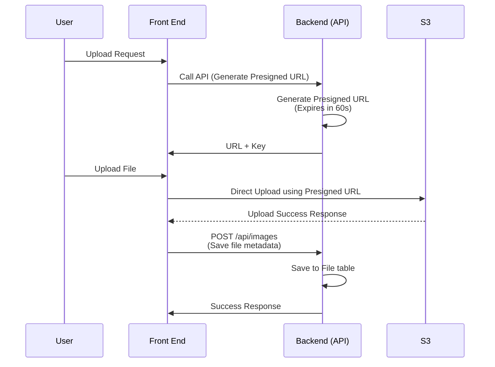
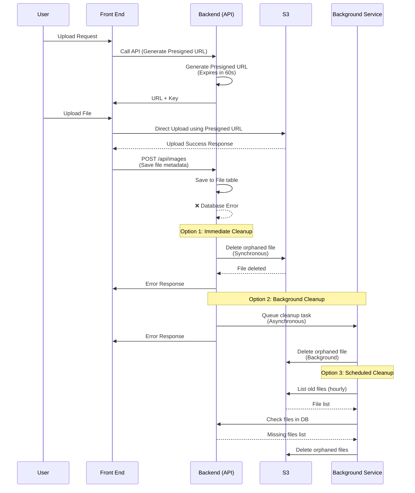

# Issue with stg-membership-res-mng-file-ecs causing resource (cpus&memory) spike and exceeding 70% threshold alert

- [Issue with stg-membership-res-mng-file-ecs causing resource (cpus\&memory) spike and exceeding 70% threshold alert](#issue-with-stg-membership-res-mng-file-ecs-causing-resource-cpusmemory-spike-and-exceeding-70-threshold-alert)
  - [Root Cause](#root-cause)
  - [Proposed Solutions](#proposed-solutions)
    - [1. Reduce CPU Load by Configuring SDK](#1-reduce-cpu-load-by-configuring-sdk)
    - [2. Limit Concurrent Uploads with SemaphoreSlim](#2-limit-concurrent-uploads-with-semaphoreslim)
    - [3. Switch to Presigned URL (Direct Upload from FE → S3)](#3-switch-to-presigned-url-direct-upload-from-fe--s3)
      - [Flow Diagram (Upload Image via Presigned URL)](#flow-diagram-upload-image-via-presigned-url)
      - [Sample Code (.NET 8 – Presigned URL Generation \& File Metadata Save)](#sample-code-net-8--presigned-url-generation--file-metadata-save)
  - [Optimal Recommendation](#optimal-recommendation)

## Root Cause

The main cause of high resource usage is the image upload mechanism from FE -> BE -> S3 through S3 SDK because:

- Current resource usage is very low with **0.25 vCPU & 0.5 GB memory**.
- The media upload mechanism from BE to S3 through SDK will by default perform the following processing tasks that increase CPU usage:
  - Calculate and sign SHA-256 of file content (**DisablePayloadSigning=false**)
  - Calculate MD5 checksum and integrity verification (**DisableMD5Stream=false**)
- When FE simultaneously selects up to 5 images with each image having an average size of 10MB, it will make 5 API calls to BE simultaneously. This is for 1 user - if 10/20/..50+ users process simultaneously along with the 2 causes mentioned above, high resource usage is inevitable.

Below is a quote from AWS S3 SDK ([AWS Document - Version: 3.7.x.x](https://docs.aws.amazon.com/sdkfornet/v3/apidocs/items/S3/TUploadPartRequest.html))

- **DisablePayloadSigning**: SHA-256 computation requires significant CPU cycles, especially for large files
  - Type: System.Nullable<System.Boolean>
  - Description: **Under certain circumstances, such as uploading to S3 while using MD5 hashing, it may be desireable to use UNSIGNED-PAYLOAD to decrease signing CPU usage**. This flag only applies to Amazon S3 PutObject and UploadPart requests.MD5Stream, SigV4 payload signing, and HTTPS each provide some data integrity verification. If DisableMD5Stream is true and DisablePayloadSigning is true, then the possibility of data corruption is completely dependant on HTTPS being the only remaining source of data integrity verification.

- **DisableMD5Stream**: MD5 checksum calculation adds additional computational overhead
  - Type: System.Nullable<System.Boolean>
  - Description: **When true, MD5Stream will not be used in upload requests. This may increase upload performance under high CPU loads.** The default value is false. Set this value to true to disable MD5Stream use in all S3 upload requests or override this value per request by setting the DisableMD5Stream property on PutObjectRequest, UploadPartRequest, or TransferUtilityUploadRequest.

## Proposed Solutions

### 1. Reduce CPU Load by Configuring SDK

Disable the default CPU-intensive mechanisms of AWS SDK:

```csharp
var putObjectRequest = new PutObjectRequest
{
    // ...
    DisablePayloadSigning = true,    // ✅ Do not sign SHA-256 payload
    DisableMD5Stream = true          // ✅ Do not calculate MD5 hash of content
};
```

- Advantages:
  - Significantly reduces CPU when uploading large or multiple images.
  - Easy to implement, no system flow changes required.

- Disadvantages:
  - No content integrity verification beyond HTTPS.
  - Not suitable if checksum or integrity verification is mandatory.
  - Must increase configuration, but even when increased, can only handle a maximum specified number of concurrent users with at least 2 vCPU & 1.5 GB Memory

### 2. Limit Concurrent Uploads with SemaphoreSlim

Restrict the number of parallel uploads:

```csharp
private static readonly SemaphoreSlim _uploadSemaphore = new(5);

// Option 1: Wait for available slot
await _uploadSemaphore.WaitAsync();
try { await UploadToS3Async(...); }
finally {_uploadSemaphore.Release(); }

// Option 2: Reject immediately if threshold exceeded
if (!await _uploadSemaphore.WaitAsync(0)) // Don't wait, check immediately
{
    throw new TooManyConcurrentUploadException("Too many concurrent uploads. Please try again later.");
    // Return HTTP 429 (Too Many Requests)
}
try { await UploadToS3Async(...); }
finally {_uploadSemaphore.Release(); }
```

- Advantages:
  - Good resource control.
  - Simple to integrate.

- Disadvantages:
  - Creates queues if users upload multiple images simultaneously.
  - User experience may be slower.
  - Must increase configuration, but even when increased, can only handle a maximum specified number of concurrent users with at least 2 vCPU & 1.5 GB Memory. After increasing configuration, will need to reconfigure the number of concurrent tasks when using SemaphoreSlim.

### 3. Switch to Presigned URL (Direct Upload from FE → S3)

- BE only provides [Presigned URL](https://docs.aws.amazon.com/AmazonS3/latest/userguide/using-presigned-url.html) to FE.
- FE uses that URL to upload files directly to S3.

**Implementation Guide**: [AWS S3 Presigned URL Examples](https://docs.aws.amazon.com/AmazonS3/latest/API/s3_example_s3_Scenario_PresignedUrl_section.html)

- Advantages:
  - Works well with low configuration
  - Reduces 100% load on BE.
  - Increases upload speed.
  - S3 handles the entire image receiving process.

- Disadvantages:
  - BE needs to handle authentication and authorization for URL generation.
  - Difficult to handle post-upload requirements (metadata, resize...) if no post-process flow exists.

#### Flow Diagram (Upload Image via Presigned URL)

**Normal Flow:**



**Error Handling Flow (S3 Success + Database Fail):**



- Presigned URL should have a short TTL (e.g. 30–60 seconds) to prevent abuse and ensure it's bound to one file upload.
- BE should validate user authorization before generating the URL.
- Frontend must handle S3 upload success before calling the metadata save API.

---

#### Sample Code (.NET 8 – Presigned URL Generation & File Metadata Save)

```csharp
// File.cs (Entity Model)
public class File
{
    public string? Secret { get; set; }
    public string? Extension { get; set; }

    /// <summary>
    /// コンテントタイプ
    /// </summary>
    public string? ContentType { get; set; }

    /// <summary>
    /// ファイルサイズ
    /// </summary>
    public float FileSize { get; set; }

    public string? Encrypt { get; set; }

    public string? Description { get; set; }
    public string? Tag { get; set; }
}
```

```csharp
// PresignedUrlService.cs
public interface IPresignedUrlService
{
    (string uploadUrl, string s3Key) GenerateUploadUrl(string fileName, string contentType);
}

public class PresignedUrlService : IPresignedUrlService
{
    private readonly AwsS3Options _options;
    private readonly IAmazonS3 _s3Client;

    public PresignedUrlService(IOptions<AwsS3Options> options)
    {
        _options = options.Value;
        var config = new AmazonS3Config
        {
            RegionEndpoint = RegionEndpoint.GetBySystemName(_options.Region)
        };
        _s3Client = new AmazonS3Client(_options.AccessKeyId, _options.SecretAccessKey, config);
    }

    public (string uploadUrl, string s3Key) GenerateUploadUrl(string fileName, string contentType)
    {
        var s3Key = $"uploads/{Guid.NewGuid()}_{fileName}";

        var request = new GetPreSignedUrlRequest
        {
            BucketName = _options.BucketName,
            Key = s3Key,
            Verb = HttpVerb.PUT,
            ContentType = contentType,
            Expires = DateTime.UtcNow.AddSeconds(60) // 30–60s recommended
        };

        var url = _s3Client.GetPreSignedURL(request);
        return (url, s3Key);
    }
}
```

```csharp
// ImagesController.cs
[ApiController]
[Route("api/[controller]")]
[Authorize]
public class ImagesController : ControllerBase
{
    private readonly IPresignedUrlService _urlService;
    private readonly IMediator _mediator;

    public ImagesController(IPresignedUrlService urlService, IMediator mediator)
    {
        _urlService = urlService;
        _mediator = mediator;
    }

    [HttpGet("presigned-url")]
    public IActionResult GeneratePresignedUrl([FromQuery] string fileName, [FromQuery] string contentType)
    {
        var (uploadUrl, s3Key) = _urlService.GenerateUploadUrl(fileName, contentType);

        return Ok(new { uploadUrl, s3Key });
    }

    [HttpPost]
    [ProducesResponseType(StatusCodes.Status200OK)]
    public async Task<IActionResult> CreateImage(
        [FromForm] ImageCreateRequest request,
        CancellationToken cancellationToken
    )
    {
        var response = await _mediator.Send(
            new ImageCreateCommand { Payload = request },
            cancellationToken
        );

        return ActionResultUtil.WrapOrNotFound(response)
            .WithHeaders(
                HeaderUtil.CreateEntityCreationAlert(
                    nameof(Reservation.Application.Contexts.DataContexts.Entities.Data.File),
                    response.ToString()
                )
            );
    }
}

// ImageCreateRequest.cs
public record ImageCreateRequest(
    IFormFile File,
    List<FilePurposeTypes>? FilePurposeTypes,
    List<long>? ImageCategoryIds
);
```

```csharp
// S3CleanupService.cs - Supporting service for cleanup operations
public interface IS3CleanupService
{
    Task DeleteFileAsync(string s3Key);
    Task<List<S3Object>> GetFilesOlderThanAsync(TimeSpan age);
}

public class S3CleanupService : IS3CleanupService
{
    private readonly IAmazonS3 _s3Client;
    private readonly AwsS3Options _options;
    private readonly ILogger<S3CleanupService> _logger;

    public S3CleanupService(IAmazonS3 s3Client, IOptions<AwsS3Options> options, ILogger<S3CleanupService> logger)
    {
        _s3Client = s3Client;
        _options = options.Value;
        _logger = logger;
    }

    public async Task DeleteFileAsync(string s3Key)
    {
        try
        {
            await _s3Client.DeleteObjectAsync(_options.BucketName, s3Key);
            _logger.LogInformation("Successfully deleted S3 file: {S3Key}", s3Key);
        }
        catch (Exception ex)
        {
            _logger.LogError(ex, "Failed to delete S3 file: {S3Key}", s3Key);
            throw;
        }
    }

    public async Task<List<S3Object>> GetFilesOlderThanAsync(TimeSpan age)
    {
        var request = new ListObjectsV2Request
        {
            BucketName = _options.BucketName,
            Prefix = "uploads/"
        };

        var cutoffTime = DateTime.UtcNow.Subtract(age);
        var result = new List<S3Object>();

        do
        {
            var response = await _s3Client.ListObjectsV2Async(request);
            result.AddRange(response.S3Objects.Where(obj => obj.LastModified < cutoffTime));
            request.ContinuationToken = response.NextContinuationToken;
        }
        while (request.ContinuationToken != null);

        return result;
    }
}
```

**Key Implementation Notes:**

1. **Two-Step Process**:
   - Step 1: Generate presigned URL via `GET /api/images/presigned-url`
   - Step 2: After successful S3 upload, save file metadata via `POST /api/images` with form data including file information

2. **Ensuring Success**: Both operations must succeed:
   - S3 upload success (handled by frontend)
   - Database save success (handled by POST endpoint with complete file metadata)

3. **File Information Flow**:
   - Frontend gets presigned URL from backend
   - Frontend uploads file directly to S3 using presigned URL
   - After S3 upload success, frontend sends file metadata (extension, content type, file size, etc.) to `POST /api/images`

4. **Error Handling - S3 Upload Success but Database Save Fails**:

   This is a critical scenario that requires careful handling to prevent orphaned files in S3:

   **Option 1: Immediate Cleanup (Synchronous)**

   ```csharp
   [HttpPost]
   public async Task<IActionResult> CreateImage([FromForm] ImageCreateRequest request, CancellationToken cancellationToken)
   {
       try
       {
           var response = await _mediator.Send(new ImageCreateCommand { Payload = request }, cancellationToken);
           return ActionResultUtil.WrapOrNotFound(response);
       }
       catch (Exception ex)
       {
           // Database save failed, cleanup S3 file immediately
           if (!string.IsNullOrEmpty(request.S3Key))
           {
               await _s3CleanupService.DeleteFileAsync(request.S3Key);
               _logger.LogWarning("Cleaned up orphaned S3 file: {S3Key} due to database error: {Error}", request.S3Key, ex.Message);
           }
           throw;
       }
   }
   ```

   **Option 2: Background Cleanup (Asynchronous)**

   ```csharp
   [HttpPost]
   public async Task<IActionResult> CreateImage([FromForm] ImageCreateRequest request, CancellationToken cancellationToken)
   {
       try
       {
           var response = await _mediator.Send(new ImageCreateCommand { Payload = request }, cancellationToken);
           return ActionResultUtil.WrapOrNotFound(response);
       }
       catch (Exception ex)
       {
           // Queue cleanup task for background processing
           await _backgroundTaskQueue.QueueBackgroundWorkItemAsync(async token =>
           {
               await _s3CleanupService.DeleteFileAsync(request.S3Key);
               _logger.LogInformation("Background cleanup completed for S3 file: {S3Key}", request.S3Key);
           });

           _logger.LogError(ex, "Database save failed for S3 file: {S3Key}, queued for cleanup", request.S3Key);
           throw;
       }
   }
   ```

   **Option 3: Scheduled Cleanup Job**

   ```csharp
   // Periodic background service to clean orphaned files
   public class OrphanedFileCleanupService : BackgroundService
   {
       protected override async Task ExecuteAsync(CancellationToken stoppingToken)
       {
           while (!stoppingToken.IsCancellationRequested)
           {
               try
               {
                   var orphanedFiles = await _s3Service.GetFilesOlderThanAsync(TimeSpan.FromHours(1));
                   var dbFiles = await _fileRepository.GetS3KeysAsync(orphanedFiles.Select(f => f.Key));

                   var filesToDelete = orphanedFiles.Where(s3File => !dbFiles.Contains(s3File.Key));

                   foreach (var file in filesToDelete)
                   {
                       await _s3Service.DeleteFileAsync(file.Key);
                       _logger.LogInformation("Cleaned up orphaned file: {S3Key}", file.Key);
                   }
               }
               catch (Exception ex)
               {
                   _logger.LogError(ex, "Error during orphaned file cleanup");
               }

               await Task.Delay(TimeSpan.FromHours(1), stoppingToken); // Run every hour
           }
       }
   }
   ```

   **Recommended Approach**: Combine Option 1 (immediate cleanup) with Option 3 (scheduled cleanup) for comprehensive coverage.

## Optimal Recommendation

**Apply Presigned URL to transfer load to S3 and keep BE lightweight**, combined with queue or background worker if metadata post-processing is needed.
